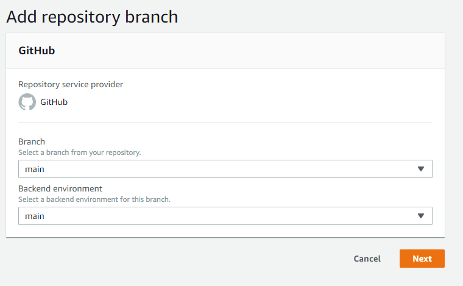
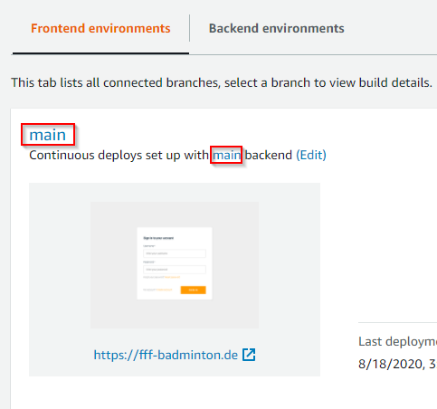
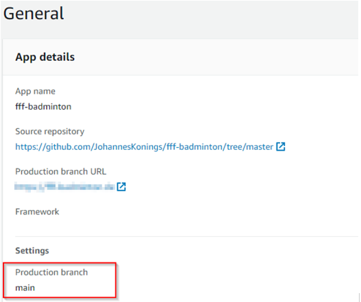
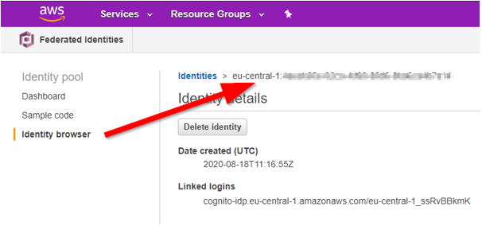

As part of #BlackLivesMatter there was a discussion to rename git branch master to main. How to do that in git and GitHub and some more about the background is described here:
[http://www.kapwing.com/blog/how-to-rename-your-master-branch-to-main-in-git/](http://www.kapwing.com/blog/how-to-rename-your-master-branch-to-main-in-git/)

Together with the master branch I had a master env, which was connected to the git master branch in the amplify console. I also wanted to rename this master env.

# AWS Amplify

After the master branch was renamed to main, the corresponding env have to be also renamed from master to main.

## Create new env

Check If you are in the master env with `amplify status`. If not checkout the master env with `amplify env checkout master`.
Run the command `amplify add env main` and `amplify push`. After that, you can connect the main branch with the main env in the amplify console.

## Connection of main branch with main env in the Amplify Console

The new main branch and the new main env can now be connected in the amplify console.

Afterwards the production branch must be changed to main.

# Migration

The new env main is now ready to use, but the data is missing. That must be migrated from the master env to the main env. In my case, it was Cognito users, DynamoDB data and S3 profile photos.

## Cognito

There are some approaches to export und import cognito users:

[https://docs.aws.amazon.com/cognito/latest/developerguide/cognito-user-pools-import-users.html](https://docs.aws.amazon.com/cognito/latest/developerguide/cognito-user-pools-import-users.html)

[https://medium.com/collaborne-engineering/migrate-aws-cognito-user-pools-ff2a91a745a2](https://medium.com/collaborne-engineering/migrate-aws-cognito-user-pools-ff2a91a745a2)

However, since it is a small internal app, it is sufficient for users to register again 😊

## DynamoDb

The DynamoDB data is more important. The easiest way to migrate the data was with a shell script and the aws cli:

[dynamodb-migration.sh](https://github.com/JohannesKonings/fff-badminton/blob/main/AmplifyEnvMigration/dynamodb-migration.sh)

## S3

As described here the users can upload new profile pictures:
[AWS Amplify Storage: React example for Avatar pictures](https://dev.to/johanneskonings/aws-amplify-storage-react-example-for-avatar-pictures-273o)

That profile pictures can also be copied by a script [s3-migration.sh](https://github.com/JohannesKonings/fff-badminton/blob/main/AmplifyEnvMigration/s3-migration.sh). But it's necessary to rename the folder name to the new identity pool identity browser id, that the pictures will be found.

I fixed that manually 😊
