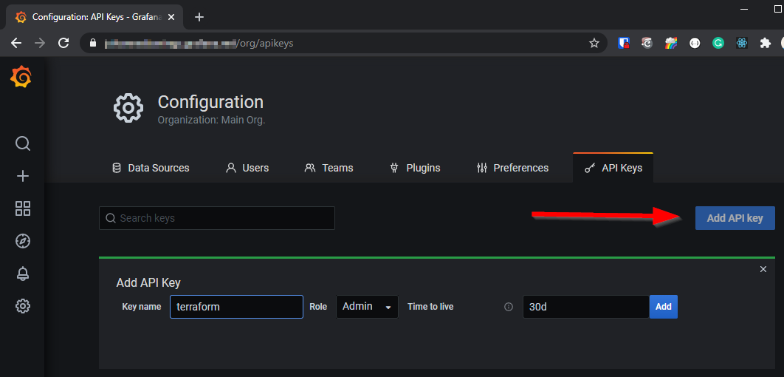
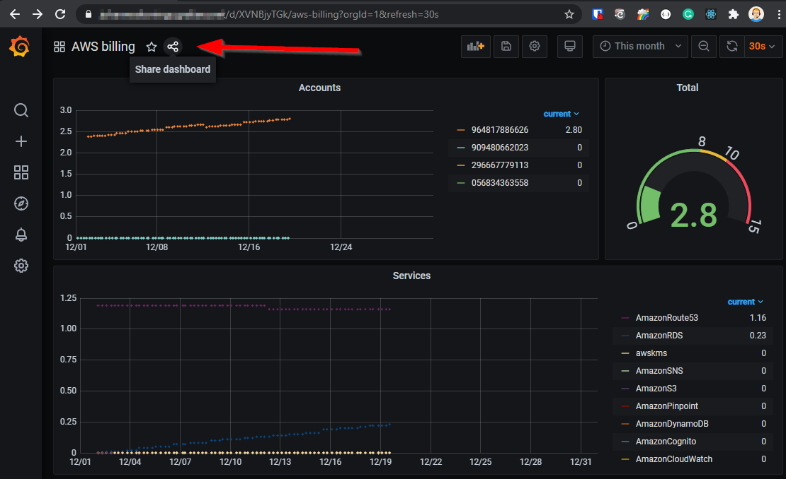
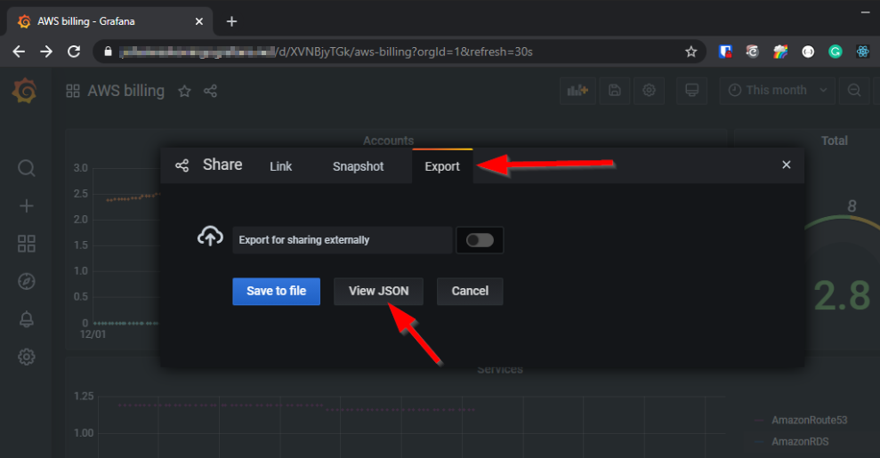

# Why Terraform?

In this [post](./aws_billing_metrics_and_grafana_cloud/) I described how to display AWS Billing metrics in Grafana Cloud. Therefore it was necessary to create manually the data source and the dashboard.
With Terraform, you can describe the setup as code and benefit from the full advantages of [IaC](https://en.wikipedia.org/wiki/Infrastructure_as_code).

# Terraform

[Terraform](https://www.terraform.io/) is a tool for infrastructure as code and works with many different [provider](https://www.terraform.io/docs/providers/index.html#lists-of-terraform-providers).
Terraform comes with a CLI for the deployments.

# Grafana Provider and Dashboard declaration

For this use case, you need a Grafana data source and a Grafana dashboard. These configurations have to defined in a .tf file like this [one](https://github.com/JohannesKonings/aws-grafana-billing-dashboard/blob/main/grafana.tf)

At first the [provider](https://registry.terraform.io/providers/grafana/grafana/latest/docs).

```
provider "grafana" {
  url  = var.grafana_url
  auth = var.grafana_api_key
}
```

Then the [data source](https://registry.terraform.io/providers/grafana/grafana/latest/docs/resources/data_source) and [dashboard](https://registry.terraform.io/providers/grafana/grafana/latest/docs/resources/dashboard).
The dashboard section links to the file [dashboards/aws-billing.json](https://github.com/JohannesKonings/aws-grafana-billing-dashboard/blob/main/dashboards/aws-billing.json).

```
resource "grafana_data_source" "cloudwatch" {
  type = "cloudwatch"
  name = "CloudWatch"

  json_data {
    default_region = var.region
    auth_type      = "keys"
  }

  secure_json_data {
    access_key = var.access_key_grafana
    secret_key = var.secret_key_grafana
  }
}

resource "grafana_dashboard" "metrics" {
  config_json = file("dashboards/aws-billing.json")
}
```

For security reasons and flexible sharing of the template, the parameters for secrets and variables like region are in a .env file. This is the [template](https://github.com/JohannesKonings/aws-grafana-billing-dashboard/blob/main/.env_template) for that.

```
# The URL of the Grafana instance
export TF_VAR_grafana_url=
# The API key of the Grafana instance
export TF_VAR_grafana_api_key=
# IAM user like described here: https://grafana.com/docs/grafana/latest/datasources/cloudwatch/#iam-policies
export TF_VAR_access_key_grafana=
export TF_VAR_secret_key_grafana=
# Default region of the data source
export TF_VAR_region=
```

The declaration of Terraform variables looks like that.

```
variable "grafana_url" {}
variable "grafana_api_key" {}
variable "access_key_grafana" {}
variable "secret_key_grafana" {}
variable "region" {}
```

In this case it's in the file [variable.tf](https://github.com/JohannesKonings/aws-grafana-billing-dashboard/blob/main/variables.tf) like described [here](https://learn.hashicorp.com/tutorials/terraform/azure-variables).

# Grafana API Key

Terraform can "communicate" with Grafana via an API key.
Navigate to this URL "https://<<Grafana instance>>/org/apikeys" and create on with the role "Admin".



Put the API key into the .env file.

# Usage of the env file

Before the creation of the S3 Backend and the deployment run the command `source .env`.

# Terraform AWS S3 backend

This setup so far works for the first deployment. Changes and a redeployment lead to an error because the resource already exists.
Therefore it's necessary to extend the setup with a [Terraform backend](https://www.terraform.io/docs/backends/index.html).
In this example, it's a [S3 backend](https://www.terraform.io/docs/backends/types/s3.html).

Unfortunately, it's not possible to use variables here. This is discussed in this [issue](https://github.com/hashicorp/terraform/issues/13022) with some approaches for workarounds. I use this [one](https://github.com/hashicorp/terraform/issues/13022#issuecomment-482014961), more or less.

Concrete I put a [script](https://github.com/JohannesKonings/aws-grafana-billing-dashboard/blob/main/scripts/terraformInit.sh) around the command `terraform init`. This script can use the environment variables and create a terraform file for the backend.

```bash
#!/bin/sh
cat > ./backend.tf << EOF
terraform {
  backend "s3" {
    bucket = "${TF_VAR_s3_bucket_name}"
    key    = "${TF_VAR_backend_key}"
    region = "${TF_VAR_region}"
  }
}
EOF

terraform init -input=false
```

This [script](https://github.com/JohannesKonings/aws-grafana-billing-dashboard/blob/main/scripts/createS3BackendBucket.sh) creates the bucket.

```sh
#!/bin/sh

aws s3api create-bucket --bucket $TF_VAR_s3_bucket_name --region $TF_VAR_region
```

For the backend, it needs an IAM user. This [script](https://github.com/JohannesKonings/aws-grafana-billing-dashboard/blob/main/scripts/createUser4S3BackendBucket.sh) creates the user and return access and secret key. Put that into the .env file.

```
# Name of the Terrafrom S3 backend for state handling
export TF_VAR_s3_bucket_name=
# Name of the state file
export TF_VAR_backend_key=terraform.tfstate
# IAM user credentials to access S3 and write the state file
export AWS_ACCESS_KEY_ID=
export AWS_SECRET_ACCESS_KEY=
```

```sh
#!/bin/sh

aws iam create-user --user-name terraform_state

aws iam create-access-key --user-name terraform_state
```

This [script](https://github.com/JohannesKonings/aws-grafana-billing-dashboard/blob/main/scripts/createAndAttachS3BackendBucketPolicy.sh) creates and attach the missing policy.

```sh
#!/bin/bash

cat > ./scripts/policy << EOF
{
  "Version": "2012-10-17",
  "Statement": [
    {
      "Effect": "Allow",
      "Action": "s3:ListBucket",
      "Resource": "arn:aws:s3:::${TF_VAR_s3_bucket_name}"
    },
    {
      "Effect": "Allow",
      "Action": ["s3:GetObject", "s3:PutObject"],
      "Resource": "arn:aws:s3:::${TF_VAR_s3_bucket_name}/*"
    }
  ]
}
EOF

aws iam create-policy --policy-name terraform_state --policy-document file://scripts/policy

ARN=$(aws iam list-policies --query 'Policies[?PolicyName==`terraform_state`].Arn' --output text)

aws iam attach-user-policy --policy-arn $ARN --user-name terraform_state
```

# Deployment commands

Once the S3 backend is created, you're a few commands away from the deployment.

At first, the initialization of Terraform, which is wrapped in a script.

`sh scripts/terraformInit.sh`

For the next commands, the Terraform CLI is sufficient.

[validate:](https://www.terraform.io/docs/commands/validate.html) `terraform validate`

[plan:](https://www.terraform.io/docs/commands/plan.html) `terraform plan`

[apply:](https://www.terraform.io/docs/commands/apply.html) `terraform apply`

# Grafana Dasboard changes

The dashboard can now be changed directly via the JSON file in the folder dashboards. The easier way is to do that manually in Grafana and copy the changed JSON via the share functionality.





Overwrite the file aws-billing.json with the JSON from Grafana and redeploy.

# CI/CD pipeline

The local deployment is also possible with a CI/CD pipeline. In [this example](https://github.com/JohannesKonings/aws-grafana-billing-dashboard/blob/main/.github/workflows/deploy2grafana.yml) it's with GitHub actions.
Instead of the .env file, the variables and credentials coming from GitHub secrets.

# Code

[https://github.com/JohannesKonings/aws-grafana-billing-dashboard](https://github.com/JohannesKonings/aws-grafana-billing-dashboard)
