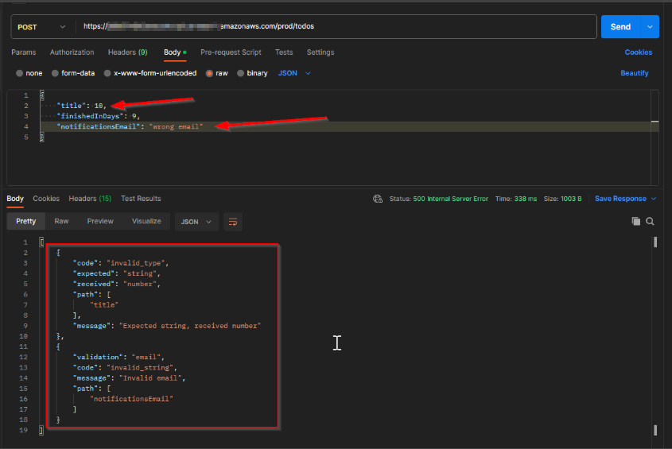
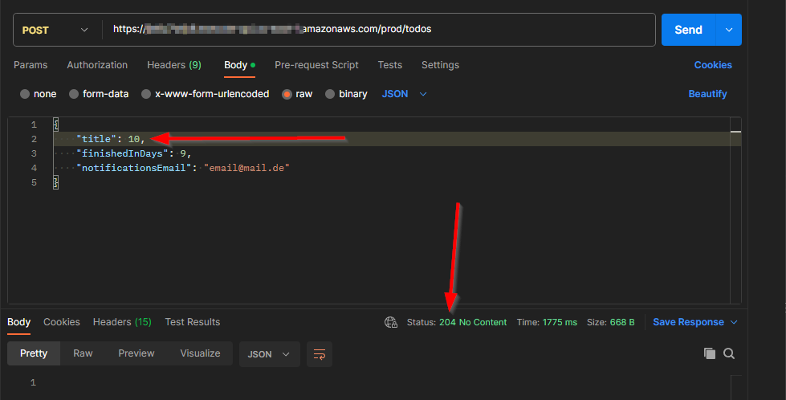
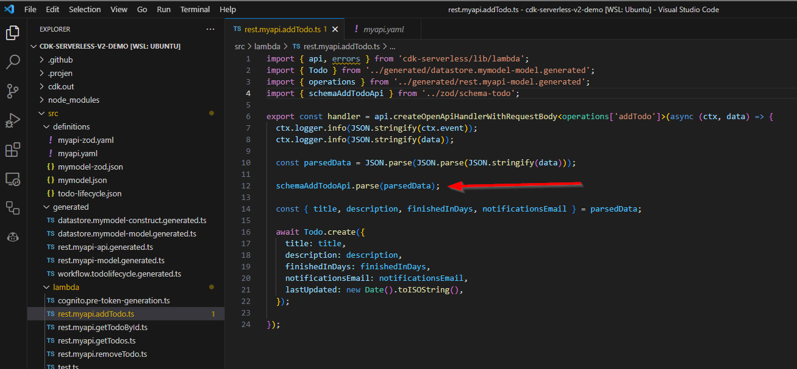

The [AWS CDK Serverless Toolsuite](https://github.com/taimos/cdk-serverless) from [Thorsten Hoeger](https://github.com/hoegertn) helps, among others, to deploy an API Gateway from [OpenApi specs](https://www.openapis.org/) and a DynamoDb from [DynamoDb onetable data modeling](https://doc.onetable.io/). The advantage is to leverage the type safety from Typscript generated from these files.

That helps during the development cycle, but a runtime Typescript is Javascript without any type checking. This post is about enhancing this setup with [zod](https://github.com/colinhacks/zod) to validate the types during runtime.

The workflow so far is to create a definition and generate Typescript types from that. Now the workflow has a step before to create a zod schema and derive the definitions from the zod schema.

## Type checking without zod

As you can see, the types are available at development time via the OpenApi spec.



This is because of the defined components in this [openApi spec](https://github.com/JohannesKonings/cdk-serverless-v2-demo/blob/main/src/definitions/myapi.yaml)

```yaml
components:
  schemas:
    Todo:
      type: object
      required:
        - id
        - state
        - title
        - description
        - lastUpdate
      properties:
        id:
          type: string
        state:
          type: string
        title:
          type: string
        description:
          type: string
        lastUpdate:
          type: string
          format: date-time
    AddTodo:
      type: object
      required:
        - title
        - description
      properties:
        title:
          type: string
        description:
          type: string
```

But that didn't prevent you from using the false type during runtime.



## Type checking with zod

With a one-line parsing command, zod checks all the types.



Furthermore, zod has some [string-specific validations](https://github.com/colinhacks/zod#strings) that can check if the email is valid.

```typescript
notificationsEmail: z.string().email(),
```


## Implementation

To implement that, first, the zod schemas are needed. [This setup](https://github.com/JohannesKonings/cdk-serverless-v2-demo/blob/main/src/zod/schema-todo.ts) has three schemas.
One for the API request, one for the API response and one how the data is stored.

With zod it's possible to reference existing schema an extend fields or omit some.

```typescript
import * as z from "zod";

export const schemaTodoApi = z.object({
  id: z.string().uuid(),
  state: z.enum(["OPEN", "IN PROGRESS", "DONE"]).default("OPEN"),
  title: z.string(),
  finishedInDays: z.number().int().positive(),
  notificationsEmail: z.string().email(),
  description: z.string().optional(),
  lastUpdate: z.string().datetime(),
});

export const schemaAddTodoApi = schemaTodoApi.omit({
  id: true,
  state: true,
  lastUpdate: true,
});

export const schemaTodoDdb = schemaTodoApi
  .extend({
    lastUpdated: z.string().datetime(),
  })
  .omit({ lastUpdate: true });
```

### openApi

To create the openApi spec I'm using the `@asteasolutions/zod-to-openapi` package. zod has listed some more packages [here](https://github.com/colinhacks/zod#zod-to-x) which can be used.

The definition of the apiSpec is now created via Typescript as you can see [here](https://github.com/JohannesKonings/cdk-serverless-v2-demo/blob/main/src/zod/openapi.ts) and generate a yaml file.

```typescript
import fs from "node:fs";
import {
  extendZodWithOpenApi,
  OpenAPIRegistry,
  OpenApiGeneratorV3,
} from "@asteasolutions/zod-to-openapi";
import yaml from "js-yaml";
import * as z from "zod";
import { schemaAddTodoApi, schemaTodoApi } from "./schema-todo";

extendZodWithOpenApi(z);

const registry = new OpenAPIRegistry();

const apiKeyComponent = registry.registerComponent(
  "securitySchemes",
  "api_key",
  {
    type: "apiKey",
    name: "x-api-key",
    in: "header",
  }
);

registry.register("Todo", schemaTodoApi.openapi({}));
registry.register("AddTodo", schemaAddTodoApi.openapi({}));

registry.registerPath({
  method: "get",
  path: "/todos",
  summary: "return list of todos",
  tags: ["admin"],
  security: [{ [apiKeyComponent.name]: [] }],
  operationId: "getTodos",
  responses: {
    200: {
      description: "successful operation",
      content: {
        "application/json": {
          schema: {
            type: "array",
            items: {
              $ref: "#/components/schemas/Todo",
            },
          },
        },
        "text/calendar": {
          schema: {
            type: "string",
          },
        },
      },
    },
  },
});
registry.registerPath({
  method: "post",
  path: "/todos",
  summary: "add new todo",
  tags: ["admin"],
  security: [{ [apiKeyComponent.name]: [] }],
  operationId: "addTodo",
  requestBody: {
    required: true,
    content: {
      "application/json": {
        schema: {
          $ref: "#/components/schemas/AddTodo",
        },
      },
    },
  },
  responses: {
    201: {
      description: "successful operation",
      content: {
        "application/json": {
          schema: {
            $ref: "#/components/schemas/Todo",
          },
        },
      },
    },
    401: {
      description: "you are not logged in",
      content: {},
    },
    403: {
      description: "you are not authorized to add todos",
      content: {},
    },
  },
  "x-codegen-request-body-name": "body",
});
registry.registerPath({
  method: "post",
  path: "/todos/{id}",
  summary: "get a todo by its id",
  tags: ["admin"],
  security: [{ [apiKeyComponent.name]: [] }],
  operationId: "getTodoById",
  responses: {
    200: {
      description: "successful operation",
      content: {
        "application/json": {
          schema: {
            $ref: "#/components/schemas/Todo",
          },
        },
      },
    },
    401: {
      description: "you are not logged in",
      content: {},
    },
    403: {
      description: "you are not authorized to add todos",
      content: {},
    },
  },
});
registry.registerPath({
  method: "delete",
  path: "/todos/{id}",
  summary: "delete a todo",
  tags: ["admin"],
  security: [{ [apiKeyComponent.name]: [] }],
  operationId: "removeTodo",
  responses: {
    200: {
      description: "successful operation",
      content: {},
    },
  },
});

const generator = new OpenApiGeneratorV3(registry.definitions);

const generatorDocument = generator.generateDocument({
  openapi: "3.0.1",
  info: {
    version: "1.0",
    title: "Serverless Demo with zod",
  },
  tags: [
    {
      name: "info",
    },
    {
      name: "admin",
    },
  ],
});

const yamlString = yaml.dump(generatorDocument, { indent: 2 });

fs.writeFileSync("./src/definitions/myapi-zod.yaml", yamlString);
```

### onetable

Unfortunately, for onetable didn't exist a npm package. So the conversion is made from scratch.
[This](https://github.com/JohannesKonings/cdk-serverless-v2-demo/blob/main/src/zod/onetable.ts) is how it looks like.

```typescript
import fs from "node:fs";
import { z } from "zod";
import { schemaTodoDdb } from "./schema-todo";

const modelTodoDdb = {
  PK: {
    type: "string",
    value: "TODO#${id}",
  },
  SK: {
    type: "string",
    value: "TODO#${id}",
  },
  id: {
    type: "string",
    required: true,
    generate: "uuid",
  },
  GSI1PK: {
    type: "string",
    value: "TODOS",
  },
  GSI1SK: {
    type: "string",
    value: "${state}#${title}",
  },
};

const schemaTodoValues = schemaTodoDdb.keyof().Values;

const modelTodoFields = Object.keys(schemaTodoValues).reduce((acc, key) => {
  const keyOfSchemaTodoKeyValues = key as keyof typeof schemaTodoValues;
  const shapeType = schemaTodoDdb.shape[keyOfSchemaTodoKeyValues];

  const { type, required, generate, enumValues, defaultValue } =
    deriveAttributes(shapeType);

  return {
    ...acc,
    [key]: {
      type: type,
      required: required,
      generate: generate,
      enum: enumValues,
      default: defaultValue,
    },
  };
}, {});

function deriveAttributes(shapeType: z.ZodType<any, any>) {
  let type = "";
  let required = false;
  let generate = undefined;
  let enumValues = [] as string[];
  let defaultValue = undefined;

  if (shapeType === undefined) {
    throw new Error("type is undefined");
  } else if (shapeType instanceof z.ZodString) {
    type = "string";
    required = true;
    generate = shapeType.isUUID ? "uuid" : undefined;
  } else if (shapeType instanceof z.ZodNumber) {
    type = "number";
    required = true;
  } else if (shapeType instanceof z.ZodEnum) {
    required = true;
    type = "string";
    enumValues = shapeType._def.values;
  } else if (shapeType instanceof z.ZodDefault) {
    required = true;
    defaultValue = shapeType._def.defaultValue();
    const { type: typeInnerType, enumValues: enumInnerType } = deriveAttributes(
      shapeType._def.innerType
    );
    type = typeInnerType;
    enumValues = enumInnerType as string[];
  } else if (shapeType instanceof z.ZodOptional) {
    required = false;
    const { type: typeInnerType } = deriveAttributes(shapeType._def.innerType);
    type = typeInnerType;
  } else {
    console.log("shapeType", shapeType);
    throw new Error("type is not supported");
  }
  return {
    type,
    required: required ? true : undefined,
    generate,
    enumValues: enumValues && enumValues.length > 0 ? enumValues : undefined,
    defaultValue,
  };
}

export const modelTodo = {
  ...modelTodoDdb,
  ...modelTodoFields,
};

const onetable = {
  indexes: {
    primary: {
      hash: "PK",
      sort: "SK",
    },
    GSI1: {
      hash: "GSI1PK",
      sort: "GSI1SK",
      project: "all",
    },
    LSI1: {
      type: "local",
      sort: "lastUpdated",
      project: ["id", "lastUpdated", "title"],
    },
  },
  models: {
    Todo: modelTodo,
  },
  version: "0.1.0",
  format: "onetable:1.1.0",
  queries: {},
};

fs.writeFileSync(
  "./src/definitions/mymodel-zod.json",
  JSON.stringify(onetable, null, 2)
);
```

### Integration into the file creation workflow

The definition files can now be generated based on a zod schema. So that that will happen together with generating the files from the spec the projen.ts file need to be enhanced. This will create two commands before.

```typescript
const taskDefinitionsCreation = project.addTask("definitionsCreation", {
  steps: [
    { exec: "ts-node ./src/zod/openapi.ts" },
    { exec: "ts-node ./src/zod/onetable.ts" },
  ],
});
project.defaultTask!.prependSpawn(taskDefinitionsCreation);
```

Than the steps look like this.

```json
  "default": {
      "name": "default",
      "description": "Synthesize project files",
      "steps": [
        {
          "spawn": "definitionsCreation"
        },
        {
          "exec": "ts-node --project tsconfig.dev.json .projenrc.ts"
        },
        {
          "spawn": "generate:api:myapi"
        }
      ]
    },
```

Now with the command `npm run projen` the definition file are created derived from zod and from that on the workflow is like before.

## Code

[https://github.com/JohannesKonings/cdk-serverless-v2-demo](https://github.com/JohannesKonings/cdk-serverless-v2-demo)
