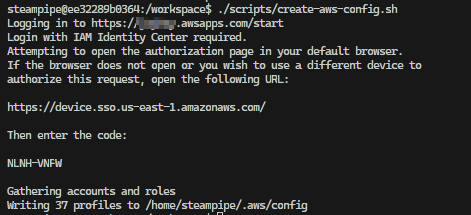

## Use case

You are in charge of several AWS accounts within an AWS Organisation and need to check the resources across these accounts. E.g., to check which are the configured runtimes for the lambdas.

## Approach with Steampipe

[Steampipe](https://steampipe.io/) is a tool to query data from different providers. Among others, there is a [plugin for AWS](https://hub.steampipe.io/plugins/turbot/aws).

The big plus is that Steampipe provides the ability to query more than one account with a query with [aggregator connection](https://steampipe.io/docs/managing/connections#using-aggregators)

This is how the result will look like for my AWS SSO accounts.


More about Steampipe and AWS: <https://dev.to/aws-builders/easily-query-your-cloud-inventory-with-steampipe-2af3>

## Setup

It's necessary to have a link between AWS CLI profiles and Steampipe connection for the AWS SSO accounts that can be recreated without any effects on the local setup, which is created inside a docker image. This [docker image](https://github.com/JohannesKonings/aws-sso-steampipe/blob/main/Dockerfile) is based on Steampipe with additional installation of some tools, the AWS CLI and the AWS steampipe plugin.

### Docker

```dockerfile
FROM ghcr.io/turbot/steampipe

# Setup prerequisites (as root)
USER root:0
RUN apt-get update -y \
 && apt-get install -y git curl unzip jq python3-pip python3-venv

# Install AWS CLI
RUN curl "https://awscli.amazonaws.com/awscli-exe-linux-x86_64.zip" -o "awscliv2.zip" \
 && unzip awscliv2.zip \
 && ./aws/install \
 && rm -rf awscliv2.zip ./aws

# Install pipx
RUN pip3 install pipx

# Update steampipe to current version
RUN /bin/sh -c "$(curl -fsSL https://steampipe.io/install/steampipe.sh)"

# Install the aws and steampipe plugins for Steampipe (as steampipe user).
USER steampipe:0
RUN steampipe plugin install steampipe aws

# Install aws-sso-util for steampipe user
RUN pipx install aws-sso-util && pipx ensurepath
```

The Steampipe docu is here: <https://steampipe.io/docs/managing/containers>

After creating the image with `docker build -t steampipe-query .`. The container can be created with the following command.

```bash
docker run --entrypoint /bin/bash -it \
--mount type=bind,source="${PWD}/queries",target=/workspace/queries \
--mount type=bind,source="${PWD}/scripts",target=/workspace/scripts \
--mount type=bind,source="${PWD}/.env",target=/workspace/.env \
--name steampipe-query \
steampipe-query
```

These are the commands to use the container again `docker start -a steampipe-query` and `docker exec -it steampipe-query /bin/bash`.

## Queries

One of the mount points was the folder queries, which contain, in this example, the SQL to check the lambda runtime.

```sql
select
  account_id,
  _ctx ->> 'connection_name' as connection_name,
  runtime,
  count(*),
  SUM(COUNT(*)) OVER() AS total_count
from
  aws_all.aws_lambda_function
where runtime not in ('nodejs18.x', 'nodejs16.x', 'python3.9')
group by
  account_id,
  _ctx,
  runtime
order by
  connection_name,
  runtime,
  count;
```

The command to run this query is `steampipe query queries/lambda-runtime.sql`. This will work after the scripts have created the profiles and connections config.

## Scripts

The other mount points are scripts and the env file. The env file contains the necessary env variables for the scripts.

```plain
SSO_START_URL= # https://<your-aws-account-id>.awsapps.com/start
SSO_SESSION_NAME= # <your session name, it's just a name>
SSO_REGION= # <your region, e.g. us-east-1>
```

After setting the env file run the script `./scripts/create-aws-config.sh` inside the container, which creates the file ~/.aws/config with SS0 session values using the [aws-sso-util](https://github.com/benkehoe/aws-sso-util).

It will look like this.



Open the link in the browser and put in the code.


Then, allow the access.


The last step for the setup is to create the connections for Steampipe with the script `./scripts/create-steampipe-aws-config.sh` inside the container. This will create a connection for each profile in the AWS config file ~/.aws/config.
Not every role is allowed to query the data, so it's necessary to set the env variable `ALLOWED_ROLES` with the roles allowed to query the data. The roles are comma-separated. E.g.

`ALLOWED_ROLES="AWSReadOnlyAccess,AWSAdministratorAccess"`

And now it's possible to run the queries with steampipe 🥳

## Code

[https://github.com/JohannesKonings/aws-sso-steampipe](https://github.com/JohannesKonings/aws-sso-steampipe)

## Sources

* [aws-sso-util](https://github.com/benkehoe/aws-sso-util)
