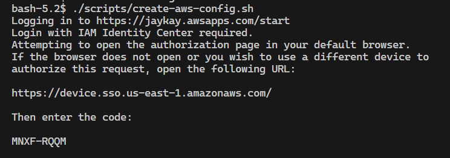
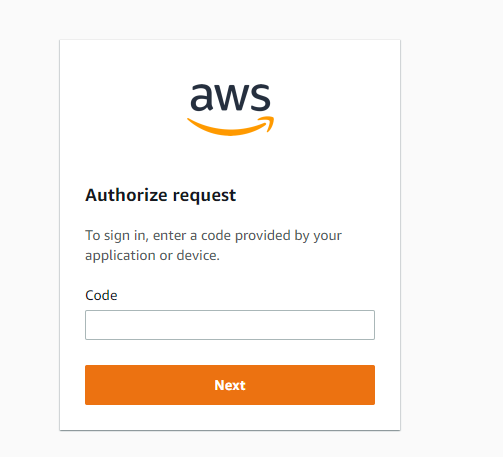
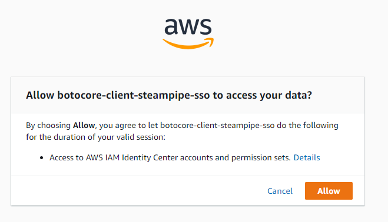
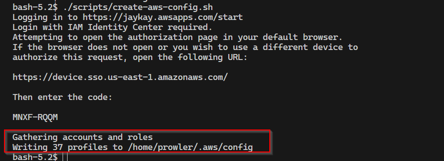
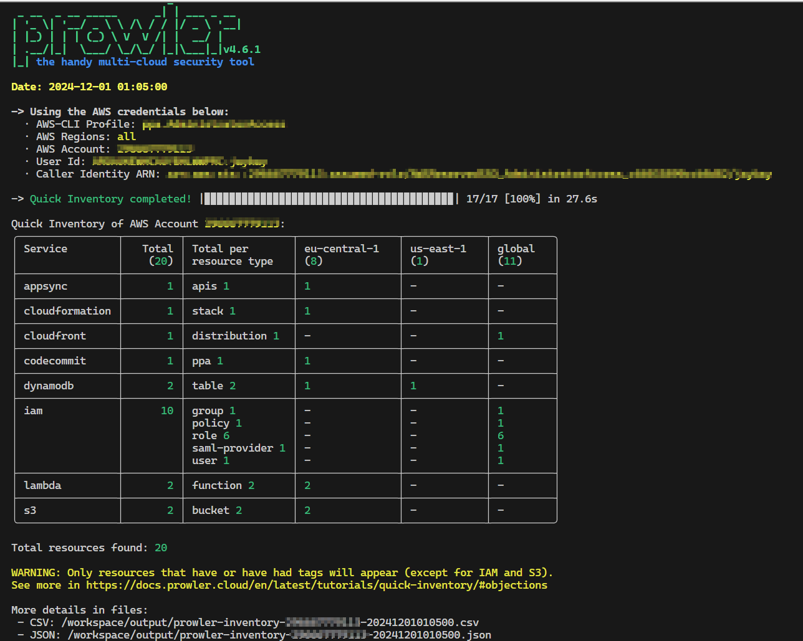
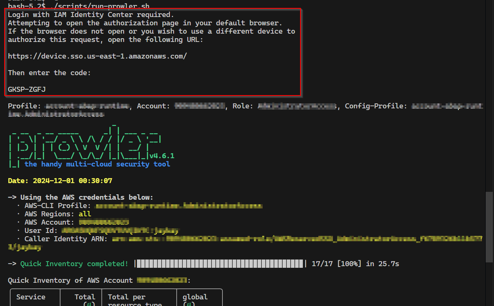

## Use case

You want to run [prowler](https://docs.prowler.com/projects/prowler-open-source/en/latest/) scans for different AWS accounts, which AWS SSO manages.

## Approach

To scan multiple AWS accounts with prowler is described here: https://docs.prowler.com/projects/prowler-open-source/en/latest/tutorials/aws/multiaccount/
Therefore, it's necessary to have permission to assume a role in every account.
This post describes how to do it with AWS SSO.

## Setup

With a dockerfile, all needed tools are prepared in advance to run the scans.

### Docker

The Dockerfile mainly uses the Prowler image and adds [aws-sso-util](https://github.com/benkehoe/aws-sso-util).

```dockerfile
FROM public.ecr.aws/docker/library/alpine:3.20.3 AS builder

RUN apk update && apk add --no-cache bash

FROM public.ecr.aws/prowler-cloud/prowler:4.6.1

COPY --from=builder /bin/bash /bin/bash

RUN pip install pipx && \
    pipx install aws-sso-util
    # pipx ensurepath

WORKDIR /workspace

ENTRYPOINT ["/bin/bash"]
```

The prowler docu for installing with docker is here: https://docs.prowler.com/projects/prowler-open-source/en/latest/#__tabbed_2_3

After creating the image with `docker build -t prowler.`. The container can be created with the following command.

```bash
docker run --entrypoint /bin/bash -it \
--mount type=bind,source="${PWD}/scripts",target=/workspace/scripts \
--mount type=bind,source="${PWD}/.env",target=/workspace/.env \
--mount type=bind,source="${PWD}/output",target=/workspace/output \
--name prowler \
prowler
```

These are the commands to use the container again `docker start -a prowler` and `docker exec -it prowler /bin/bash`.

## Initial configuration after container creation

The command for running the container mounted the folder `scripts` and `.env` file to the container.

One of the scripts is `./scripts/create-aws-config.sh` which creates the file `~/.aws/config`, with the SSO session values.

```bash
#!/bin/bash

if [ ! -f .env ] ; then
    echo "ERROR: .env file not found!"
    exit 1
else
    source .env
fi
if [ -z "$SSO_START_URL" ] ; then
    echo "ERROR: SSO_START_URL not set in .env file!"
    exit 1
fi
if [ -z "$SSO_SESSION_NAME" ] ; then
    echo "ERROR: SSO_SESSION_NAME not set in .env file!"
    exit 1
fi
if [ -z "$SSO_REGION" ] ; then
    echo "ERROR: REGION not set in .env file!"
    exit 1
fi

aws-sso-util configure populate \
--sso-start-url $SSO_START_URL \
--sso-region $SSO_REGION \
--region $SSO_REGION
```

The script needs the following env variables as file `.env`.

```plain
export SSO_START_URL= # https://<your-aws-account-id>.awsapps.com/start
export SSO_SESSION_NAME= # <your session name, it's just a name>
export SSO_REGION= # <your region, e.g. us-east-1>
```

If you run the script `./scripts/create-aws-config.sh` inside the container, the tool `aws-sso-util` will ask for the SSO credentials.



Open the link in the browser and put in the code.



Then, allow the access.



After confirmation, the config file is created.



## Prowler scans

The second script is `./scripts/run-prowler.sh` which runs the prowler scan for all accounts.

```bash
#!/bin/bash

if [ ! -f .env ] ; then
    echo "ERROR: .env file not found!"
    exit 1
else
    source .env
fi
if [ -z "$SSO_START_URL" ] ; then
    echo "ERROR: SSO_START_URL not set in .env file!"
    exit 1
fi
if [ -z "$SSO_SESSION_NAME" ] ; then
    echo "ERROR: SSO_SESSION_NAME not set in .env file!"
    exit 1
fi
if [ -z "$SSO_REGION" ] ; then
    echo "ERROR: REGION not set in .env file!"
    exit 1
fi

ROLE_NAME_REGEX="^AdministratorAccess"
PROWLER_COMAND="prowler aws -i"

ACCOUNTS=$(aws-sso-util roles --no-header  --separator , --role-name $ROLE_NAME_REGEX --sso-start-url $SSO_START_URL --sso-region $SSO_REGION)

while IFS=',' read -r PROFILE ACCOUNT ROLE; do
    PROFILE=${PROFILE// /-}  # Replace spaces with hyphens in PROFILE, like aws-sso-util does
    CONFIG_PROFILE=$PROFILE.$ROLE
    echo "Profile: $PROFILE, Account: $ACCOUNT, Role: $ROLE, Config-Profile: $CONFIG_PROFILE"
    $PROWLER_COMAND --profile $CONFIG_PROFILE
done <<< "$ACCOUNTS"
```

The value of the variable `ROLE_NAME_REGEX` is a regex filter of the role name, which is connected to the AWS SSO.
In this case, only the role name `AdministratorAccess` is used.

Some Accounts are connected with multiple roles.
In this example, all Accounts have the role `AdministratorAccess`, so this filter works to scan all listed accounts.
In another scenario, the script must be adapted to filter the right role.

The variable `PROWLER_COMAND` is the command to run the prowler scan.

The script `./scripts/run-prowler.sh` call will look like this for every account.



If the login is expired, the script will ask for the credentials again.



The scan result is additionally saved in the folder `output,` which is mounted to the container.
With this configuration, a JSON and a CSV file are created for every account.

This example used the Prowler [quick inventory](https://docs.prowler.com/projects/prowler-open-source/en/latest/tutorials/quick-inventory/) scan. [Here](https://docs.prowler.com/projects/prowler-open-source/en/latest/tutorials/prowler-app/) are more examples for different scans.
E.g. for [compliance scans](https://docs.prowler.com/projects/prowler-open-source/en/latest/tutorials/compliance/).

That's it. Now you can scan all your AWS accounts with Prowler and AWS SSO 🥳
