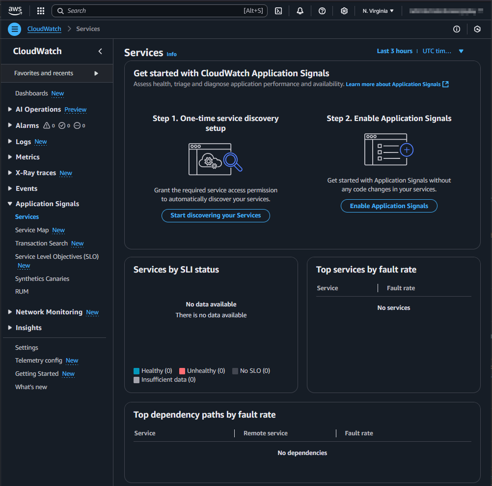

## Use case

You want to use [AWS Cloudwatch Application Signals](https://docs.aws.amazon.com/AmazonCloudWatch/latest/monitoring/CloudWatch-Application-Monitoring-Sections.html) for your NodeJs Lambda functions. For IaC you use CDK.

## Setup

In a new AWS account the Management Console show the two steps to set up the Cloudwatch Application Signals.
Step 1 is an Account wide setup, 
Step 2 is necessary for each Lambda function.



### Account wide setup

For starting the discovery the service linked role `application-signals.cloudwatch.amazonaws.com` must be created: https://docs.aws.amazon.com/AmazonCloudWatch/latest/monitoring/using-service-linked-roles.html#service-linked-role-signals. 
CDK itself has no direct functionality for that. The [SDK](https://docs.aws.amazon.com/AWSJavaScriptSDK/v3/latest/client/application-signals/command/StartDiscoveryCommand/) can help here via a custom resource.

```typescript
 const serviceLinkeRoleArnApplicationSignals = `arn:aws:iam::${Stack.of(this).account}:role/aws-service-role/application-signals.cloudwatch.amazonaws.com/AWSServiceRoleForCloudWatchApplicationSignals`;
    const applicationSignalsStartDiscovery = new AwsCustomResource(
      this,
      "ApplicationSignalsStartDiscovery",
      {
        onCreate: {
          service: "@aws-sdk/client-application-signals",
          action: "StartDiscovery",
          physicalResourceId: PhysicalResourceId.of(
            "ApplicationSignalsStartDiscovery",
          ),
        },
        // fromSdkCalls didn't work, that's why the policy is set manually
        // policy: AwsCustomResourcePolicy.fromSdkCalls({ resources: AwsCustomResourcePolicy.ANY_RESOURCE }),
        policy: AwsCustomResourcePolicy.fromStatements([
          new PolicyStatement({
            effect: Effect.ALLOW,
            actions: ["iam:CreateServiceLinkedRole"],
            resources: [serviceLinkeRoleArnApplicationSignals],
          }),
          new PolicyStatement({
            effect: Effect.ALLOW,
            actions: ["application-signals:StartDiscovery"],
            resources: ["*"],
          }),
        ]),
      },
    );

    const customResourceId = `AWS${AwsCustomResource.PROVIDER_FUNCTION_UUID.replaceAll("-", "")}`;
    NagSuppressions.addResourceSuppressionsByPath(
      Stack.of(this),
      [
        `/${Stack.of(this).stackName}/${customResourceId}/ServiceRole/Resource`,
        `/${Stack.of(this).stackName}/${customResourceId}/Resource`,
      ],
      [
        {
          id: "AwsSolutions-L1",
          reason: "CDK managed lambda function",
        },
        {
          id: "AwsSolutions-IAM4",
          reason: "CDK managed policy",
        },
        {
          id: "AwsSolutions-IAM5",
          reason: "CDK managed policy",
        },
      ],
      true,
    );

    NagSuppressions.addResourceSuppressions(
      applicationSignalsStartDiscovery,
      [
        {
          id: "AwsSolutions-IAM5",
          reason: "CDK managed policy",
        },
      ],
      true,
    );
```

### Each Lambda function

As described [here](https://docs.aws.amazon.com/AmazonCloudWatch/latest/monitoring/CloudWatch-Application-Signals-Enable-Lambda.html) each lambda need the environment variable `AWS_LAMBDA_EXEC_WRAPPER` with the value `/opt/otel-instrument` and the layer `AWSOpenTelemetryDistroJs` with the respective ARN.

```typescript
  const LAMBDA_APPLICATION_SIGNALS_LAYER_ARN =
    "arn:aws:lambda:us-east-1:615299751070:layer:AWSOpenTelemetryDistroJs:5";
  const LAMBDA_APPLICATION_SIGNALS_ENV = {
    AWS_LAMBDA_EXEC_WRAPPER: "/opt/otel-instrument",
  };


    const lambda = new NodejsFunction(this, id, {
      runtime: Runtime.NODEJS_22_X,
      timeout: Duration.seconds(10),
      environment: props.enableApplicationSignals
        ? LAMBDA_APPLICATION_SIGNALS_ENV
        : {},
    });
    lambda.role?.addManagedPolicy(
      ManagedPolicy.fromAwsManagedPolicyName(
        "CloudWatchLambdaApplicationSignalsExecutionRolePolicy",
      ),
    );
    NagSuppressions.addResourceSuppressions(
      lambda,
      [
        {
          id: "AwsSolutions-IAM4",
          reason: "CDK managed policy",
        },
      ],
      true,
    );
    const layerApplicationSignals = LayerVersion.fromLayerVersionArn(
      this,
      "LambdaApplicationSignalsLayer",
      LAMBDA_APPLICATION_SIGNALS_LAYER_ARN,
    );

    lambda.addLayers(layerApplicationSignals);
```	

The lambda function implementation can than look like this:

```typescript
const handler = async (event: undefined, context: undefined) => {
  console.log("lambda was called...");
  return {
    statusCode: 200,
    body: JSON.stringify({
      message: "Hello from Lambda!",
    }),
  };
};
module.exports = { handler };
```

⚠️ The [documentation](https://docs.aws.amazon.com/AmazonCloudWatch/latest/monitoring/CloudWatch-Application-Signals-supportmatrix.html#CloudWatch-Application-Signals-supportmatrix-nodejs) recommend to use currently CommonJS (CJS) instead of ECMAScript Modules (ESM).

Also for CommonJs some "details" are to consider like the export of the handler: https://github.com/aws-observability/aws-otel-lambda/issues/284#issuecomment-1465465790

## Result

After the setup and some runs of the Lambda function the Cloudwatch Application Signals are visible in the Management Console (It takes some minutes).


