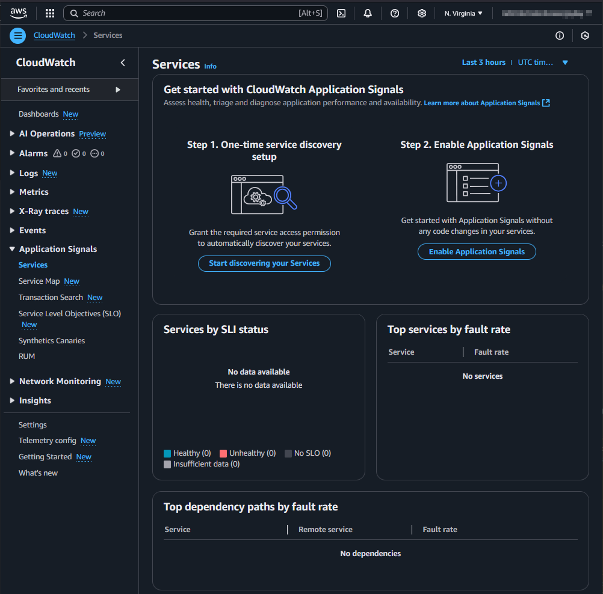

## Update 2025-06-18: Provisioning with CloudFormation

It can now also be configured using CloudFormation.
https://docs.aws.amazon.com/AWSCloudFormation/latest/TemplateReference/aws-resource-applicationsignals-discovery.html

```typescript
import { CfnDiscovery } from "aws-cdk-lib/aws-applicationsignals";

new CfnDiscovery(this, "ApplicationSignalsDiscovery");
```

> [!NOTE]
> With the `CfnDiscovery` resource now available, the following sections detailing the custom resource implementation are for informational purposes only. They show the workaround that was needed before native CloudFormation support was added.

## Use case

This guide shows how to use [AWS CloudWatch Application Signals](https://docs.aws.amazon.com/AmazonCloudWatch/latest/monitoring/CloudWatch-Application-Monitoring-Sections.html) for your Node.js Lambda functions when using the AWS CDK for Infrastructure as Code (IaC).

## Setup

In a new AWS account, the Management Console shows two steps to set up CloudWatch Application Signals.
Step 1 is an account-wide setup.
Step 2 is necessary for each Lambda function.



### Account-wide setup

To start discovery, the service-linked role `application-signals.cloudwatch.amazonaws.com` must be created: https://docs.aws.amazon.com/AmazonCloudWatch/latest/monitoring/using-service-linked-roles.html#service-linked-role-signals.
The AWS CDK does not have a high-level construct for this. However, we can use the AWS SDK via a custom resource to achieve this.

```typescript
const serviceLinkeRoleArnApplicationSignals = `arn:aws:iam::${Stack.of(this).account}:role/aws-service-role/application-signals.cloudwatch.amazonaws.com/AWSServiceRoleForCloudWatchApplicationSignals`;
const applicationSignalsStartDiscovery = new AwsCustomResource(
  this,
  "ApplicationSignalsStartDiscovery",
  {
    onCreate: {
      service: "@aws-sdk/client-application-signals",
      action: "StartDiscovery",
      physicalResourceId: PhysicalResourceId.of(
        "ApplicationSignalsStartDiscovery",
      ),
    },
    // fromSdkCalls didn't work, that's why the policy is set manually
    // policy: AwsCustomResourcePolicy.fromSdkCalls({ resources: AwsCustomResourcePolicy.ANY_RESOURCE }),
    policy: AwsCustomResourcePolicy.fromStatements([
      new PolicyStatement({
        effect: Effect.ALLOW,
        actions: ["iam:CreateServiceLinkedRole"],
        resources: [serviceLinkeRoleArnApplicationSignals],
      }),
      new PolicyStatement({
        effect: Effect.ALLOW,
        actions: ["application-signals:StartDiscovery"],
        resources: ["*"],
      }),
    ]),
  },
);

const customResourceId = `AWS${AwsCustomResource.PROVIDER_FUNCTION_UUID.replaceAll("-", "")}`;
NagSuppressions.addResourceSuppressionsByPath(
  Stack.of(this),
  [
    `/${Stack.of(this).stackName}/${customResourceId}/ServiceRole/Resource`,
    `/${Stack.of(this).stackName}/${customResourceId}/Resource`,
  ],
  [
    {
      id: "AwsSolutions-L1",
      reason: "CDK managed lambda function",
    },
    {
      id: "AwsSolutions-IAM4",
      reason: "CDK managed policy",
    },
    {
      id: "AwsSolutions-IAM5",
      reason: "CDK managed policy",
    },
  ],
  true,
);

NagSuppressions.addResourceSuppressions(
  applicationSignalsStartDiscovery,
  [
    {
      id: "AwsSolutions-IAM5",
      reason: "CDK managed policy",
    },
  ],
  true,
);
```

### Each Lambda function

As described [here](https://docs.aws.amazon.com/AmazonCloudWatch/latest/monitoring/CloudWatch-Application-Signals-Enable-Lambda.html), each Lambda needs the environment variable `AWS_LAMBDA_EXEC_WRAPPER` with the value `/opt/otel-instrument` and the `AWSOpenTelemetryDistroJs` layer with the respective ARN.

```typescript
const LAMBDA_APPLICATION_SIGNALS_LAYER_ARN =
  "arn:aws:lambda:us-east-1:615299751070:layer:AWSOpenTelemetryDistroJs:5";
const LAMBDA_APPLICATION_SIGNALS_ENV = {
  AWS_LAMBDA_EXEC_WRAPPER: "/opt/otel-instrument",
};

const lambda = new NodejsFunction(this, id, {
  runtime: Runtime.NODEJS_22_X,
  timeout: Duration.seconds(10),
  environment: props.enableApplicationSignals
    ? LAMBDA_APPLICATION_SIGNALS_ENV
    : {},
});
lambda.role?.addManagedPolicy(
  ManagedPolicy.fromAwsManagedPolicyName(
    "CloudWatchLambdaApplicationSignalsExecutionRolePolicy",
  ),
);
NagSuppressions.addResourceSuppressions(
  lambda,
  [
    {
      id: "AwsSolutions-IAM4",
      reason: "CDK managed policy",
    },
  ],
  true,
);
const layerApplicationSignals = LayerVersion.fromLayerVersionArn(
  this,
  "LambdaApplicationSignalsLayer",
  LAMBDA_APPLICATION_SIGNALS_LAYER_ARN,
);

lambda.addLayers(layerApplicationSignals);
```

The Lambda function implementation can then look like this:

```typescript
const handler = async (event: undefined, context: undefined) => {
  console.log("lambda was called...");
  return {
    statusCode: 200,
    body: JSON.stringify({
      message: "Hello from Lambda!",
    }),
  };
};
module.exports = { handler };
```

⚠️ The [documentation](https://docs.aws.amazon.com/AmazonCloudWatch/latest/monitoring/CloudWatch-Application-Signals-supportmatrix.html#CloudWatch-Application-Signals-supportmatrix-nodejs) currently recommends using CommonJS (CJS) instead of ECMAScript Modules (ESM).

For CommonJS, some details need to be considered, such as how the handler is exported: https://github.com/aws-observability/aws-otel-lambda/issues/284#issuecomment-1465465790

## Result

After the setup and a few invocations of the Lambda function, the CloudWatch Application Signals will be visible in the Management Console. This might take a few minutes.


