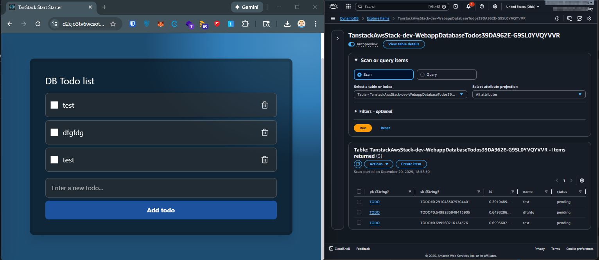

## Introduction

In [Deploying TanStack Start on AWS with Lambda Function URLs](/blog/2025-11-30-tanstack-start-aws-serverless/), I describe how to deploy TanStack Start serverless on AWS.
This post contains a simple example of using TanStack DB (https://tanstack.com/db/latest) with DynamoDB on AWS.

At a high level, we’ll go from infrastructure (a DynamoDB table), to a small DynamoDB client, to a TanStack Start server route, and finally to a TanStack DB collection that powers a simple UI.

The complete implementation is available in the [tanstack-aws repository](https://github.com/JohannesKonings/tanstack-aws), which serves as a working example and template for this deployment pattern.

## Disclaimer

This is a very simple example to get you started with TanStack DB and DynamoDB on AWS. It is not production-ready and lacks features like error handling, security, and optimizations.

## TanStack DB

This (https://frontendatscale.com/blog/tanstack-db/) blog post explains the concepts of TanStack DB very well.
In short, TanStack DB is a client-first database that runs in the browser or in a server environment. It provides a simple API to store, query, and sync data.
TanStack DB is based on collections, with existing sync engines like ElectricSQL (https://tanstack.com/db/latest/docs/collections/electric-collection).

This post uses the Query Collection to wire it via an API to DynamoDB (https://tanstack.com/db/latest/docs/collections/query-collection).

The idea is straightforward: TanStack DB remains the place where your app reads and writes “records” (in this case, todos), while the collection’s fetch and mutation hooks delegate persistence to your own backend API.

## DynamoDB in CDK

This is a very simple configuration, just to store the todos.

To keep the example focused, the table uses a generic partition key and sort key (`pk`/`sk`). That makes it easy to evolve into a single-table design later, while keeping the code here minimal.

```typescript
import { AttributeType, BillingMode, Table } from "aws-cdk-lib/aws-dynamodb";
import { Construct } from "constructs";

export class DatabaseTodos extends Construct {
  public readonly dbTodos: Table;
  constructor(scope: Construct, id: string) {
    super(scope, id);

    this.dbTodos = new Table(this, "Todos", {
      partitionKey: { name: "pk", type: AttributeType.STRING },
      sortKey: { name: "sk", type: AttributeType.STRING },
      billingMode: BillingMode.PAY_PER_REQUEST,
    });
  }
}
```

https://github.com/JohannesKonings/tanstack-aws/blob/main/lib/constructs/DatabaseTodos.ts

This table needs to be wired to the web app server Lambda.

In the web app construct, the table construct is added.
The Lambda is allowed to read and write data to the table.

Concretely, that means (1) creating the table, (2) passing the table name into the server function, and (3) granting the function read/write permissions.

```typescript
const databaseTodos = new DatabaseTodos(this, "DatabaseTodos");

const webappServer = new WebappServer(this, "WebappServer", {
  tableName: databaseTodos.dbTodos.tableName,
});

databaseTodos.dbTodos.grantReadWriteData(webappServer.webappServer);
```

https://github.com/JohannesKonings/tanstack-aws/blob/main/lib/constructs/Webapp.ts

The passed table name is exposed as an environment variable in the Lambda function.

This keeps the application code decoupled from CDK: the Lambda only needs to know an env var, and CDK is responsible for wiring that value at deploy time.

```typescript
this.webappServer = new Function(this, "WebappServer", {
  code: Code.fromAsset(
    path.join(
      path.dirname(new URL(import.meta.url).pathname),
      "../../.output/server",
    ),
  ),
  // functionName: PhysicalName.GENERATE_IF_NEEDED,
  handler: "index.handler",
  memorySize: 2048,
  runtime: Runtime.NODEJS_24_X,
  // oxlint-disable-next-line no-magic-numbers
  timeout: Duration.seconds(60),
  environment: {
    DDB_TODOS_TABLE_NAME: tableName,
  },
});
```

https://github.com/JohannesKonings/tanstack-aws/blob/main/lib/constructs/WebappServer.ts

## A DynamoDB Client

In this example, a simple wrapper around the DynamoDB client is used. In larger projects, something like https://electrodb.dev/ can help.
This is the bridge from the API behind TanStack DB to DynamoDB.

The client below implements the four operations the demo needs: list todos, create a todo, update one or more todos, and delete todos in batches.

Here is the environment variable used for the table name.

```typescript
import { DynamoDBClient } from "@aws-sdk/client-dynamodb";
import {
  BatchWriteCommand,
  DynamoDBDocumentClient,
  PutCommand,
  QueryCommand,
  UpdateCommand,
} from "@aws-sdk/lib-dynamodb";
import { type Todo, todoSchema, type TodoUpdate } from "@/webapp/types/todo";

const TODOS_PK = "TODO";
const TODOS_TABLE_ENV = "DDB_TODOS_TABLE_NAME";
const EMPTY_LENGTH = 0;
const INITIAL_ATTEMPT = 0;
const NEXT_ATTEMPT_INCREMENT = 1;
const MAX_RETRY_ATTEMPTS = 3;
const MAX_BATCH_WRITE_ITEMS = 25;

let ddbDocSingleton: DynamoDBDocumentClient | null = null;

export const getDdbDocClient = (): DynamoDBDocumentClient => {
  if (!ddbDocSingleton) {
    ddbDocSingleton = DynamoDBDocumentClient.from(new DynamoDBClient({}), {
      marshallOptions: {
        removeUndefinedValues: true,
      },
    });
  }

  return ddbDocSingleton;
};

export const requireEnvVar = (name: string): string => {
  const value = process.env[name];
  if (!value) {
    throw new Error(`Missing env var: ${name}`);
  }

  return value;
};

export const getTodosTableName = (): string => requireEnvVar(TODOS_TABLE_ENV);

const todoSortKey = (id: number): string => `TODO#${id}`;

const parseTodoItem = (item: Record<string, unknown>): Todo | null => {
  const parsed = todoSchema.safeParse({
    id: item.id,
    name: item.name,
    status: item.status,
  });

  if (!parsed.success) {
    return null;
  }

  return parsed.data;
};

const chunkItems = <Item>(items: Item[], chunkSize: number): Item[][] => {
  const out: Item[][] = [];
  for (let index = EMPTY_LENGTH; index < items.length; index += chunkSize) {
    out.push(items.slice(index, index + chunkSize));
  }
  return out;
};

export type TodosDdbClient = {
  getTodos: () => Promise<Todo[]>;
  putTodo: (todo: Todo) => Promise<Todo>;
  updateTodos: (updates: TodoUpdate[]) => Promise<void>;
  deleteTodos: (ids: number[]) => Promise<void>;
};

const retryBatchWrite = async (args: {
  ddbDoc: DynamoDBDocumentClient;
  requestItems: unknown;
  attempt: number;
}): Promise<void> => {
  const response = await args.ddbDoc.send(
    new BatchWriteCommand({
      RequestItems: args.requestItems as never,
    }),
  );

  const unprocessedItems = response.UnprocessedItems;
  if (
    !unprocessedItems ||
    Object.keys(unprocessedItems).length === EMPTY_LENGTH
  ) {
    return;
  }

  if (args.attempt + NEXT_ATTEMPT_INCREMENT >= MAX_RETRY_ATTEMPTS) {
    return;
  }

  await retryBatchWrite({
    ddbDoc: args.ddbDoc,
    requestItems: unprocessedItems,
    attempt: args.attempt + NEXT_ATTEMPT_INCREMENT,
  });
};

export const createTodosDdbClient = (): TodosDdbClient => {
  const ddbDoc = getDdbDocClient();

  return {
    getTodos: async () => {
      const tableName = getTodosTableName();
      const result = await ddbDoc.send(
        new QueryCommand({
          TableName: tableName,
          KeyConditionExpression: "#pk = :pk",
          ExpressionAttributeNames: {
            "#pk": "pk",
          },
          ExpressionAttributeValues: {
            ":pk": TODOS_PK,
          },
        }),
      );

      const items = (result.Items ?? [])
        .map((item) => parseTodoItem(item))
        .filter((todo): todo is Todo => todo !== null);
      return items;
    },

    putTodo: async (todo: Todo) => {
      const tableName = getTodosTableName();
      await ddbDoc.send(
        new PutCommand({
          TableName: tableName,
          Item: {
            pk: TODOS_PK,
            sk: todoSortKey(todo.id),
            id: todo.id,
            name: todo.name,
            status: todo.status,
          },
        }),
      );

      return todo;
    },

    updateTodos: async (updates: TodoUpdate[]) => {
      const tableName = getTodosTableName();

      await Promise.all(
        updates.map(async (update) => {
          const sets: string[] = [];
          const names: Record<string, string> = {
            "#pk": "pk",
            "#sk": "sk",
          };
          const values: Record<string, unknown> = {};

          if (update.changes.name !== undefined) {
            names["#name"] = "name";
            values[":name"] = update.changes.name;
            sets.push("#name = :name");
          }

          if (update.changes.status !== undefined) {
            names["#status"] = "status";
            values[":status"] = update.changes.status;
            sets.push("#status = :status");
          }

          if (sets.length === EMPTY_LENGTH) {
            return;
          }

          try {
            await ddbDoc.send(
              new UpdateCommand({
                TableName: tableName,
                Key: {
                  pk: TODOS_PK,
                  sk: todoSortKey(update.id),
                },
                UpdateExpression: `SET ${sets.join(", ")}`,
                ConditionExpression:
                  "attribute_exists(#pk) AND attribute_exists(#sk)",
                ExpressionAttributeNames: names,
                ExpressionAttributeValues: values,
              }),
            );
          } catch (error) {
            const errorName = (error as { name?: string } | undefined)?.name;
            if (errorName !== "ConditionalCheckFailedException") {
              throw error;
            }
          }
        }),
      );
    },

    deleteTodos: async (ids: number[]) => {
      const tableName = getTodosTableName();
      const groups = chunkItems(ids, MAX_BATCH_WRITE_ITEMS);

      await Promise.all(
        groups.map(async (group) => {
          const requestItems = {
            [tableName]: group.map((id) => ({
              DeleteRequest: {
                Key: {
                  pk: TODOS_PK,
                  sk: todoSortKey(id),
                },
              },
            })),
          };

          await retryBatchWrite({
            ddbDoc,
            requestItems,
            attempt: INITIAL_ATTEMPT,
          });
        }),
      );
    },
  };
};
```

https://github.com/JohannesKonings/tanstack-aws/blob/main/src/webapp/integrations/ddb-client/ddbClient.ts

## The API connection to DynamoDB

With the DynamoDB client created above, you can create an API that connects TanStack DB to DynamoDB.

In TanStack Start, this is a server route with standard HTTP verbs. The route validates input, calls the DynamoDB client, and returns JSON responses.

```typescript
// oxlint-disable func-style
import { createFileRoute } from "@tanstack/react-router";
import { createTodosDdbClient } from "@/webapp/integrations/ddb-client/ddbClient";
import {
  createTodoRequestSchema,
  deleteTodosRequestSchema,
  updateTodosRequestSchema,
} from "@/webapp/types/todo";

const todosClient = createTodosDdbClient();

export const Route = createFileRoute("/demo/api/ddb-todos")({
  server: {
    handlers: {
      // oxlint-disable-next-line arrow-body-style
      GET: async () => {
        const items = await todosClient.getTodos();
        return Response.json(items);
      },
      POST: async ({ request }) => {
        const requestJson = await request.json();
        const todoParsed = createTodoRequestSchema.parse(requestJson);

        const saved = await todosClient.putTodo(todoParsed);
        return Response.json(saved);
      },
      PUT: async ({ request }) => {
        const requestJson = await request.json();
        const updates = updateTodosRequestSchema.parse(requestJson);

        await todosClient.updateTodos(updates);

        return Response.json({ ok: true });
      },
      DELETE: async ({ request }) => {
        const requestJson = await request.json();
        const ids = deleteTodosRequestSchema.parse(requestJson);

        await todosClient.deleteTodos(ids);

        return Response.json({ ok: true });
      },
    },
  },
});
```

https://github.com/JohannesKonings/tanstack-aws/blob/main/src/webapp/routes/demo/api.ddb-todos.ts

## The TanStack DB collection

The collection uses the API to fetch and mutate data in DynamoDB.

This is the key integration point: the collection fetches via the `queryFn`, and the transaction callbacks (`onInsert`, `onUpdate`, `onDelete`) translate local writes into API calls.

```typescript
import { queryCollectionOptions } from "@tanstack/query-db-collection";
import { createCollection } from "@tanstack/react-db";
import { getContext } from "@/webapp/integrations/tanstack-query/root-provider";
import { type Todo, todoSchema } from "../types/todo";

// const todoApiPath = '/demo/api/tq-todos';
const todoApiPath = "/demo/api/ddb-todos";
const api = {
  async fetchTodos(): Promise<Todo[]> {
    const response = await fetch(todoApiPath);
    if (!response.ok) {
      throw new Error("Failed to fetch todos");
    }
    const data = await response.json();
    return todoSchema.array().parse(data);
  },

  async createTodos(todo: Omit<Todo, "id">) {
    await fetch(todoApiPath, {
      method: "POST",
      headers: {
        "Content-Type": "application/json",
      },
      body: JSON.stringify(todo),
    });
  },

  async updateTodos(
    updates: { id: number; changes: Partial<Omit<Todo, "id">> }[],
  ) {
    await fetch(todoApiPath, {
      method: "PUT",
      headers: {
        "Content-Type": "application/json",
      },
      body: JSON.stringify(updates),
    });
  },

  async deleteTodos(ids: number[]) {
    await fetch(todoApiPath, {
      method: "DELETE",
      headers: {
        "Content-Type": "application/json",
      },
      body: JSON.stringify(ids),
    });
  },
};

export const todosCollection = createCollection(
  queryCollectionOptions<Todo>({
    queryKey: ["todos"],
    queryFn: () => api.fetchTodos(),
    queryClient: getContext().queryClient,
    getKey: (item) => item.id,
    onInsert: async ({ transaction }) => {
      const newItems = transaction.mutations.map((mutation) => ({
        id: Math.random(), // Temporary ID; real ID should be assigned by the server
        name: mutation.modified.name,
        status: mutation.modified.status,
      }));
      for (const item of newItems) {
        api.createTodos(item);
      }
    },
    onUpdate: async ({ transaction }) => {
      const updates = transaction.mutations.map((mutation) => ({
        id: mutation.key,
        changes: mutation.changes,
      }));
      await api.updateTodos(updates);
    },
    onDelete: async ({ transaction }) => {
      const ids = transaction.mutations.map((mutation) => mutation.key);
      await api.deleteTodos(ids);
    },
  }),
);
```

https://github.com/JohannesKonings/tanstack-aws/blob/main/src/webapp/db-collections/todos.ts

## The hook

These hooks provide a small, UI-friendly API on top of the collection. Components can call `addTodo`/`toggleTodoStatus`/`deleteTodo`, and `useTodos` subscribes to the live query for rendering.

```typescript
import { useLiveQuery } from "@tanstack/react-db";
// oxlint-disable func-style
import { todosCollection } from "@/webapp/db-collections/todos";
import type { Todo } from "../types/todo";

export function useTodo() {
  const addTodo = async ({ name, status }: Omit<Todo, "id">) => {
    // oxlint-disable-next-line no-magic-numbers
    const randomId = Math.floor(Math.random() * 1000000);
    todosCollection.insert({ id: randomId, name, status });
  };

  const toggleTodoStatus = (id: number, status: "pending" | "completed") => {
    todosCollection.update(id, (draft) => {
      if (draft) {
        draft.status = status;
      }
    });
  };

  const deleteTodo = (id: number) => {
    todosCollection.delete(id);
  };

  return { addTodo, toggleTodoStatus, deleteTodo };
}

export function useTodos() {
  const { data: todos } = useLiveQuery((todoQuery) =>
    todoQuery.from({ todo: todosCollection }).select(({ todo }) => ({
      ...todo,
    })),
  );

  return todos as Todo[];
}
```

https://github.com/JohannesKonings/tanstack-aws/blob/main/src/webapp/hooks/useDbTodos.ts

## The component

Finally, the UI component is just a thin layer over the hooks: render the list, submit a new todo, toggle completion, and delete items.

```typescript
// oxlint-disable func-style
import { createFileRoute } from "@tanstack/react-router";
import { Trash2 } from "lucide-react";
import { useState } from "react";
import { useTodo, useTodos } from "@/webapp/hooks/useDbTodos";

export const Route = createFileRoute("/demo/db-todo")({
  ssr: false,
  component: DbTodos,
});

function DbTodos() {
  const todos = useTodos();
  const { addTodo, toggleTodoStatus, deleteTodo } = useTodo();

  const [todo, setTodo] = useState<string>("");

  const submitTodo = () => {
    if (todo.trim() !== "") {
      addTodo({ name: todo, status: "pending" });
      setTodo("");
    }
  };

  const handleTodoStatusToggle = (todoItem: (typeof todos)[number]) => {
    if (todoItem.status === "completed") {
      toggleTodoStatus(todoItem.id, "pending");
    } else {
      toggleTodoStatus(todoItem.id, "completed");
    }
  };

  return (
    <div
      className="flex items-center justify-center min-h-screen bg-linear-to-br from-purple-100 to-blue-100 p-4 text-white"
      style={{
        backgroundImage:
          "radial-gradient(50% 50% at 95% 5%, #4a90c2 0%, #317eb9 50%, #1e4d72 100%)",
      }}
    >
      <div className="w-full max-w-2xl p-8 rounded-xl backdrop-blur-md bg-black/50 shadow-xl border-8 border-black/10">
        <h1 className="text-2xl mb-4">DB Todo list</h1>
        <ul className="mb-4 space-y-2">
          {todos?.map((todoItem) => {
            const isCompleted = todoItem.status === "completed";
            let textClasses = "";
            if (isCompleted) {
              textClasses = "line-through opacity-60";
            }
            return (
              <li
                key={todoItem.id}
                className="bg-white/10 border border-white/20 rounded-lg p-3 backdrop-blur-sm shadow-md flex items-center gap-3"
              >
                <input
                  type="checkbox"
                  checked={isCompleted}
                  onChange={() => handleTodoStatusToggle(todoItem)}
                  className="w-5 h-5 cursor-pointer accent-blue-400"
                />
                <span className={`text-lg text-white flex-1 ${textClasses}`}>
                  {todoItem.name}
                </span>
                <button
                  type="button"
                  onClick={() => deleteTodo(todoItem.id)}
                  className="text-white/80 hover:text-red-300 p-2 rounded-full hover:bg-white/10 transition-colors"
                  aria-label={`Delete todo ${todoItem.name}`}
                >
                  <Trash2 className="w-5 h-5" aria-hidden="true" />
                </button>
              </li>
            );
          })}
        </ul>
        <div className="flex flex-col gap-2">
          <input
            type="text"
            value={todo}
            onChange={(event) => setTodo(event.target.value)}
            onKeyDown={(event) => {
              if (event.key === "Enter") {
                submitTodo();
              }
            }}
            placeholder="Enter a new todo..."
            className="w-full px-4 py-3 rounded-lg border border-white/20 bg-white/10 backdrop-blur-sm text-white placeholder-white/60 focus:outline-none focus:ring-2 focus:ring-blue-400 focus:border-transparent"
          />
          <button
            // oxlint-disable-next-line no-magic-numbers
            disabled={todo.trim().length === 0}
            onClick={submitTodo}
            className="bg-blue-500 hover:bg-blue-600 disabled:bg-blue-500/50 disabled:cursor-not-allowed text-white font-bold py-3 px-4 rounded-lg transition-colors"
          >
            Add todo
          </button>
        </div>
      </div>
    </div>
  );
}
```

https://github.com/JohannesKonings/tanstack-aws/blob/main/src/webapp/routes/demo/db-todo.tsx

## Result



## Conclusion

This is a simple example and implementation of TanStack DB with DynamoDB on AWS.
In a more complete example, you’d need to figure out how to map a single-table design in DynamoDB to multiple collections in TanStack DB.

From here, the next natural steps are adding authentication/authorization on the API, better id generation (server-assigned ids), and a more explicit data model to support multiple entity types.

## Sources and References

- **Examples (full implementation on GitHub)**: [github.com/JohannesKonings/tanstack-aws](https://github.com/JohannesKonings/tanstack-aws)
- **TanStack DB documentation**: [tanstack.com/db/latest](https://tanstack.com/db/latest)
