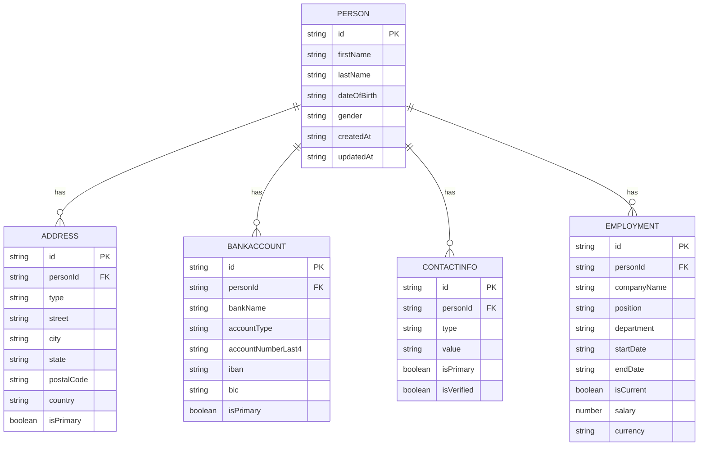

## Introduction

In [Simple example of TanStack DB with DynamoDB on AWS](/blog/2025-12-20-tanstack-start-aws-db-simple/), I describe how to use TanStack DB with a single entity in combination with DynamoDB.
This post contains a simple example with multiple entities and how to sync single table design with TanStack DB collections.

At a high level, we’ll go from infrastructure (a DynamoDB table), to a small DynamoDB client, to a TanStack Start server route, and finally to a TanStack DB collection that powers a simple UI.

The complete implementation is available in the [tanstack-aws repository](https://github.com/JohannesKonings/tanstack-aws), which serves as a working example and template for this deployment pattern.

## Disclaimer

This is an enhancement of a very simple example to get you started with TanStack DB and DynamoDB on AWS with multiple entities, but still simple. It is not production-ready and lacks features like error handling, security, and optimizations.

## The data model

This example implements a multi-entity data model for managing persons with related information. The schemas are defined using Zod as the single source of truth, with ElectroDB entities derived from these schemas to ensure type safety throughout the stack.



## DynamoDB single table design

All entities are stored in a single DynamoDB table using a carefully designed key structure that enables efficient querying patterns.

### Key Structure

| Entity      | Partition Key (pk)  | Sort Key (sk)               | Description                 |
| ----------- | ------------------- | --------------------------- | --------------------------- |
| Person      | `PERSON#<personId>` | `PROFILE`                   | Person profile data         |
| Address     | `PERSON#<personId>` | `ADDRESS#<addressId>`       | Person's addresses          |
| BankAccount | `PERSON#<personId>` | `BANK#<bankId>`             | Person's bank accounts      |
| ContactInfo | `PERSON#<personId>` | `CONTACT#<contactId>`       | Person's contact info       |
| Employment  | `PERSON#<personId>` | `EMPLOYMENT#<employmentId>` | Person's employment history |

This structure groups all data for a single person under the same partition key, allowing efficient retrieval of a person and all their related entities in a single query.

### Access Patterns

The design supports the following access patterns:

| Access Pattern             | Key Condition                                    | Description                                          |
| -------------------------- | ------------------------------------------------ | ---------------------------------------------------- |
| Get all persons            | GSI1: `gsi1pk = PERSONS`                         | List all persons                                     |
| Get person by ID           | `pk = PERSON#<id>`, `sk = PROFILE`               | Single person lookup                                 |
| Get person with all data   | `pk = PERSON#<id>`                               | Get person + all related entities (collection query) |
| Get person's addresses     | `pk = PERSON#<id>`, `sk begins_with ADDRESS#`    | All addresses for a person                           |
| Get person's bank accounts | `pk = PERSON#<id>`, `sk begins_with BANK#`       | All bank accounts for a person                       |
| Get person's contacts      | `pk = PERSON#<id>`, `sk begins_with CONTACT#`    | All contacts for a person                            |
| Get person's employment    | `pk = PERSON#<id>`, `sk begins_with EMPLOYMENT#` | All employment records for a person                  |

The table entries will look a little bit different as ElectroDB will take care of the attribute mapping.

### Global Secondary Indexes

**GSI1: List All Persons**

- Partition Key: `gsi1pk = "PERSONS"` (constant for all person entities)
- Sort Key: `gsi1sk = "PERSON#<personId>"`
- Purpose: Efficiently list all persons without scanning the entire table

The access pattern is to first fetch all persons via GSI1, then from the application layer fetch related entities (addresses, bank accounts, contacts, employment) for each person using the primary key structure. This allows flexible entity loading - you can fetch just the person data, or the person plus all related data as needed.

## ElectroDB as DynamoDB client

[ElectroDB](https://electrodb.dev/) simplifies working with single-table designs that contain multiple entities. In this example, a single DynamoDB table stores Person, Address, BankAccount, ContactInfo, and Employment entities using composite keys. ElectroDB handles the complexity of query building, attribute mapping, and relationship management across these entities, eliminating the need to manually construct DynamoDB expressions. It provides type-safe entity definitions (derived from Zod schemas), automatic key generation, and collection queries that efficiently retrieve related entities together—making single-table designs more maintainable and less error-prone than raw DynamoDB client code.

The schema looks like this:

```typescript
import { getDdbDocClient } from "#src/webapp/integrations/ddb-client/ddbClient.ts";
import { zodToElectroDBAttributes } from "#src/webapp/integrations/electrodb/zod-to-electrodb.ts";
import {
  AddressSchema,
  BankAccountSchema,
  ContactInfoSchema,
  EmploymentSchema,
  PersonSchema,
} from "#src/webapp/types/person.ts";
import { Entity, type EntityConfiguration, Service } from "electrodb";

// =============================================================================
// Table Configuration
// =============================================================================

const TABLE_NAME =
  process.env.DDB_PERSONS_TABLE_NAME ?? "TanstackAwsStack-db-persons";

const getEntityConfig = (): EntityConfiguration => ({
  client: getDdbDocClient(),
  table: TABLE_NAME,
});

// =============================================================================
// Derived ElectroDB Attributes from Zod Schemas (Single Source of Truth)
// =============================================================================

const personAttributes = zodToElectroDBAttributes(PersonSchema);
const addressAttributes = zodToElectroDBAttributes(AddressSchema);
const bankAccountAttributes = zodToElectroDBAttributes(BankAccountSchema);
const contactInfoAttributes = zodToElectroDBAttributes(ContactInfoSchema);
const employmentAttributes = zodToElectroDBAttributes(EmploymentSchema);

// =============================================================================
// Person Entity
// =============================================================================

export const PersonEntity = new Entity(
  {
    model: {
      entity: "Person",
      version: "1",
      service: "persons",
    },
    attributes: personAttributes,
    indexes: {
      primary: {
        pk: { field: "pk", composite: ["id"] },
        sk: { field: "sk", composite: [] },
      },
      // GSI1: List all persons
      allPersons: {
        index: "GSI1",
        pk: { field: "gsi1pk", composite: [], template: "PERSONS" },
        sk: { field: "gsi1sk", composite: ["lastName", "firstName", "id"] },
      },
    },
  },
  getEntityConfig(),
);

// =============================================================================
// Address Entity
// =============================================================================

export const AddressEntity = new Entity(
  {
    model: {
      entity: "Address",
      version: "1",
      service: "persons",
    },
    attributes: addressAttributes,
    indexes: {
      primary: {
        pk: { field: "pk", composite: ["personId"] },
        sk: { field: "sk", composite: ["id"] },
      },
    },
  },
  getEntityConfig(),
);

// =============================================================================
// BankAccount Entity
// =============================================================================

export const BankAccountEntity = new Entity(
  {
    model: {
      entity: "BankAccount",
      version: "1",
      service: "persons",
    },
    attributes: bankAccountAttributes,
    indexes: {
      primary: {
        pk: { field: "pk", composite: ["personId"] },
        sk: { field: "sk", composite: ["id"] },
      },
    },
  },
  getEntityConfig(),
);

// =============================================================================
// ContactInfo Entity
// =============================================================================

export const ContactInfoEntity = new Entity(
  {
    model: {
      entity: "ContactInfo",
      version: "1",
      service: "persons",
    },
    attributes: contactInfoAttributes,
    indexes: {
      primary: {
        pk: { field: "pk", composite: ["personId"] },
        sk: { field: "sk", composite: ["id"] },
      },
    },
  },
  getEntityConfig(),
);

// =============================================================================
// Employment Entity
// =============================================================================

export const EmploymentEntity = new Entity(
  {
    model: {
      entity: "Employment",
      version: "1",
      service: "persons",
    },
    attributes: employmentAttributes,
    indexes: {
      primary: {
        pk: { field: "pk", composite: ["personId"] },
        sk: { field: "sk", composite: ["id"] },
      },
    },
  },
  getEntityConfig(),
);

// =============================================================================
// Persons Service - Collection Queries
// =============================================================================

export const PersonsService = new Service(
  {
    person: PersonEntity,
    address: AddressEntity,
    bankAccount: BankAccountEntity,
    contactInfo: ContactInfoEntity,
    employment: EmploymentEntity,
  },
  getEntityConfig(),
);

// =============================================================================
// Type Exports
// =============================================================================

export type PersonEntityType = typeof PersonEntity;
export type AddressEntityType = typeof AddressEntity;
export type BankAccountEntityType = typeof BankAccountEntity;
export type ContactInfoEntityType = typeof ContactInfoEntity;
export type EmploymentEntityType = typeof EmploymentEntity;

// ElectroDB inferred types
export type PersonItem = ReturnType<typeof PersonEntity.parse>;
export type AddressItem = ReturnType<typeof AddressEntity.parse>;
export type BankAccountItem = ReturnType<typeof BankAccountEntity.parse>;
export type ContactInfoItem = ReturnType<typeof ContactInfoEntity.parse>;
export type EmploymentItem = ReturnType<typeof EmploymentEntity.parse>;
```

Certain fields are derived from Zod schemas to ensure type safety throughout the stack and have a single source of truth

**Full implementation**: [person.ts (Zod Schemas)](https://github.com/JohannesKonings/tanstack-aws/blob/2025-12-27-tanstack-start-aws-db-multiple-entities/src/webapp/types/person.ts) | [entities.ts (ElectroDB Entities)](https://github.com/JohannesKonings/tanstack-aws/blob/2025-12-27-tanstack-start-aws-db-multiple-entities/src/webapp/integrations/electrodb/entities.ts) | [zod-to-electrodb.ts](https://github.com/JohannesKonings/tanstack-aws/blob/2025-12-27-tanstack-start-aws-db-multiple-entities/src/webapp/integrations/electrodb/zod-to-electrodb.ts)

## The persons client

This wrapper around ElectroDB entities provides type-safe methods for performing CRUD operations on persons and their related entities.

**Full implementation**: [personsClient.ts](https://github.com/JohannesKonings/tanstack-aws/blob/2025-12-27-tanstack-start-aws-db-multiple-entities/src/webapp/integrations/electrodb/personsClient.ts)

```typescript
/**
 * ElectroDB-based Persons Client
 *
 * Uses ElectroDB entities for type-safe DynamoDB operations.
 */

import type {
  Address,
  BankAccount,
  ContactInfo,
  Employment,
  Person,
} from "#src/webapp/types/person.ts";
import {
  AddressEntity,
  BankAccountEntity,
  ContactInfoEntity,
  EmploymentEntity,
  PersonEntity,
} from "#src/webapp/integrations/electrodb/entities.ts";

// =============================================================================
// Types for All Data Response
// =============================================================================

// Note: AllEntitiesData types are removed as GSI2 (used for Orama search) is postponed.
// These will be added back when search functionality is implemented.

// =============================================================================
// Person Operations
// =============================================================================

/**
 * Get all persons using GSI1
 */
export const getAllPersons = async (): Promise<Person[]> => {
  const result = await PersonEntity.query.allPersons({}).go();
  return result.data.map((item) => ({
    id: item.id,
    firstName: item.firstName,
    lastName: item.lastName,
    dateOfBirth: item.dateOfBirth,
    gender: item.gender,
    createdAt: item.createdAt,
    updatedAt: item.updatedAt,
  }));
};

/**
 * Create a new person
 */
export const createPerson = async (person: Person): Promise<Person> => {
  const result = await PersonEntity.put(person).go();
  return result.data as Person;
};

/**
 * Update a person
 */
export const updatePerson = async (
  personId: string,
  updates: Partial<Person>,
): Promise<Person> => {
  const result = await PersonEntity.patch({ id: personId })
    .set(updates)
    .go({ response: "all_new" });
  return result.data as Person;
};

/**
 * Delete a person and all related entities
 */
export const deletePerson = async (personId: string): Promise<void> => {
  // Delete all related entities first
  const [addresses, bankAccounts, contacts, employments] = await Promise.all([
    AddressEntity.query.primary({ personId }).go(),
    BankAccountEntity.query.primary({ personId }).go(),
    ContactInfoEntity.query.primary({ personId }).go(),
    EmploymentEntity.query.primary({ personId }).go(),
  ]);

  // Delete all related items
  await Promise.all([
    ...addresses.data.map((addr) =>
      AddressEntity.delete({ personId, id: addr.id }).go(),
    ),
    ...bankAccounts.data.map((bank) =>
      BankAccountEntity.delete({ personId, id: bank.id }).go(),
    ),
    ...contacts.data.map((contact) =>
      ContactInfoEntity.delete({ personId, id: contact.id }).go(),
    ),
    ...employments.data.map((emp) =>
      EmploymentEntity.delete({ personId, id: emp.id }).go(),
    ),
    PersonEntity.delete({ id: personId }).go(),
  ]);
};

// =============================================================================
// Address Operations
// =============================================================================

export const getAddressesByPersonId = async (
  personId: string,
): Promise<Address[]> => {
  const result = await AddressEntity.query.primary({ personId }).go();
  return result.data as Address[];
};

export const createAddress = async (address: Address): Promise<Address> => {
  const result = await AddressEntity.put(address).go();
  return result.data as Address;
};

export const updateAddress = async (address: Address): Promise<Address> => {
  const result = await AddressEntity.put(address).go();
  return result.data as Address;
};

export const deleteAddress = async (
  personId: string,
  addressId: string,
): Promise<void> => {
  await AddressEntity.delete({ personId, id: addressId }).go();
};

// =============================================================================
// BankAccount Operations
// =============================================================================

export const getBankAccountsByPersonId = async (
  personId: string,
): Promise<BankAccount[]> => {
  const result = await BankAccountEntity.query.primary({ personId }).go();
  return result.data as BankAccount[];
};

export const createBankAccount = async (
  bankAccount: BankAccount,
): Promise<BankAccount> => {
  const result = await BankAccountEntity.put(bankAccount).go();
  return result.data as BankAccount;
};

export const updateBankAccount = async (
  bankAccount: BankAccount,
): Promise<BankAccount> => {
  const result = await BankAccountEntity.put(bankAccount).go();
  return result.data as BankAccount;
};

export const deleteBankAccount = async (
  personId: string,
  bankAccountId: string,
): Promise<void> => {
  await BankAccountEntity.delete({ personId, id: bankAccountId }).go();
};

// =============================================================================
// ContactInfo Operations
// =============================================================================

export const getContactsByPersonId = async (
  personId: string,
): Promise<ContactInfo[]> => {
  const result = await ContactInfoEntity.query.primary({ personId }).go();
  return result.data as ContactInfo[];
};

export const createContact = async (
  contact: ContactInfo,
): Promise<ContactInfo> => {
  const result = await ContactInfoEntity.put(contact).go();
  return result.data as ContactInfo;
};

export const updateContact = async (
  contact: ContactInfo,
): Promise<ContactInfo> => {
  const result = await ContactInfoEntity.put(contact).go();
  return result.data as ContactInfo;
};

export const deleteContact = async (
  personId: string,
  contactId: string,
): Promise<void> => {
  await ContactInfoEntity.delete({ personId, id: contactId }).go();
};

// =============================================================================
// Employment Operations
// =============================================================================

// Helper to convert null to undefined for ElectroDB compatibility
const normalizeEmployment = (employment: Employment) => ({
  ...employment,
  endDate: employment.endDate ?? undefined,
});

export const getEmploymentsByPersonId = async (
  personId: string,
): Promise<Employment[]> => {
  const result = await EmploymentEntity.query.primary({ personId }).go();
  return result.data as Employment[];
};

export const createEmployment = async (
  employment: Employment,
): Promise<Employment> => {
  const result = await EmploymentEntity.put(
    normalizeEmployment(employment),
  ).go();
  return result.data as Employment;
};

export const updateEmployment = async (
  employment: Employment,
): Promise<Employment> => {
  const result = await EmploymentEntity.put(
    normalizeEmployment(employment),
  ).go();
  return result.data as Employment;
};

export const deleteEmployment = async (
  personId: string,
  employmentId: string,
): Promise<void> => {
  await EmploymentEntity.delete({ personId, id: employmentId }).go();
};
```

## The new GSI for DynamoDB

The DynamoDB table was extended by the GSI needed for listing all persons.

**Full implementation**: [DatabasePersons.ts](https://github.com/JohannesKonings/tanstack-aws/blob/2025-12-27-tanstack-start-aws-db-multiple-entities/lib/constructs/DatabasePersons.ts)

```typescript
import {
  AttributeType,
  BillingMode,
  ProjectionType,
  Table,
} from "aws-cdk-lib/aws-dynamodb";
import { Construct } from "constructs";

export class DatabasePersons extends Construct {
  public readonly dbPersons: Table;
  constructor(scope: Construct, id: string) {
    super(scope, id);

    this.dbPersons = new Table(this, "Persons", {
      partitionKey: { name: "pk", type: AttributeType.STRING },
      sortKey: { name: "sk", type: AttributeType.STRING },
      billingMode: BillingMode.PAY_PER_REQUEST,
    });

    // GSI1: For listing all persons
    // Example gsi1pk = "PERSONS", gsi1sk = "PERSON#<personId>"
    this.dbPersons.addGlobalSecondaryIndex({
      indexName: "GSI1",
      partitionKey: { name: "gsi1pk", type: AttributeType.STRING },
      sortKey: { name: "gsi1sk", type: AttributeType.STRING },
      projectionType: ProjectionType.ALL,
    });
  }
}
```

## The TanStack DB collection with server functions

The collection is defined as follows:

**Full implementation**: [persons.ts (collections)](https://github.com/JohannesKonings/tanstack-aws/blob/2025-12-27-tanstack-start-aws-db-multiple-entities/src/webapp/db-collections/persons.ts)

```typescript
import * as electrodbClient from "#src/webapp/integrations/electrodb/personsClient";
import { getContext } from "#src/webapp/integrations/tanstack-query/root-provider";
import {
  type Address,
  AddressSchema,
  type BankAccount,
  BankAccountSchema,
  type ContactInfo,
  ContactInfoSchema,
  type Employment,
  EmploymentSchema,
  type Person,
  PersonSchema,
} from "#src/webapp/types/person";
import { queryCollectionOptions } from "@tanstack/query-db-collection";
import { createCollection } from "@tanstack/react-db";
import { createServerFn } from "@tanstack/react-start";

// =============================================================================
// Server Functions
// =============================================================================

/**
 * Get all persons (profile only)
 */
const fetchPersons = createServerFn({ method: "GET" }).handler(async () =>
  electrodbClient.getAllPersons(),
);

/**
 * Create a new person
 */
const createPersonFn = createServerFn({ method: "POST" })
  .inputValidator((input: Person) => PersonSchema.parse(input))
  .handler(async ({ data }) => electrodbClient.createPerson(data));

/**
 * Update a person
 */
const updatePersonFn = createServerFn({ method: "POST" })
  .inputValidator(
    (input: { personId: string; updates: Partial<Person> }) => input,
  )
  .handler(async ({ data }) =>
    electrodbClient.updatePerson(data.personId, data.updates),
  );

/**
 * Delete a person
 */
const deletePersonFn = createServerFn({ method: "POST" })
  .inputValidator((input: string) => input)
  .handler(async ({ data: personId }) =>
    electrodbClient.deletePerson(personId),
  );

// --- Address Server Functions ---

const fetchAddresses = createServerFn({ method: "GET" })
  .inputValidator((input: string) => input)
  .handler(async ({ data: personId }) =>
    electrodbClient.getAddressesByPersonId(personId),
  );

const createAddressFn = createServerFn({ method: "POST" })
  .inputValidator((input: Address) => AddressSchema.parse(input))
  .handler(async ({ data }) => electrodbClient.createAddress(data));

const updateAddressFn = createServerFn({ method: "POST" })
  .inputValidator((input: Address) => AddressSchema.parse(input))
  .handler(async ({ data }) => electrodbClient.updateAddress(data));

const deleteAddressFn = createServerFn({ method: "POST" })
  .inputValidator((input: { personId: string; addressId: string }) => input)
  .handler(async ({ data }) =>
    electrodbClient.deleteAddress(data.personId, data.addressId),
  );

// --- BankAccount Server Functions ---

const fetchBankAccounts = createServerFn({ method: "GET" })
  .inputValidator((input: string) => input)
  .handler(async ({ data: personId }) =>
    electrodbClient.getBankAccountsByPersonId(personId),
  );

const createBankAccountFn = createServerFn({ method: "POST" })
  .inputValidator((input: BankAccount) => BankAccountSchema.parse(input))
  .handler(async ({ data }) => electrodbClient.createBankAccount(data));

const updateBankAccountFn = createServerFn({ method: "POST" })
  .inputValidator((input: BankAccount) => BankAccountSchema.parse(input))
  .handler(async ({ data }) => electrodbClient.updateBankAccount(data));

const deleteBankAccountFn = createServerFn({ method: "POST" })
  .inputValidator((input: { personId: string; bankId: string }) => input)
  .handler(async ({ data }) =>
    electrodbClient.deleteBankAccount(data.personId, data.bankId),
  );

// --- ContactInfo Server Functions ---

const fetchContacts = createServerFn({ method: "GET" })
  .inputValidator((input: string) => input)
  .handler(async ({ data: personId }) =>
    electrodbClient.getContactsByPersonId(personId),
  );

const createContactFn = createServerFn({ method: "POST" })
  .inputValidator((input: ContactInfo) => ContactInfoSchema.parse(input))
  .handler(async ({ data }) => electrodbClient.createContact(data));

const updateContactFn = createServerFn({ method: "POST" })
  .inputValidator((input: ContactInfo) => ContactInfoSchema.parse(input))
  .handler(async ({ data }) => electrodbClient.updateContact(data));

const deleteContactFn = createServerFn({ method: "POST" })
  .inputValidator((input: { personId: string; contactId: string }) => input)
  .handler(async ({ data }) =>
    electrodbClient.deleteContact(data.personId, data.contactId),
  );

// --- Employment Server Functions ---

const fetchEmployments = createServerFn({ method: "GET" })
  .inputValidator((input: string) => input)
  .handler(async ({ data: personId }) =>
    electrodbClient.getEmploymentsByPersonId(personId),
  );

const createEmploymentFn = createServerFn({ method: "POST" })
  .inputValidator((input: Employment) => EmploymentSchema.parse(input))
  .handler(async ({ data }) => electrodbClient.createEmployment(data));

const updateEmploymentFn = createServerFn({ method: "POST" })
  .inputValidator((input: Employment) => EmploymentSchema.parse(input))
  .handler(async ({ data }) => electrodbClient.updateEmployment(data));

const deleteEmploymentFn = createServerFn({ method: "POST" })
  .inputValidator((input: { personId: string; employmentId: string }) => input)
  .handler(async ({ data }) =>
    electrodbClient.deleteEmployment(data.personId, data.employmentId),
  );

// =============================================================================
// TanStack DB Collections
// =============================================================================

/**
 * Persons Collection - Main collection for person profiles
 */
export const personsCollection = createCollection(
  queryCollectionOptions<Person>({
    queryKey: ["persons"],
    queryFn: () => fetchPersons(),
    queryClient: getContext().queryClient,
    getKey: (item) => item.id,
    onInsert: async ({ transaction }) => {
      await Promise.all(
        transaction.mutations.map((mutation) =>
          createPersonFn({ data: mutation.modified as Person }),
        ),
      );
    },
    onUpdate: async ({ transaction }) => {
      await Promise.all(
        transaction.mutations.map((mutation) =>
          updatePersonFn({
            data: {
              personId: mutation.key as string,
              updates: mutation.changes as Partial<Person>,
            },
          }),
        ),
      );
    },
    onDelete: async ({ transaction }) => {
      await Promise.all(
        transaction.mutations.map((mutation) =>
          deletePersonFn({ data: mutation.key as string }),
        ),
      );
    },
  }),
);

/**
 * Create a collection for addresses of a specific person
 * This is a factory function since we need personId context
 */
export const createAddressesCollection = (personId: string) =>
  createCollection(
    queryCollectionOptions<Address>({
      queryKey: ["persons", personId, "addresses"],
      queryFn: () => fetchAddresses({ data: personId }),
      queryClient: getContext().queryClient,
      getKey: (item) => item.id,
      onInsert: async ({ transaction }) => {
        await Promise.all(
          transaction.mutations.map((mutation) =>
            createAddressFn({ data: mutation.modified as Address }),
          ),
        );
      },
      onUpdate: async ({ transaction }) => {
        await Promise.all(
          transaction.mutations.map((mutation) =>
            updateAddressFn({ data: mutation.modified as Address }),
          ),
        );
      },
      onDelete: async ({ transaction }) => {
        await Promise.all(
          transaction.mutations.map((mutation) =>
            deleteAddressFn({
              data: { personId, addressId: mutation.key as string },
            }),
          ),
        );
      },
    }),
  );

/**
 * Create a collection for bank accounts of a specific person
 */
export const createBankAccountsCollection = (personId: string) =>
  createCollection(
    queryCollectionOptions<BankAccount>({
      queryKey: ["persons", personId, "bankAccounts"],
      queryFn: () => fetchBankAccounts({ data: personId }),
      queryClient: getContext().queryClient,
      getKey: (item) => item.id,
      onInsert: async ({ transaction }) => {
        await Promise.all(
          transaction.mutations.map((mutation) =>
            createBankAccountFn({ data: mutation.modified as BankAccount }),
          ),
        );
      },
      onUpdate: async ({ transaction }) => {
        await Promise.all(
          transaction.mutations.map((mutation) =>
            updateBankAccountFn({ data: mutation.modified as BankAccount }),
          ),
        );
      },
      onDelete: async ({ transaction }) => {
        await Promise.all(
          transaction.mutations.map((mutation) =>
            deleteBankAccountFn({
              data: { personId, bankId: mutation.key as string },
            }),
          ),
        );
      },
    }),
  );

/**
 * Create a collection for contacts of a specific person
 */
export const createContactsCollection = (personId: string) =>
  createCollection(
    queryCollectionOptions<ContactInfo>({
      queryKey: ["persons", personId, "contacts"],
      queryFn: () => fetchContacts({ data: personId }),
      queryClient: getContext().queryClient,
      getKey: (item) => item.id,
      onInsert: async ({ transaction }) => {
        await Promise.all(
          transaction.mutations.map((mutation) =>
            createContactFn({ data: mutation.modified as ContactInfo }),
          ),
        );
      },
      onUpdate: async ({ transaction }) => {
        await Promise.all(
          transaction.mutations.map((mutation) =>
            updateContactFn({ data: mutation.modified as ContactInfo }),
          ),
        );
      },
      onDelete: async ({ transaction }) => {
        await Promise.all(
          transaction.mutations.map((mutation) =>
            deleteContactFn({
              data: { personId, contactId: mutation.key as string },
            }),
          ),
        );
      },
    }),
  );

/**
 * Create a collection for employments of a specific person
 */
export const createEmploymentsCollection = (personId: string) =>
  createCollection(
    queryCollectionOptions<Employment>({
      queryKey: ["persons", personId, "employments"],
      queryFn: () => fetchEmployments({ data: personId }),
      queryClient: getContext().queryClient,
      getKey: (item) => item.id,
      onInsert: async ({ transaction }) => {
        await Promise.all(
          transaction.mutations.map((mutation) =>
            createEmploymentFn({ data: mutation.modified as Employment }),
          ),
        );
      },
      onUpdate: async ({ transaction }) => {
        await Promise.all(
          transaction.mutations.map((mutation) =>
            updateEmploymentFn({ data: mutation.modified as Employment }),
          ),
        );
      },
      onDelete: async ({ transaction }) => {
        await Promise.all(
          transaction.mutations.map((mutation) =>
            deleteEmploymentFn({
              data: { personId, employmentId: mutation.key as string },
            }),
          ),
        );
      },
    }),
  );
```

The collections are mapped to the ElectroDB entities via server functions.
That's a straightforward way for the local TanStack DB collection to work with the remote DynamoDB table via ElectroDB.

## The hook

Custom React hooks provide a clean interface for components to interact with the TanStack DB collections. The `usePersons` hook manages the persons list, while `usePersonDetail` combines person data with all related entities in a single hook, simplifying component logic and state management.

**Full implementation**: [useDbPersons.ts](https://github.com/JohannesKonings/tanstack-aws/blob/2025-12-27-tanstack-start-aws-db-multiple-entities/src/webapp/hooks/useDbPersons.ts)

```typescript
import type {
  Address,
  BankAccount,
  ContactInfo,
  Employment,
  Person,
} from "#src/webapp/types/person";
import {
  createAddressesCollection,
  createBankAccountsCollection,
  createContactsCollection,
  createEmploymentsCollection,
  personsCollection,
} from "#src/webapp/db-collections/persons";
// oxlint-disable no-magic-numbers
// oxlint-disable func-style
import { useLiveQuery } from "@tanstack/react-db";
import { useMemo } from "react";

// =============================================================================
// Persons List Hook
// =============================================================================

/**
 * Hook for accessing and mutating the persons collection
 */
export function usePersons() {
  // Live query for all persons
  const query = useLiveQuery(personsCollection);

  // Mutation functions (React Compiler handles memoization)
  const addPerson = (person: Person) => {
    personsCollection.insert(person);
  };

  const updatePerson = (id: string, changes: Partial<Person>) => {
    personsCollection.update(id, (draft) => {
      Object.assign(draft, changes, { updatedAt: new Date().toISOString() });
    });
  };

  const deletePerson = (id: string) => {
    personsCollection.delete(id);
  };

  return {
    persons: query.data ?? [],
    isLoading: query.isLoading,
    isError: query.isError,
    addPerson,
    updatePerson,
    deletePerson,
  };
}

// =============================================================================
// Person Detail Hooks (for related entities)
// =============================================================================

/**
 * Hook for accessing addresses of a specific person
 */
function usePersonAddresses(personId: string) {
  const collection = useMemo(
    () => createAddressesCollection(personId),
    [personId],
  );

  const query = useLiveQuery(collection);

  const addAddress = (address: Omit<Address, "id" | "personId">) => {
    const newAddress: Address = {
      ...address,
      id: crypto.randomUUID(),
      personId,
    };
    collection.insert(newAddress);
  };

  const updateAddress = (addressId: string, changes: Partial<Address>) => {
    collection.update(addressId, (draft) => {
      Object.assign(draft, changes);
    });
  };

  const deleteAddress = (addressId: string) => {
    collection.delete(addressId);
  };

  return {
    addresses: query.data ?? [],
    isLoading: query.isLoading,
    isError: query.isError,
    addAddress,
    updateAddress,
    deleteAddress,
  };
}

/**
 * Hook for accessing bank accounts of a specific person
 */
function usePersonBankAccounts(personId: string) {
  const collection = useMemo(
    () => createBankAccountsCollection(personId),
    [personId],
  );

  const query = useLiveQuery(collection);

  const addBankAccount = (account: Omit<BankAccount, "id" | "personId">) => {
    const newAccount: BankAccount = {
      ...account,
      id: crypto.randomUUID(),
      personId,
    };
    collection.insert(newAccount);
  };

  const updateBankAccount = (
    accountId: string,
    changes: Partial<BankAccount>,
  ) => {
    collection.update(accountId, (draft) => {
      Object.assign(draft, changes);
    });
  };

  const deleteBankAccount = (accountId: string) => {
    collection.delete(accountId);
  };

  return {
    bankAccounts: query.data ?? [],
    isLoading: query.isLoading,
    error: query.error,
    addBankAccount,
    updateBankAccount,
    deleteBankAccount,
  };
}

/**
 * Hook for accessing contacts of a specific person
 */
function usePersonContacts(personId: string) {
  const collection = useMemo(
    () => createContactsCollection(personId),
    [personId],
  );

  const query = useLiveQuery(collection);

  const addContact = (contact: Omit<ContactInfo, "id" | "personId">) => {
    const newContact: ContactInfo = {
      ...contact,
      id: crypto.randomUUID(),
      personId,
    };
    collection.insert(newContact);
  };

  const updateContact = (contactId: string, changes: Partial<ContactInfo>) => {
    collection.update(contactId, (draft) => {
      Object.assign(draft, changes);
    });
  };

  const deleteContact = (contactId: string) => {
    collection.delete(contactId);
  };

  return {
    contacts: query.data ?? [],
    isLoading: query.isLoading,
    isError: query.isError,
    addContact,
    updateContact,
    deleteContact,
  };
}

/**
 * Hook for accessing employments of a specific person
 */
function usePersonEmployments(personId: string) {
  const collection = useMemo(
    () => createEmploymentsCollection(personId),
    [personId],
  );

  const query = useLiveQuery(collection);

  const addEmployment = (employment: Omit<Employment, "id" | "personId">) => {
    const newEmployment: Employment = {
      ...employment,
      id: crypto.randomUUID(),
      personId,
    };
    collection.insert(newEmployment);
  };

  const updateEmployment = (
    employmentId: string,
    changes: Partial<Employment>,
  ) => {
    collection.update(employmentId, (draft) => {
      Object.assign(draft, changes);
    });
  };

  const deleteEmployment = (employmentId: string) => {
    collection.delete(employmentId);
  };

  return {
    employments: query.data ?? [],
    isLoading: query.isLoading,
    isError: query.isError,
    addEmployment,
    updateEmployment,
    deleteEmployment,
  };
}

// =============================================================================
// Combined Person Detail Hook
// =============================================================================

/**
 * Hook for accessing a person with all related entities
 */
export function usePersonDetail(personId: string) {
  const { persons, updatePerson, deletePerson } = usePersons();
  const person = useMemo(
    () => persons.find((p) => p.id === personId),
    [persons, personId],
  );

  const addresses = usePersonAddresses(personId);
  const bankAccounts = usePersonBankAccounts(personId);
  const contacts = usePersonContacts(personId);
  const employments = usePersonEmployments(personId);

  const isLoading =
    addresses.isLoading ||
    bankAccounts.isLoading ||
    contacts.isLoading ||
    employments.isLoading;

  return {
    person,
    addresses: addresses.addresses,
    bankAccounts: bankAccounts.bankAccounts,
    contacts: contacts.contacts,
    employments: employments.employments,
    isLoading,
    // Person mutations
    updatePerson: (changes: Partial<Person>) => updatePerson(personId, changes),
    deletePerson: () => deletePerson(personId),
    // Address mutations
    addAddress: addresses.addAddress,
    updateAddress: addresses.updateAddress,
    deleteAddress: addresses.deleteAddress,
    // Bank account mutations
    addBankAccount: bankAccounts.addBankAccount,
    updateBankAccount: bankAccounts.updateBankAccount,
    deleteBankAccount: bankAccounts.deleteBankAccount,
    // Contact mutations
    addContact: contacts.addContact,
    updateContact: contacts.updateContact,
    deleteContact: contacts.deleteContact,
    // Employment mutations
    addEmployment: employments.addEmployment,
    updateEmployment: employments.updateEmployment,
    deleteEmployment: employments.deleteEmployment,
  };
}
```

## Seed the database

A seed script populates the DynamoDB table with realistic test data using Faker. It creates persons with all related entities, handles batching to avoid throttling, and supports clearing existing data before seeding.

**Full implementation**: [seed-persons.ts](https://github.com/JohannesKonings/tanstack-aws/blob/2025-12-27-tanstack-start-aws-db-multiple-entities/scripts/seed-persons.ts)

```typescript
#!/usr/bin/env node
// oxlint-disable max-statements
/* oxlint-disable no-console, no-await-in-loop, no-magic-numbers */
/**
 * Seed Script for DB Persons
 *
 * Populates the DynamoDB Persons table with fake data.
 * Uses ElectroDB client and faker data generators.
 *
 * Usage:
 *   pnpm seed:persons
 *   pnpm seed:persons 100     # Seed 100 persons
 *   pnpm seed:persons --clear # Clear existing data first
 */

import type {
  ContactInfo,
  Employment,
  PersonWithRelations,
} from "#src/webapp/types/person.ts";
import { generatePersons, initFaker } from "#src/webapp/data/fake-persons.ts";
import {
  createAddress,
  createBankAccount,
  createContact,
  createEmployment,
  createPerson,
  deletePerson,
  getAllPersons,
} from "#src/webapp/integrations/electrodb/personsClient.ts";

// =============================================================================
// Configuration
// =============================================================================

const DEFAULT_COUNT = 50;
const BATCH_SIZE = 10;
const LOG_INTERVAL = 10;

// =============================================================================
// Helpers
// =============================================================================

const normalizeContactInfo = (
  contact: ContactInfo,
): Omit<ContactInfo, "isVerified"> & { isVerified: boolean } => ({
  ...contact,
  isVerified: contact.isVerified ?? false,
});

const normalizeEmployment = (
  employment: Employment,
): Omit<Employment, "endDate"> & { endDate: string | undefined } => ({
  ...employment,
  endDate: employment.endDate ?? undefined,
});

const sleep = (ms: number) => new Promise((resolve) => setTimeout(resolve, ms));

// =============================================================================
// Seed Functions
// =============================================================================

const seedOnePerson = async (
  personData: PersonWithRelations,
): Promise<void> => {
  // Create the person
  await createPerson({
    id: personData.id,
    firstName: personData.firstName,
    lastName: personData.lastName,
    dateOfBirth: personData.dateOfBirth,
    gender: personData.gender,
    createdAt: personData.createdAt,
    updatedAt: personData.updatedAt,
  });

  // Create related entities in parallel
  await Promise.all([
    ...personData.addresses.map((addr) => createAddress(addr)),
    ...personData.bankAccounts.map((bank) => createBankAccount(bank)),
    ...personData.contacts.map((contact) =>
      createContact(normalizeContactInfo(contact)),
    ),
    ...personData.employments.map((emp) =>
      createEmployment(normalizeEmployment(emp)),
    ),
  ]);
};

const seedPersonsBatch = async (
  persons: PersonWithRelations[],
): Promise<number> => {
  let successCount = 0;

  for (const person of persons) {
    try {
      await seedOnePerson(person);
      successCount++;
    } catch (error) {
      console.error(`Failed to seed person ${person.id}:`, error);
    }
  }

  return successCount;
};

const clearAllPersons = async (): Promise<number> => {
  console.log("Clearing existing persons...");

  const existingPersons = await getAllPersons();
  let deletedCount = 0;

  for (const person of existingPersons) {
    try {
      await deletePerson(person.id);
      deletedCount++;
      if (deletedCount % LOG_INTERVAL === 0) {
        console.log(
          `  Deleted ${deletedCount}/${existingPersons.length} persons...`,
        );
      }
    } catch (error) {
      console.error(`Failed to delete person ${person.id}:`, error);
    }
  }

  console.log(`Cleared ${deletedCount} persons`);
  return deletedCount;
};

// =============================================================================
// Main
// =============================================================================

const main = async () => {
  // Parse arguments
  const args = process.argv.slice(2);
  const shouldClear = args.includes("--clear");
  const countArg = args.find((arg) => !arg.startsWith("--"));
  let count = DEFAULT_COUNT;
  if (countArg) {
    count = parseInt(countArg, 10);
  }

  console.log("=".repeat(60));
  console.log("DB Persons Seed Script");
  console.log("=".repeat(60));

  // Check for table name
  const tableName = process.env.DDB_PERSONS_TABLE_NAME;
  if (!tableName) {
    console.error("Error: DDB_PERSONS_TABLE_NAME environment variable not set");
    console.log("\nRun: export DDB_PERSONS_TABLE_NAME=<your-table-name>");
    process.exit(1);
  }
  console.log(`Table: ${tableName}`);

  // Clear if requested
  if (shouldClear) {
    await clearAllPersons();
    console.log("");
  }

  // Generate fake data
  console.log(`Generating ${count} persons...`);
  initFaker();
  const persons = generatePersons(count);
  console.log(`Generated ${persons.length} persons with relations`);

  // Seed in batches
  console.log(`\nSeeding in batches of ${BATCH_SIZE}...`);
  let totalSeeded = 0;

  for (let idx = 0; idx < persons.length; idx += BATCH_SIZE) {
    const batch = persons.slice(idx, idx + BATCH_SIZE);
    const seeded = await seedPersonsBatch(batch);
    totalSeeded += seeded;

    console.log(`  Seeded ${totalSeeded}/${persons.length} persons...`);

    // Small delay to avoid throttling
    await sleep(100);
  }

  console.log("");
  console.log("=".repeat(60));
  console.log(`Seed Complete: ${totalSeeded} persons created`);
  console.log("=".repeat(60));
};

main().catch((error) => {
  console.error("Seed script failed:", error);
  process.exit(1);
});
```


## Result

The implementation demonstrates a multi-entity data model with DynamoDB's single table design. The DynamoDB table shows the hierarchical key structure with person profiles and related entities stored efficiently. The UI displays the person list with all associated data managed through TanStack DB collections.


## Conclusion

Because ElectroDB handles the entities and single table design, it's more or less a direct mapping from the ElectroDB client to TanStack DB collections.
At least for the described data model and access patterns.

At this size of around 10 persons, this is enough. With much more data, filtering, pagination, and search will be needed.
Then, the TanStack DB collections can be extended with more advanced query functions.

## Sources and References

- **Examples (full implementation on GitHub)**: [github.com/JohannesKonings/tanstack-aws](https://github.com/JohannesKonings/tanstack-aws)
- **Tag for this post**: [2025-12-27-tanstack-start-aws-db-multiple-entities](https://github.com/JohannesKonings/tanstack-aws/releases/tag/2025-12-27-tanstack-start-aws-db-multiple-entities)
- **TanStack DB documentation**: [tanstack.com/db/latest](https://tanstack.com/db/latest)
- **ElectroDB documentation**: [electrodb.dev](https://electrodb.dev/)
