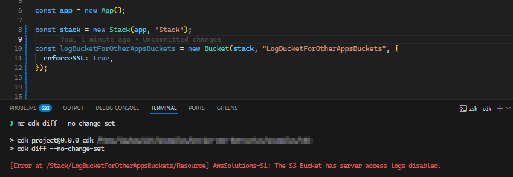

## Overview

How you secure cloud configuration often starts with cdk-nag, but many teams also use third-party tools after deployments.
Using the “server access logs not configured” example, this post shows how cdk-nag can interact with those tools by tagging log buckets created by the AWS CDK.

This example focuses on the AwsSolutions-S1 rule from the AWS Solutions ruleset (https://github.com/cdklabs/cdk-nag/blob/main/RULES.md#awssolutions).

As of [@jaykingson/cdk-nag-custom-nag-pack v0.0.11](https://github.com/JohannesKonings/cdk-nag-custom-nag-pack/releases/tag/v0.0.11), this behavior is available via a log bucket tagger and an AwsSolutions-S1 suppression helper.

## The cdk-nag log bucket behavior

If the log bucket and the source buckets are created in the same AWS CDK app, cdk-nag can identify that relationship and won’t raise AwsSolutions-S1 for the log bucket.
If the app only provides the log bucket for usage outside the app, cdk-nag will raise AwsSolutions-S1.



## The bridge to third party tools

If a third-party tool doesn’t check bucket dependencies and only checks whether the log bucket has server access logs enabled, it will still raise findings.
One universal approach is to suppress those findings based on tags on the bucket itself.

## The extension for cdk-nag to handle log bucket tagging

Because cdk-nag can identify the dependency within the app, it can also tag the log bucket to indicate that it is used for server access logs.
e.g. `isLogBucket=true` and for better visibility an additional tag `LogBucketTaggedBy=cdk-nag` (or however you want the source to look).

## The result

This app contains different usage patterns for log buckets and shows how the custom checks suppress and tag the log bucket.

<details>
<summary>TypeScript example</summary>

```typescript
#!/usr/bin/env node
import { App, Aspects, Stack } from "aws-cdk-lib";
import {
  CustomChecks,
  CustomChecksSuppressions,
} from "@jaykingson/cdk-nag-custom-nag-pack";
import { Bucket } from "aws-cdk-lib/aws-s3";

const app = new App();

// Create two separate CloudFormation stacks to demonstrate cross-stack resource references
// Stack 1 will contain the primary log bucket and a test bucket
const stack = new Stack(app, "Stack");
// Stack 2 will demonstrate referencing log buckets from different stacks
const stack2 = new Stack(app, "Stack2");

// Create a dedicated log bucket that will serve as the central logging destination
// for other application buckets across the infrastructure
const logBucketForOtherAppsBuckets = new Bucket(
  stack,
  "LogBucketForOtherAppsBuckets",
  {
    enforceSSL: true,
  },
);
// Usage of the new supression, which also tag as an log bucket
CustomChecksSuppressions.addLogBucketS1Suppression(
  logBucketForOtherAppsBuckets,
);

// Reference an existing log bucket in Stack2 by its ARN (Amazon Resource Name)
// This demonstrates importing external resources that may already exist in your AWS account
const logBucketLookup = Bucket.fromBucketArn(
  stack2,
  "LogBucketLookup",
  "arn:aws:s3:::log-bucket-lookup",
);

// Create another log bucket in Stack 1 for demonstration purposes
// This bucket will also serve as a logging destination for application buckets
const logBucket = new Bucket(stack, "LogBucket", {
  enforceSSL: true,
});

// Create a test application bucket in Stack 1 that logs access to the local log bucket
// This demonstrates the standard pattern: application bucket → log bucket (same stack)
new Bucket(stack, "TestBucket", {
  enforceSSL: true,
  serverAccessLogsBucket: logBucket,
});

// Create a test bucket in Stack2 that references the imported log bucket
// This shows how buckets can log to external/imported logging destinations
new Bucket(stack2, "TestBucketLookup", {
  enforceSSL: true,
  serverAccessLogsBucket: logBucketLookup,
});

// Create another test bucket in Stack2, but this time referencing the log bucket from Stack 1
// This demonstrates CROSS-STACK resource references - a powerful CDK feature
// CDK automatically creates the necessary CloudFormation exports/imports
new Bucket(stack2, "TestBucket2", {
  enforceSSL: true,
  serverAccessLogsBucket: logBucket,
});

// Apply custom CDK Nag checks to the entire application using the Aspects pattern
// Aspects run validation rules against all resources in the app before synthesis
Aspects.of(app).add(
  new CustomChecks({
    enableAwsSolutionChecks: true, // Enable AWS Solutions construct library compliance checks
    enableLogBucketTagger: true, // Automatically tag log buckets for third-party security scanners
  }),
);
```

</details>

`LogBucketForOtherAppsBucketsF118033B` has the suppression and the tags applied, and `LogBucketCC3B17E8` is treated as a log bucket because it is created and referenced within the app.

The synthesized CloudFormation template

<details>
<summary>CloudFormation template excerpt</summary>

```json
{
 "Resources": {
  "LogBucketForOtherAppsBucketsF118033B": {
   "Type": "AWS::S3::Bucket",
   "Properties": {
    "Tags": [
     {
      "Key": "isLogBucket",
      "Value": "true"
     },
     {
      "Key": "LogBucketTaggedBy",
      "Value": "cdkNagCustomChecks"
     }
    ]
   },
   "UpdateReplacePolicy": "Retain",
   "DeletionPolicy": "Retain",
   "Metadata": {
    "aws:cdk:path": "Stack/LogBucketForOtherAppsBuckets/Resource",
    "cdk_nag": {
     "rules_to_suppress": [
      {
       "reason": "This is intended to be a log bucket. Log bucket does not require access logging to prevent infinite loop",
       "id": "AwsSolutions-S1"
      }
     ]
    }
   }
  },
 ...
  "LogBucketCC3B17E8": {
   "Type": "AWS::S3::Bucket",
   "Properties": {
    "Tags": [
     {
      "Key": "isLogBucket",
      "Value": "true"
     },
     {
      "Key": "LogBucketTaggedBy",
      "Value": "cdkNagCustomChecks"
     }
    ]
   },
   "UpdateReplacePolicy": "Retain",
   "DeletionPolicy": "Retain",
   "Metadata": {
    "aws:cdk:path": "Stack/LogBucket/Resource",
    "cdk_nag": {
     "rules_to_suppress": [
      {
       "reason": "This is intended to be a log bucket. Log bucket does not require access logging to prevent infinite loop",
       "id": "AwsSolutions-S1"
      }
     ]
    }
   }
  },
  ...
  "TestBucket560B80BC": {
   "Type": "AWS::S3::Bucket",
   "Properties": {
    "LoggingConfiguration": {
     "DestinationBucketName": {
      "Ref": "LogBucketCC3B17E8"
     }
    }
   },
   "UpdateReplacePolicy": "Retain",
   "DeletionPolicy": "Retain",
   "Metadata": {
    "aws:cdk:path": "Stack/TestBucket/Resource"
   }
  },
  ...
  "CDKMetadata": {
   "Type": "AWS::CDK::Metadata",
   "Properties": {
    "Analytics": "v2:deflate64:H4sIAAAAAAAA/0WISw5AMBBAz2LfDoYTcAHhAFJVySiVmJaIuLtFJVbvg4AFQp6ok6UerVxogLvzSluhTu65gLsK2hov6sl9FtFsC+nr37GfR7htNDBzemAJOUKWzEwk9+A8rQbayBeDG/QVeAAAAA=="
   },
   "Metadata": {
    "aws:cdk:path": "Stack/CDKMetadata/Default"
   },
   "Condition": "CDKMetadataAvailable"
  }
 },
 "Outputs": {
  "ExportsOutputRefLogBucketCC3B17E818DCEC53": {
   "Value": {
    "Ref": "LogBucketCC3B17E8"
   },
   "Export": {
    "Name": "Stack:ExportsOutputRefLogBucketCC3B17E818DCEC53"
   }
  }
 },
}
```

</details>

## Sources and links

- https://github.com/cdklabs/cdk-nag/blob/main/RULES.md#awssolutions
- https://github.com/JohannesKonings/cdk-nag-custom-nag-pack/releases/tag/v0.0.11
- https://github.com/cdklabs/cdk-nag
