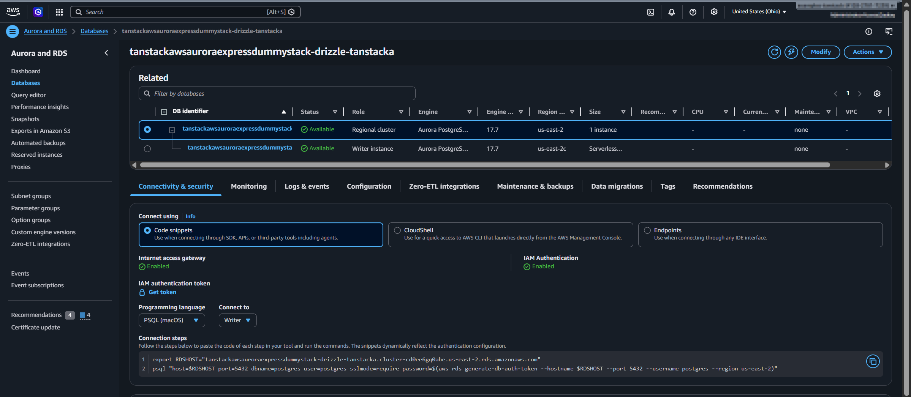
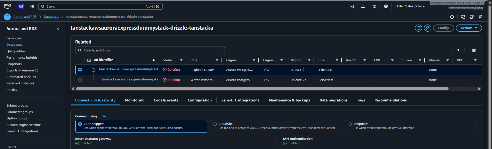
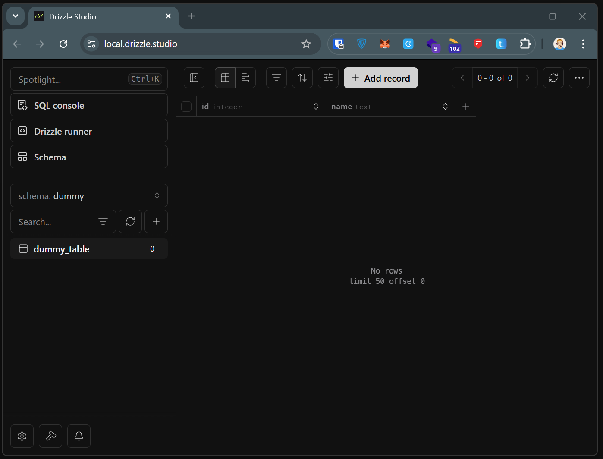
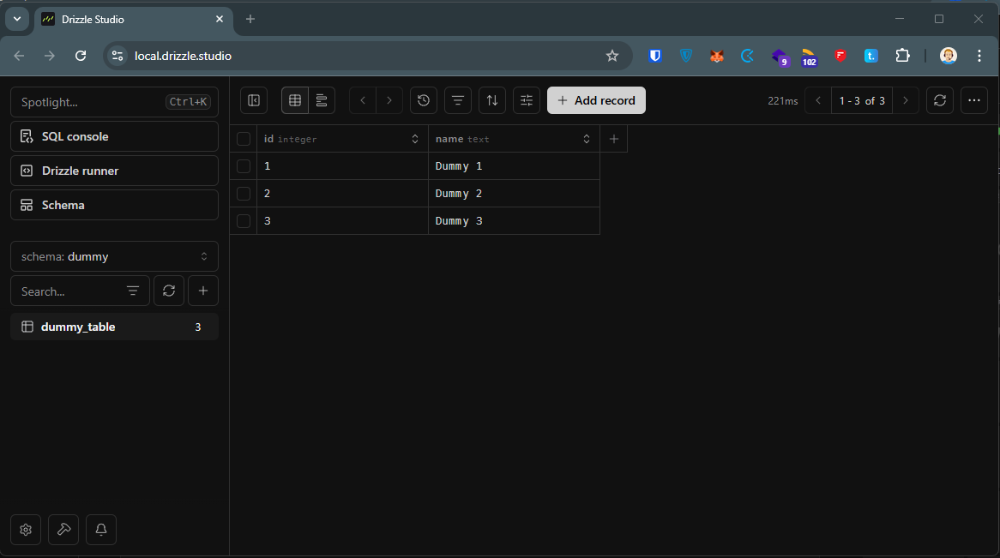

## Introduction

This post documents a setup for Aurora PostgreSQL **express configuration** with:

- AWS CDK deployment
- an AWS SDK-based custom resource (because CloudFormation support is not available yet)
- Drizzle Kit and Drizzle Studio for schema and data verification

The setup is not production-ready, but it can be used as a starting point for further development.

AWS launch post:
[Announcing Amazon Aurora PostgreSQL Serverless database creation in seconds](https://aws.amazon.com/blogs/aws/announcing-amazon-aurora-postgresql-serverless-database-creation-in-seconds/)

## CDK Custom Resource

Aurora express configuration currently requires calling the RDS API directly. In this setup, CDK uses `AwsCustomResource` with `CreateDBCluster` and cleanup calls.

API reference:
[CreateDBClusterCommand](https://docs.aws.amazon.com/AWSJavaScriptSDK/v3/latest/client/rds/command/CreateDBClusterCommand/)

```typescript
import { Names, Stack } from "aws-cdk-lib";
import { Effect, PolicyStatement } from "aws-cdk-lib/aws-iam";
import {
  AwsCustomResource,
  AwsCustomResourcePolicy,
  PhysicalResourceId,
} from "aws-cdk-lib/custom-resources";
import { NagSuppressions } from "cdk-nag";
import { Construct } from "constructs";

export type DbAuroraExpressDummyProps = {
  databaseName: string;
  maxCapacity: number;
  minCapacity: number;
  schemaName: string;
};

const toIdentifier = (value: string, maxLength: number): string => {
  const normalized = value.toLowerCase().replace(/[^a-z0-9-]/g, "-");
  const compacted = normalized.replace(/-+/g, "-").replace(/^-|-$/g, "");
  if (compacted.length <= maxLength) {
    return compacted;
  }
  return compacted.slice(0, maxLength).replace(/-+$/g, "");
};

export class DbAuroraExpressDummy extends Construct {
  public readonly clusterArn: string;
  public readonly databaseName: string;
  public readonly schemaName: string;

  constructor(scope: Construct, id: string, props: DbAuroraExpressDummyProps) {
    super(scope, id);

    this.databaseName = props.databaseName;
    this.schemaName = props.schemaName;
    const minCapacity = props.minCapacity;
    const maxCapacity = props.maxCapacity;

    const stack = Stack.of(this);
    const baseIdentifier = toIdentifier(`${Names.uniqueId(this)}`, 63);
    // Aurora Express creates an instance identifier from the cluster identifier
    // (suffix like "-instance-1"), so keep the cluster id shorter than 63 chars.
    const clusterIdentifier = toIdentifier(`${baseIdentifier}-aurora`, 52);

    const instanceIdentifier = `${clusterIdentifier}-instance-1`;

    const clusterResource = new AwsCustomResource(this, "ExpressClusterFallback", {
      policy: AwsCustomResourcePolicy.fromStatements([
        new PolicyStatement({
          effect: Effect.ALLOW,
          actions: [
            "ec2:DescribeAvailabilityZones",
            "iam:CreateServiceLinkedRole",
            "rds:CreateDBCluster",
            "rds:CreateDBInstance",
            "rds:DeleteDBCluster",
            "rds:DeleteDBInstance",
            "rds:DescribeDBClusters",
            "rds:EnableInternetAccessGateway",
          ],
          resources: ["*"],
        }),
      ]),
      installLatestAwsSdk: true,
      onCreate: {
        action: "createDBCluster",
        service: "RDS",
        ignoreErrorCodesMatching: "DBClusterAlreadyExistsFault",
        physicalResourceId: PhysicalResourceId.of(clusterIdentifier),
        parameters: {
          DBClusterIdentifier: clusterIdentifier,
          Engine: "aurora-postgresql",
          WithExpressConfiguration: true,
          // Keep explicit ACU limits while using Aurora express defaults.
          ServerlessV2ScalingConfiguration: {
            MinCapacity: minCapacity,
            MaxCapacity: maxCapacity,
          },
        },
      },
      onUpdate: {
        action: "describeDBClusters",
        service: "RDS",
        physicalResourceId: PhysicalResourceId.of(clusterIdentifier),
        parameters: {
          DBClusterIdentifier: clusterIdentifier,
          Engine: "aurora-postgresql",
          WithExpressConfiguration: true,
          // Keep explicit ACU limits while using Aurora express defaults.
          ServerlessV2ScalingConfiguration: {
            MinCapacity: minCapacity,
            MaxCapacity: maxCapacity,
          },
        },
      },
      onDelete: {
        action: "deleteDBCluster",
        service: "RDS",
        ignoreErrorCodesMatching: "DBClusterNotFoundFault",
        parameters: {
          DBClusterIdentifier: clusterIdentifier,
          DeleteAutomatedBackups: true,
          SkipFinalSnapshot: true,
        },
      },
    });

    const clusterLookupResource = new AwsCustomResource(this, "ExpressClusterLookup", {
      policy: AwsCustomResourcePolicy.fromStatements([
        new PolicyStatement({
          effect: Effect.ALLOW,
          actions: ["rds:DescribeDBClusters"],
          resources: ["*"],
        }),
      ]),
      installLatestAwsSdk: true,
      onCreate: {
        action: "describeDBClusters",
        service: "RDS",
        physicalResourceId: PhysicalResourceId.of(`${clusterIdentifier}-lookup`),
        parameters: {
          DBClusterIdentifier: clusterIdentifier,
        },
      },
      onUpdate: {
        action: "describeDBClusters",
        service: "RDS",
        physicalResourceId: PhysicalResourceId.of(`${clusterIdentifier}-lookup`),
        parameters: {
          DBClusterIdentifier: clusterIdentifier,
        },
      },
    });
    clusterLookupResource.node.addDependency(clusterResource);

    const instanceCleanupResource = new AwsCustomResource(this, "ExpressInstanceCleanup", {
      policy: AwsCustomResourcePolicy.fromStatements([
        new PolicyStatement({
          effect: Effect.ALLOW,
          actions: ["rds:DeleteDBInstance", "rds:DescribeDBInstances", "rds:DescribeDBClusters"],
          resources: ["*"],
        }),
      ]),
      installLatestAwsSdk: true,
      onCreate: {
        action: "describeDBClusters",
        service: "RDS",
        physicalResourceId: PhysicalResourceId.of(`${clusterIdentifier}-instance-cleanup`),
        parameters: {
          DBClusterIdentifier: clusterIdentifier,
        },
      },
      onUpdate: {
        action: "describeDBClusters",
        service: "RDS",
        physicalResourceId: PhysicalResourceId.of(`${clusterIdentifier}-instance-cleanup`),
        parameters: {
          DBClusterIdentifier: clusterIdentifier,
        },
      },
      onDelete: {
        action: "deleteDBInstance",
        service: "RDS",
        ignoreErrorCodesMatching: "DBInstanceNotFoundFault|InvalidDBInstanceStateFault",
        parameters: {
          DBInstanceIdentifier: instanceIdentifier,
          DeleteAutomatedBackups: true,
          SkipFinalSnapshot: true,
        },
      },
    });
    instanceCleanupResource.node.addDependency(clusterResource);

    this.clusterArn = clusterLookupResource.getResponseField("DBClusters.0.DBClusterArn");
  }
}
```

## Aurora deployment observations

From Aurora PostgreSQL express configuration documentation and deployment output:

- The cluster is created without VPC association.
- Internet access gateway is enabled for connectivity.
- IAM authentication is required for gateway-based access.
- Encryption uses an AWS/RDS managed key (a customer-managed KMS key cannot be selected at create time in this flow).
- Data API is disabled by default at create time; it can be enabled later, with authentication constraints documented by AWS ([Express configuration settings](https://docs.aws.amazon.com/AmazonRDS/latest/AuroraUserGuide/CHAP_GettingStartedAurora.AuroraPostgreSQL.ExpressConfig.html#CHAP_GettingStartedAurora.AuroraPostgreSQL.ExpressConfig.Settings), [enabling](https://docs.aws.amazon.com/AmazonRDS/latest/AuroraUserGuide/data-api.enabling.html), [usage and auth model](https://docs.aws.amazon.com/AmazonRDS/latest/AuroraUserGuide/data-api.html)). I have not managed to get Data API working with this express setup yet.



## Teardown behavior

The custom resource includes explicit delete calls for both cluster and instance identifiers. During stack deletion, the cluster and instance cleanup sequence is visible in the AWS console. This is useful for ephemeral feature stacks where database infrastructure should be created and removed per branch or short-lived environment.



## Drizzle integration

Drizzle is used for schema push, local studio inspection, and a simple seed script. Environment variables in this setup are managed with Varlock.

[Varlock documentation](https://varlock.dev/)

[Drizzle ORM documentation](https://orm.drizzle.team/)

This setup was tested with the Drizzle beta track, which is expected to become v1 soon.

### Required packages

Install these npm packages before running the examples:

- Runtime dependencies:
  `vp add @aws-sdk/rds-signer drizzle-orm pg varlock`
- Dev/tooling dependencies:
  `vp add -D drizzle-kit @types/pg`

Note: this repository uses Vite+, so commands in this post use `vp` wrappers (such as `vp add`, `vp exec`, and `vp run`) instead of direct `npm` or `pnpm` commands.

### Configuration (`drizzle-kit`)

```typescript
import { Signer } from "@aws-sdk/rds-signer";
import { defineConfig } from "drizzle-kit";
import { ENV } from "varlock/env";

const hostname = ENV.HOSTNAME;
const port = 5432;
const username = "postgres";
const database = "postgres";

const signer = new Signer({
  region: ENV.AWS_REGION,
  hostname,
  port,
  username,
});

const password = await signer.getAuthToken();

export default defineConfig({
  dialect: "postgresql",
  schema: "dummySchema.ts",
  dbCredentials: {
    host: hostname,
    port,
    user: username,
    password,
    database,
    ssl: true,
  },
});
```

### Schema

```typescript
import { integer, pgSchema, text } from "drizzle-orm/pg-core";

export const DUMMY_SCHEMA_NAME = "dummy";
export const dummySchema = pgSchema(DUMMY_SCHEMA_NAME);

export const dummyTable = dummySchema.table("dummy_table", {
  id: integer("id").primaryKey(),
  name: text("name").notNull(),
});
```

Run this command to apply schema changes:
`vp exec varlock run -- vp exec drizzle-kit push --config=drizzle-user-password.config.ts`

Run this command to open Drizzle Studio:
` vp exec varlock run -- vp exec drizzle-kit studio --config=drizzle-user-password.config.ts`

Studio before seeding (table exists, no rows):



### Seeding script

```typescript
#!/usr/bin/env node
/* oxlint-disable no-console */

import { Signer } from "@aws-sdk/rds-signer";
import { drizzle } from "drizzle-orm/node-postgres";
import { ENV } from "varlock/env";
import { dummyTable } from "../dummySchema.ts";

const hostname = ENV.HOSTNAME;
const port = 5432;
const username = "postgres";
const database = "postgres";

const signer = new Signer({
  region: ENV.AWS_REGION,
  hostname,
  port,
  username,
});

const password = await signer.getAuthToken();

console.log(ENV.HOSTNAME);
console.log(ENV.AWS_REGION);

const db = drizzle({
  connection: {
    host: hostname,
    port,
    user: username,
    password,
    database,
    ssl: true,
  },
});

await db.delete(dummyTable);

const insertResult = await db.insert(dummyTable).values([
  { id: 1, name: "Dummy 1" },
  { id: 2, name: "Dummy 2" },
  { id: 3, name: "Dummy 3" },
]);

console.log(insertResult);
```

`vp exec varlock run -- node scripts/seed-dummy.ts`

## Result

- Schema `dummy.dummy_table` is created successfully via Drizzle Kit.
- Seed script inserts three rows (`id` 1..3).
- Drizzle Studio confirms data visibility through the IAM-authenticated Aurora Express connection.



## Conclusion

Aurora PostgreSQL express configuration can be integrated into a CDK workflow today by using AWS SDK custom resources for create/delete operations. Drizzle works with this setup when authentication tokens are generated through the RDS signer and passed to Drizzle tooling/runtime.

## Sources and References

- **AWS announcement**: [Announcing Amazon Aurora PostgreSQL Serverless database creation in seconds](https://aws.amazon.com/blogs/aws/announcing-amazon-aurora-postgresql-serverless-database-creation-in-seconds/)
- **Aurora Express configuration docs**: [Creating and connecting to an Aurora PostgreSQL cluster with express configuration](https://docs.aws.amazon.com/AmazonRDS/latest/AuroraUserGuide/CHAP_GettingStartedAurora.AuroraPostgreSQL.ExpressConfig.html)
- **RDS Data API enablement**: [Enabling the Amazon RDS Data API](https://docs.aws.amazon.com/AmazonRDS/latest/AuroraUserGuide/data-api.enabling.html)
- **RDS Data API usage/auth**: [Using the Amazon RDS Data API](https://docs.aws.amazon.com/AmazonRDS/latest/AuroraUserGuide/data-api.html)
- **RDS API (SDK v3)**: [CreateDBClusterCommand](https://docs.aws.amazon.com/AWSJavaScriptSDK/v3/latest/client/rds/command/CreateDBClusterCommand/)
- **Varlock**: [varlock.dev](https://varlock.dev/)
- **Drizzle ORM**: [orm.drizzle.team](https://orm.drizzle.team/)
- **Drizzle Kit**: [orm.drizzle.team/docs/drizzle-kit-overview](https://orm.drizzle.team/docs/drizzle-kit-overview)
