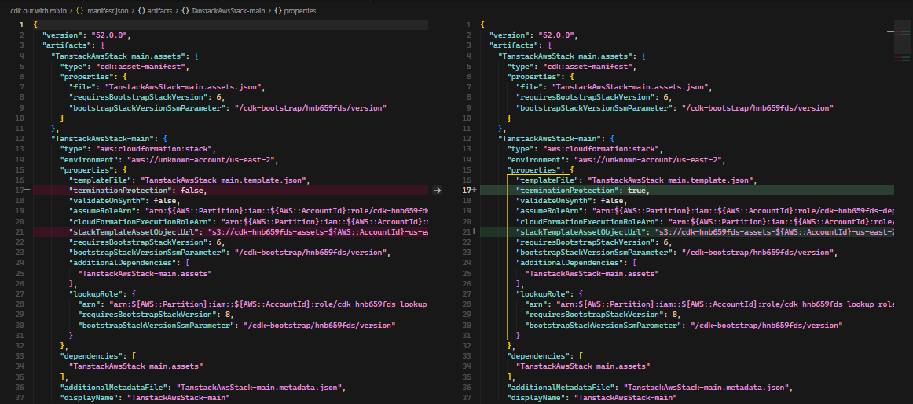
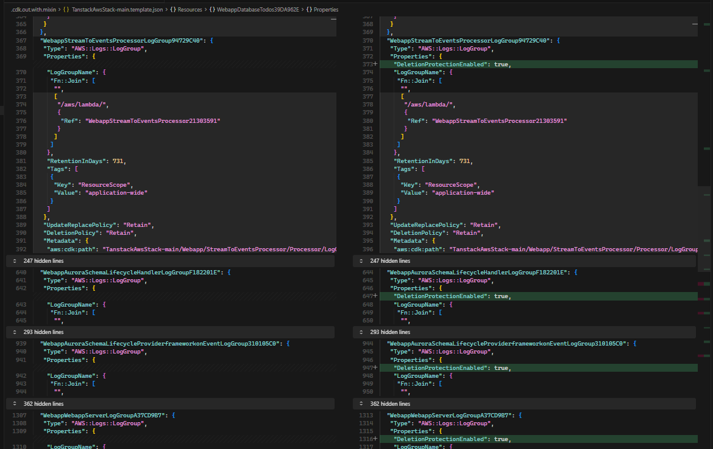
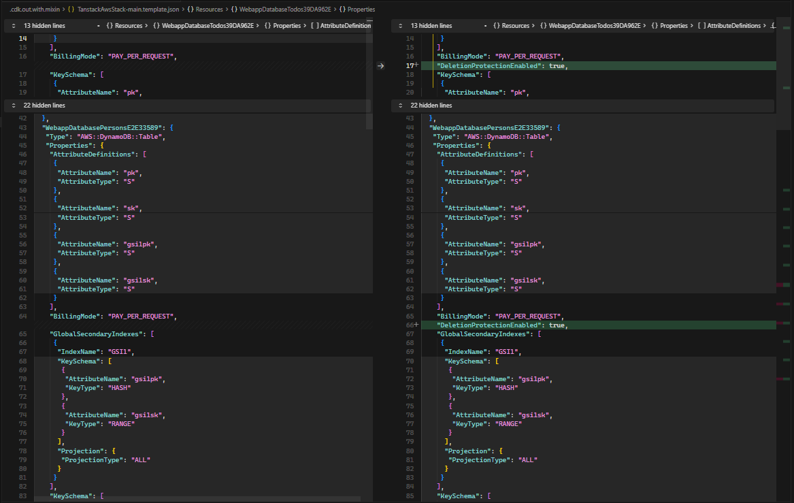

## Introduction

This post builds on the [AWS CDK Ephemeral Stacks Cleanup](./2025-06-14-aws-cdk-ephemeral-stacks-cleanup) pattern and focuses on permanent environments.  
For permanent stacks, the goal is to couple CDK removal policies with CloudFormation deletion protection so critical resources are harder to delete by accident.

## Mixin

A CDK mixin applies cross-cutting behavior across many constructs from one place.  
This `DeletionProtectionMixin` sets stack-level termination protection and, for selected CloudFormation resources, enables deletion protection only when a retain-style removal policy is present.

The mapping in `applyTo` follows CloudFormation property names:

- `Stack.terminationProtection` for stacks
- `deletionProtectionEnabled` for `AWS::Logs::LogGroup` and `AWS::DynamoDB::Table`
- `deletionProtection` for supported RDS, DocumentDB, and Neptune resources

By checking `hasRetainRemovalPolicy` first, the mixin keeps lifecycle intent aligned: resources marked to be retained also get deletion-protection settings where the service supports them.

```typescript
import { CfnDeletionPolicy, CfnResource, Mixin, Stack } from "aws-cdk-lib";
import * as docdb from "aws-cdk-lib/aws-docdb";
import * as dynamodb from "aws-cdk-lib/aws-dynamodb";
import * as logs from "aws-cdk-lib/aws-logs";
import * as neptune from "aws-cdk-lib/aws-neptune";
import * as rds from "aws-cdk-lib/aws-rds";
import type { IConstruct } from "constructs";

const hasRetainRemovalPolicy = (resource: CfnResource): boolean => {
  const { deletionPolicy, updateReplacePolicy } = resource.cfnOptions;
  return (
    deletionPolicy === CfnDeletionPolicy.RETAIN ||
    deletionPolicy === CfnDeletionPolicy.RETAIN_EXCEPT_ON_CREATE ||
    updateReplacePolicy === CfnDeletionPolicy.RETAIN ||
    updateReplacePolicy === CfnDeletionPolicy.RETAIN_EXCEPT_ON_CREATE
  );
};

export class DeletionProtectionMixin implements Mixin {
  public supports(construct: IConstruct): boolean {
    return (
      construct instanceof Stack ||
      construct instanceof logs.CfnLogGroup ||
      construct instanceof dynamodb.CfnTable ||
      construct instanceof rds.CfnDBCluster ||
      construct instanceof rds.CfnDBInstance ||
      construct instanceof rds.CfnGlobalCluster ||
      construct instanceof docdb.CfnDBCluster ||
      construct instanceof docdb.CfnGlobalCluster ||
      construct instanceof neptune.CfnDBCluster
    );
  }

  public applyTo(construct: IConstruct): IConstruct {
    if (construct instanceof Stack) {
      construct.terminationProtection = true;
      return construct;
    }

    if (!(construct instanceof CfnResource) || !hasRetainRemovalPolicy(construct)) {
      return construct;
    }

    if (construct instanceof logs.CfnLogGroup || construct instanceof dynamodb.CfnTable) {
      construct.deletionProtectionEnabled = true;
      return construct;
    }

    if (
      construct instanceof rds.CfnDBCluster ||
      construct instanceof rds.CfnDBInstance ||
      construct instanceof rds.CfnGlobalCluster ||
      construct instanceof docdb.CfnDBCluster ||
      construct instanceof docdb.CfnGlobalCluster ||
      construct instanceof neptune.CfnDBCluster
    ) {
      construct.deletionProtection = true;
    }

    return construct;
  }
}

/*
Known future expansion targets.

Top-level boolean-style deletionProtection:
AWS::RDS::DBCluster, AWS::RDS::DBInstance, AWS::RDS::GlobalCluster,
AWS::DocDB::DBCluster, AWS::DocDB::GlobalCluster, AWS::Neptune::DBCluster,
AWS::EKS::Cluster, AWS::QLDB::Ledger, AWS::NeptuneGraph::Graph

Top-level boolean-style deletionProtectionEnabled:
AWS::Logs::LogGroup, AWS::DynamoDB::Table, AWS::DSQL::Cluster,
AWS::SMSVOICE::PhoneNumber, AWS::SMSVOICE::Pool,
AWS::SMSVOICE::ProtectConfiguration, AWS::SMSVOICE::SenderId

Non-boolean mapping required:
AWS::Cognito::UserPool (ACTIVE|INACTIVE),
AWS::AutoScaling::AutoScalingGroup (none|prevent-force-deletion|prevent-all-deletion),
AWS::VerifiedPermissions::PolicyStore ({ mode: ENABLED|DISABLED })

Nested-only:
AWS::DynamoDB::GlobalTable.ReplicaSpecification.DeletionProtectionEnabled
*/
```

## app

At the app boundary, lifecycle determines which global policy is applied:

- Ephemeral stages use destroy-style cleanup behavior.
- Permanent stages apply `DeletionProtectionMixin` so stacks and selected stateful resources gain deletion protection.

Applying the mixin once at `App` scope avoids repeating the same protection logic in every stack.

```typescript
#!/usr/bin/env node
import { execSync } from 'node:child_process';
import { App, Mixins, RemovalPolicies, Tags } from 'aws-cdk-lib';
import { mixins as s3Mixins } from 'aws-cdk-lib/aws-s3';
import { DeletionProtectionMixin } from '../lib/mixins/DeletionProtection.ts';
// import { AwsSolutionsChecks, ServerlessChecks } from 'cdk-nag';
import {
  APPLICATION_RESOURCE_SCOPE_TAG_VALUE,
  RESOURCE_SCOPE_TAG_KEY,
} from '../lib/resource-tags.ts';
import { resolveStageLifecycle, resolveStageName } from '../lib/stage-name.ts';
import { TanstackAwsAuroraExpressDummyStack, TanstackAwsStack } from '../lib/tanstack-aws.ts';
import { WORKLOAD_REGION } from '../lib/workload-region.ts';

const workloadAccount = process.env.CDK_DEFAULT_ACCOUNT;

const app = new App();
Tags.of(app).add(RESOURCE_SCOPE_TAG_KEY, APPLICATION_RESOURCE_SCOPE_TAG_VALUE);

const resolveLocalGitBranch = (): string | undefined => {
  try {
    const branchName = execSync('git rev-parse --abbrev-ref HEAD', {
      encoding: 'utf8',
      stdio: ['ignore', 'pipe', 'ignore'],
    }).trim();
    return branchName && branchName !== 'HEAD' ? branchName : undefined;
  } catch {
    return undefined;
  }
};

const stageSource =
  process.env.APP_STAGE ??
  process.env.GITHUB_HEAD_REF ??
  process.env.GITHUB_REF_NAME ??
  resolveLocalGitBranch();

const appStage = resolveStageName(stageSource, {
  fallbackStage: 'dev',
  lifecycle: 'permanent',
});
const appLifecycle = resolveStageLifecycle(appStage);

// oxlint-disable-next-line no-console
console.log(`Deploying to stage: ${appStage} in region: ${WORKLOAD_REGION}`);

new TanstackAwsStack(app, `TanstackAwsStack-${appStage}`, {
  appStage,
  env: { account: workloadAccount, region: WORKLOAD_REGION },
});

...

if (appLifecycle === 'ephemeral') {
  RemovalPolicies.of(app).destroy();
  Mixins.of(app).apply(new s3Mixins.BucketAutoDeleteObjects());
} else if (appLifecycle === 'permanent') {
  Mixins.of(app).apply(new DeletionProtectionMixin());
} else {
  throw new Error(`Unknown appLifecycle: ${appLifecycle}`);
}
```

## Result


_Stack-level protection: termination protection is enabled for the permanent environment._


_Log group protection: `DeletionProtectionEnabled` is set alongside retain-style lifecycle intent._


_DynamoDB protection: table deletion protection is active for persistent data._

## Conclusion

A deletion-protection mixin gives permanent environments a consistent baseline: enforce stack termination protection, then enable resource-level deletion protection only for supported services and only when retain-style policies indicate persistence intent. This centralization reduces configuration drift, keeps lifecycle behavior predictable during updates and deletes, and makes the policy easy to apply uniformly at app scope.

The boundary is intentional: not every CloudFormation resource exposes a native deletion-protection control, and some services require non-boolean or nested mappings. The safest extension path is to add resource types incrementally, document each property mapping explicitly, and keep the retain-policy gate so deletion protection remains aligned with lifecycle intent rather than applied indiscriminately.

Aspects and property injection were also valid options for this problem space. In practice, property injection is scoped per construct type rather than as one cross-resource mapping, while aspects are more naturally geared toward traversal, validation, and invariant checks than direct cross-service property manipulation.

## Sources and References

- **Earlier pattern this post builds on**: [AWS CDK Ephemeral Stacks Cleanup](https://johanneskonings.dev/blog/2025-06-14-aws-cdk-ephemeral-stacks-cleanup)
- **CDK mixins guide**: [Mixins - AWS CDK v2 Developer Guide](https://docs.aws.amazon.com/cdk/v2/guide/mixins.html)
- **CDK aspects guide**: [Aspects - AWS CDK v2 Developer Guide](https://docs.aws.amazon.com/cdk/v2/guide/aspects.html)
- **CDK blueprints and property injection**: [Configure constructs with CDK Blueprints - AWS CDK v2 Developer Guide](https://docs.aws.amazon.com/cdk/v2/guide/blueprints.html)
- **Stack termination protection**: [AWS CDK API Reference - `StackProps.terminationProtection`](https://docs.aws.amazon.com/cdk/api/v2/docs/aws-cdk-lib.StackProps.html#terminationprotection)
- **CloudFormation deletion lifecycle**: [DeletionPolicy attribute](https://docs.aws.amazon.com/AWSCloudFormation/latest/TemplateReference/aws-attribute-deletionpolicy.html)
- **CloudFormation replacement lifecycle**: [UpdateReplacePolicy attribute](https://docs.aws.amazon.com/AWSCloudFormation/latest/UserGuide/aws-attribute-updatereplacepolicy.html)
- **Dependency-injection tradeoffs**: [Inversion of Control Containers and the Dependency Injection pattern (Martin Fowler)](https://martinfowler.com/articles/injection.html)
- **CloudWatch Logs deletion protection**: [AWS::Logs::LogGroup (`DeletionProtectionEnabled`)](https://docs.aws.amazon.com/AWSCloudFormation/latest/TemplateReference/aws-resource-logs-loggroup.html)
- **DynamoDB deletion protection**: [AWS::DynamoDB::Table (`DeletionProtectionEnabled`)](https://docs.aws.amazon.com/AWSCloudFormation/latest/TemplateReference/aws-resource-dynamodb-table.html)
- **RDS deletion protection**: [AWS::RDS::DBCluster (`DeletionProtection`)](https://docs.aws.amazon.com/AWSCloudFormation/latest/TemplateReference/aws-resource-rds-dbcluster.html), [AWS::RDS::DBInstance (`DeletionProtection`)](https://docs.aws.amazon.com/AWSCloudFormation/latest/TemplateReference/aws-resource-rds-dbinstance.html), [AWS::RDS::GlobalCluster (`DeletionProtection`)](https://docs.aws.amazon.com/AWSCloudFormation/latest/TemplateReference/aws-resource-rds-globalcluster.html)
- **DocumentDB deletion protection**: [AWS::DocDB::DBCluster (`DeletionProtection`)](https://docs.aws.amazon.com/AWSCloudFormation/latest/TemplateReference/aws-resource-docdb-dbcluster.html), [AWS::DocDB::GlobalCluster (`DeletionProtection`)](https://docs.aws.amazon.com/AWSCloudFormation/latest/TemplateReference/aws-resource-docdb-globalcluster.html)
- **Neptune deletion protection**: [AWS::Neptune::DBCluster (`DeletionProtection`)](https://docs.aws.amazon.com/AWSCloudFormation/latest/TemplateReference/aws-resource-neptune-dbcluster.html)
