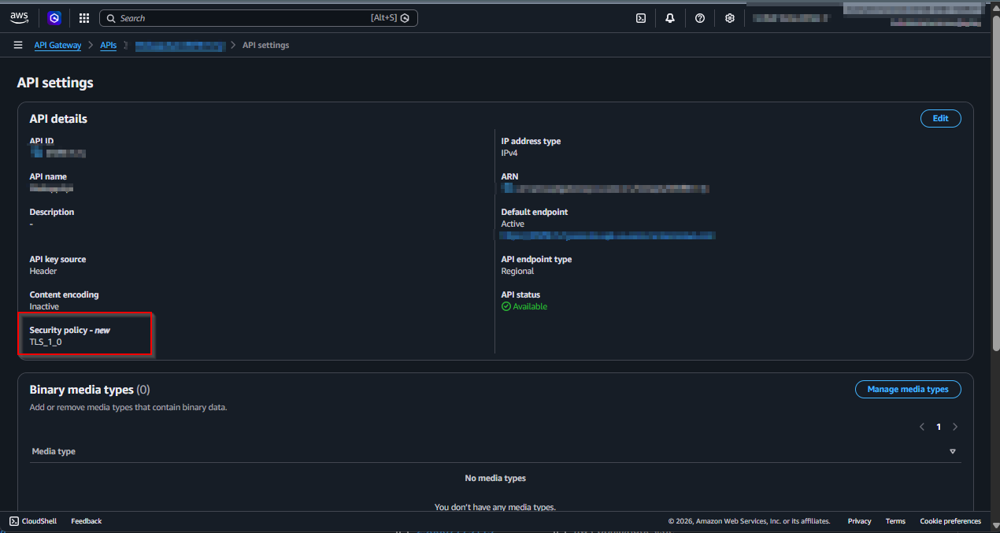
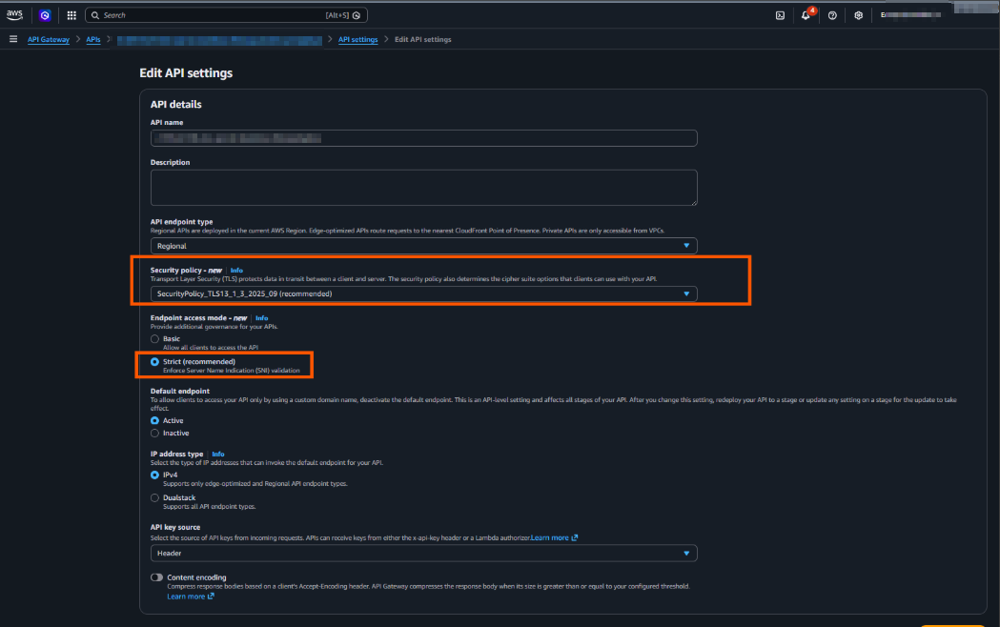

## Introduction

API Gateway REST APIs can still come up with legacy TLS defaults that prioritize backward
compatibility over a stricter security baseline. If you want a consistent policy such as
`SecurityPolicy_TLS13_1_3_2025_09` plus `EndpointAccessMode.STRICT`, wiring this by hand on
every API quickly becomes repetitive and easy to miss.

This post shows a cleaner approach: apply a CDK property mixin (`CfnRestApiPropsMixin`) once,
close to app scope, and let that policy flow to each targeted API Gateway REST API.

- **What changed in 2025**: On **Nov 19, 2025**, AWS announced additional enhanced TLS security
  policies for API Gateway REST APIs and custom domain names (the `SecurityPolicy_*` family,
  including TLS 1.3-only options). ([AWS announcement](https://aws.amazon.com/about-aws/whats-new/2025/11/amazon-api-gateway-tls-security-rest-apis/))
- **What existed before that**: REST APIs already supported legacy policies (`TLS_1_0` and
  `TLS_1_2`), but not the newer hardened policy set. ([REST API security policies](https://docs.aws.amazon.com/apigateway/latest/developerguide/apigateway-security-policies.html))
- **Current default behavior**: API Gateway still assigns legacy defaults when you create new
  resources (`TLS_1_0` for Regional and edge-optimized REST APIs, `TLS_1_2` for private APIs
  and domains). ([Supported security policies](https://docs.aws.amazon.com/apigateway/latest/developerguide/apigateway-security-policies-list.html))
- **Why strict is not default**: AWS keeps broad client compatibility as the default. Moving to
  enhanced policies and `STRICT` endpoint access mode can break older clients or clients using
  hostname/SNI patterns that do not satisfy strict checks, so AWS recommends migrating in phases
  (`BASIC` first, then `STRICT` after validation). ([AWS Compute Blog migration guidance](https://aws.amazon.com/blogs/compute/enhancing-api-security-with-amazon-api-gateway-tls-security-policies/))

For this reason, this article uses a CDK mixin to codify the stricter choice explicitly, rather
than relying on service defaults.



## Why a CDK mixin for this aspect?

The goal here is not broad reuse. The primary reason is type safety: the mixin extends the L2
`RestApi` API with compile-time-checked configuration for TLS posture, instead of relying on
string-based overrides. That gives earlier feedback, safer refactors, and clearer intent at the
construct boundary while preserving L2 ergonomics. An escape hatch would still work, but it shifts
the change to ad-hoc, stringly L1 mutations that are easier to break and harder to review.

## API GW

```typescript
import { CfnRestApiPropsMixin } from "@aws-cdk/cfn-property-mixins/aws-apigateway";
import { App, Stack } from "aws-cdk-lib";
import {
  EndpointAccessMode,
  EndpointType,
  RestApi,
  SecurityPolicy,
} from "aws-cdk-lib/aws-apigateway";

const app = new App();
const stack = new Stack(app, "ApiStack");

const apiGw = new RestApi(stack, "ApiGw", {
  endpointConfiguration: { types: [EndpointType.REGIONAL] },
});

apiGw.with(
  new CfnRestApiPropsMixin({
    securityPolicy: SecurityPolicy.TLS13_1_3_2025_09,
    endpointAccessMode: EndpointAccessMode.STRICT,
  }),
);
```

## Result



## Conclusion

If your security baseline requires modern TLS for API Gateway, rely on explicit policy instead of
defaults. A CDK mixin keeps the configuration centralized, consistent, and reviewable while still
supporting staged rollout (`BASIC` to `STRICT`) when client compatibility is uncertain.

## Sources and References

- **Earlier pattern this post builds on**: [AWS CDK Ephemeral Stacks Cleanup](https://johanneskonings.dev/blog/2025-06-14-aws-cdk-ephemeral-stacks-cleanup)
- **CDK mixins guide**: [Mixins - AWS CDK v2 Developer Guide](https://docs.aws.amazon.com/cdk/v2/guide/mixins.html)
- **REST API security policies**: [Security policies for REST APIs in API Gateway](https://docs.aws.amazon.com/apigateway/latest/developerguide/apigateway-security-policies.html)
- **Default and supported policy matrix**: [Supported security policies](https://docs.aws.amazon.com/apigateway/latest/developerguide/apigateway-security-policies-list.html)
- **API model (`securityPolicy`, `endpointAccessMode`)**: [CreateRestApi API Reference](https://docs.aws.amazon.com/apigateway/latest/api/API_CreateRestApi.html)
- **Launch announcement (enhanced TLS policies)**: [Amazon API Gateway now supports additional TLS security policies for REST APIs](https://aws.amazon.com/about-aws/whats-new/2025/11/amazon-api-gateway-tls-security-rest-apis/)
- **Deep-dive and migration guidance**: [Enhancing API security with Amazon API Gateway TLS security policies](https://aws.amazon.com/blogs/compute/enhancing-api-security-with-amazon-api-gateway-tls-security-policies/)
