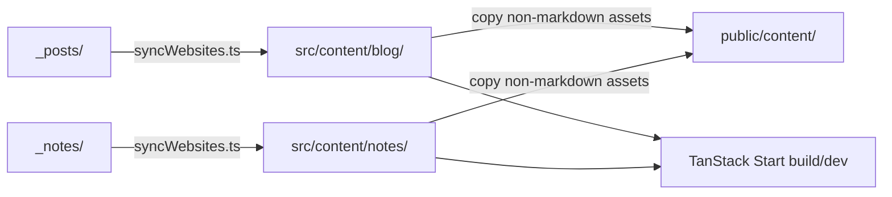

# Website Sync System Specification

## Overview

This repository uses a root-owned content model with a single TanStack website at the repository root.

Authored content lives outside the app in:

- `_posts/`
- `_notes/`

The application consumes generated copies in:

- `src/content/blog/`
- `src/content/notes/`
- `public/content/`

The sync boundary is implemented by `scripts/syncWebsites.ts`.

## Core Rules

- `_posts/` and `_notes/` are the single source of truth.
- Never edit `src/content/` directly.
- Never edit `public/content/` directly.
- All content-related build and dev flows must continue to run through the sync step.

## Sync Flow



## Operational Behavior

The sync script must:

1. Copy blog content from `_posts/` to `src/content/blog/`.
2. Copy notes content from `_notes/` to `src/content/notes/`.
3. Strip legacy `layout:` frontmatter from synced markdown.
4. Mirror only non-markdown synced assets into `public/content/` so relative asset URLs resolve consistently.

## Commands

Use root-level `vp` workflows:

```bash
vp run sync
vp run dev
vp run build
vp run start
```

`dev`, `build`, and `start` should run the sync step automatically.

## File Structure

```text
repository-root/
├── _posts/                  # Edit here
├── _notes/                  # Edit here
├── src/
│   └── content/
│       ├── blog/            # Generated/synced copies
│       └── notes/           # Generated/synced copies
├── public/
│   └── content/             # Generated asset mirror
├── scripts/
│   └── syncWebsites.ts
└── specs/
    ├── website-sync-system.md
    └── website-tanstack.md
```

## Maintenance Notes

- Keep synced directories disposable.
- Keep content path assumptions centralized in `scripts/syncWebsites.ts` and the build/verification scripts.
- Update this spec whenever the sync destinations, command surface, or asset-handling contract changes.
