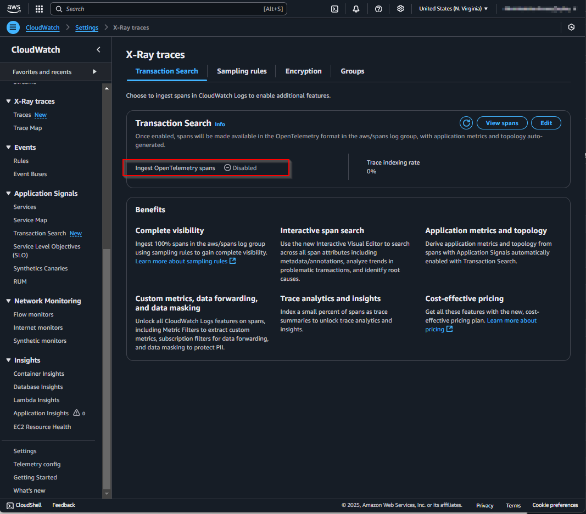
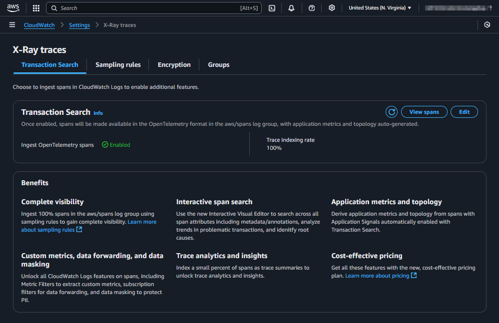

## Update 2025-06-18: Provisioning with CloudFormation

Recently, AWS added native CloudFormation support for provisioning Application Signals Transaction Search. You can find the official documentation here:

[https://docs.aws.amazon.com/AmazonCloudWatch/latest/monitoring/CloudWatch-Transaction-Search-Cloudformation.html](https://docs.aws.amazon.com/AmazonCloudWatch/latest/monitoring/CloudWatch-Transaction-Search-Cloudformation.html)

Here is an example of how to implement it in the AWS CDK:

```typescript
import { CfnTransactionSearchConfig } from "aws-cdk-lib/aws-xray";
import { CfnResourcePolicy } from "aws-cdk-lib/aws-logs";

const { account, partition, region } = Stack.of(this);

const transactionSearchAccess = new CfnResourcePolicy(
  this,
  "XRayLogResourcePolicy",
  {
    policyName: "TransactionSearchAccess",
    policyDocument: JSON.stringify({
      Version: "2012-10-17",
      Statement: [
        {
          Sid: "TransactionSearchXRayAccess",
          Effect: "Allow",
          Principal: {
            Service: "xray.amazonaws.com",
          },
          Action: "logs:PutLogEvents",
          Resource: [
            `arn:${partition}:logs:${region}:${account}:log-group:aws/spans:*`,
            `arn:${partition}:logs:${region}:${account}:log-group:/aws/application-signals/data:*`,
          ],
          Condition: {
            ArnLike: {
              "aws:SourceArn": `arn:${partition}:xray:${region}:${account}:*`,
            },
            StringEquals: {
              "aws:SourceAccount": account,
            },
          },
        },
      ],
    }),
  },
);

const transactionSearchConfig = new CfnTransactionSearchConfig(
  this,
  "XRayTransactionSearchConfig",
  {
    indexingPercentage: 100,
  },
);

transactionSearchConfig.node.addDependency(transactionSearchAccess);
```

⚠️ To avoid the following error, you must first update the X-Ray segment destination to `XRay` before creating the Transaction Search Config again with CloudFormation:

```sh
aws xray update-trace-segment-destination --destination XRay
```

Without this step, you may encounter this error:

```sh
1:24:42 PM | CREATE_FAILED        | AWS::XRay::TransactionSearchConfig             | ApplicationsSignal...archConfigF88EF961
Resource handler returned message: "null" (RequestToken: 94079df2-4a8f-2771-a3e4-03eb0ccbc436, HandlerErrorCode: AlreadyExists)
```

_(The rest of this post describes the original method using custom resources, which is still useful for understanding the underlying API calls.)_

## Use Case

This guide is for you if you want to use [AWS CloudWatch Application Signals Transaction Search](https://docs.aws.amazon.com/AmazonCloudWatch/latest/monitoring/CloudWatch-Application-Monitoring-Sections.html) and your Infrastructure as Code (IaC) is based on the AWS CDK.

## Setup

This is how the Transaction Search page looks when it's not yet configured:


And this is how it appears in the X-Ray settings:



The official AWS documentation outlines the steps to enable Transaction Search here: [https://docs.aws.amazon.com/AmazonCloudWatch/latest/monitoring/CloudWatch-Transaction-Search-getting-started.html#w24aac24c21c13b9](https://docs.aws.amazon.com/AmazonCloudWatch/latest/monitoring/CloudWatch-Transaction-Search-getting-started.html#w24aac24c21c13b9)

While the documentation provides AWS CLI commands, this post will show you how to implement the same configuration using AWS CDK Custom Resources for a true Infrastructure as Code approach.

The complete CDK implementation using custom resources looks like this:

```typescript
const { account, region } = Stack.of(this);

// https://docs.aws.amazon.com/AmazonCloudWatch/latest/monitoring/CloudWatch-Transaction-Search-getting-started.html#w24aac24c21c13b9
const applicationSignalsTransactionSearchLogsResourcePolicy =
  new AwsCustomResource(
    this,
    "ApplicationSignalsTransactionSearchLogsResourcePolicy",
    {
      onCreate: {
        service: "@aws-sdk/client-cloudwatch-logs",
        action: "PutResourcePolicy",
        parameters: {
          policyName: "ApplicationSignalsTransactionSearchLogsResourcePolicy",
          policyDocument: JSON.stringify({
            Version: "2012-10-17",
            Statement: [
              {
                Sid: "TransactionSearchXRayAccess",
                Effect: "Allow",
                Principal: {
                  Service: "xray.amazonaws.com",
                },
                Action: ["logs:PutLogEvents", "logs:CreateLogStream"],
                Resource: [
                  `arn:aws:logs:${region}:${account}:log-group:aws/spans:*`,
                  `arn:aws:logs:${region}:${account}:log-group:/aws/application-signals/data:*`,
                ],
                Condition: {
                  ArnLike: {
                    "aws:SourceArn": `arn:aws:xray:${region}:${account}:*`,
                  },
                  StringEquals: {
                    "aws:SourceAccount": account,
                  },
                },
              },
            ],
          }),
        },
        physicalResourceId: PhysicalResourceId.of(
          "ApplicationSignalsTransactionSearchLogsResourcePolicy",
        ),
      },
      policy: AwsCustomResourcePolicy.fromSdkCalls({
        resources: AwsCustomResourcePolicy.ANY_RESOURCE,
      }),
    },
  );
const applicationSignalsTransactionSearchXraySegmentDestination =
  new AwsCustomResource(
    this,
    "ApplicationSignalsTransactionSearchXraySegmentDestination",
    {
      onCreate: {
        service: "@aws-sdk/client-xray",
        action: "UpdateTraceSegmentDestination",
        parameters: {
          Destination: "CloudWatchLogs",
        },
        physicalResourceId: PhysicalResourceId.of(
          "ApplicationSignalsTransactionSearchXraySegmentDestination",
        ),
      },
      installLatestAwsSdk: true,
      policy: AwsCustomResourcePolicy.fromStatements([
        new PolicyStatement({
          effect: Effect.ALLOW,
          actions: ["logs:PutRetentionPolicy"],
          resources: [
            `arn:aws:logs:${region}:${account}:log-group:aws/spans:log-stream:`,
          ],
        }),
        new PolicyStatement({
          effect: Effect.ALLOW,
          actions: ["xray:UpdateTraceSegmentDestination"],
          resources: ["*"],
        }),
      ]),
    },
  );
applicationSignalsTransactionSearchXraySegmentDestination.node.addDependency(
  applicationSignalsTransactionSearchLogsResourcePolicy,
);
const applicationSignalsTransactionSearchXrayIndexRule = new AwsCustomResource(
  this,
  "ApplicationSignalsTransactionSearchXrayIndexRule",
  {
    onCreate: {
      service: "@aws-sdk/client-xray",
      action: "UpdateIndexingRule",
      parameters: {
        Name: "Default",
        Rule: {
          Probabilistic: {
            DesiredSamplingPercentage: 100,
          },
        },
      },
      physicalResourceId: PhysicalResourceId.of(
        "ApplicationSignalsTransactionSearchXrayIndexRule",
      ),
    },
    installLatestAwsSdk: true,
    policy: AwsCustomResourcePolicy.fromSdkCalls({
      resources: AwsCustomResourcePolicy.ANY_RESOURCE,
    }),
  },
);
NagSuppressions.addResourceSuppressions(
  [
    applicationSignalsTransactionSearchXraySegmentDestination,
    applicationSignalsTransactionSearchLogsResourcePolicy,
    applicationSignalsTransactionSearchXrayIndexRule,
  ],
  [
    {
      id: "AwsSolutions-IAM5",
      reason: "CDK managed policy",
    },
  ],
  true,
);
```

It consists of the following steps:

1.  Update the CloudWatch Logs Resource Policy.
2.  Update the X-Ray settings.

### Update the CloudWatch Logs Resource Policy

The official documentation found [here](https://docs.aws.amazon.com/AmazonCloudWatch/latest/monitoring/CloudWatch-Transaction-Search-getting-started.html#w24aac24c21c13b9) is slightly misleading in a couple of areas. First, the `aws:SourceArn` condition should use the `xray` service principal (`arn:partition:xray:region:account-id:*`), not `logs`. Second, the `Action` requires both `logs:PutLogEvents` and `logs:CreateLogStream` permissions.

```typescript
const applicationSignalsTransactionSearchLogsResourcePolicy =
  new AwsCustomResource(
    this,
    "ApplicationSignalsTransactionSearchLogsResourcePolicy",
    {
      onCreate: {
        service: "@aws-sdk/client-cloudwatch-logs",
        action: "PutResourcePolicy",
        parameters: {
          policyName: "ApplicationSignalsTransactionSearchLogsResourcePolicy",
          policyDocument: JSON.stringify({
            Version: "2012-10-17",
            Statement: [
              {
                Sid: "TransactionSearchXRayAccess",
                Effect: "Allow",
                Principal: {
                  Service: "xray.amazonaws.com",
                },
                Action: ["logs:PutLogEvents", "logs:CreateLogStream"],
                Resource: [
                  `arn:aws:logs:${region}:${account}:log-group:aws/spans:*`,
                  `arn:aws:logs:${region}:${account}:log-group:/aws/application-signals/data:*`,
                ],
                Condition: {
                  ArnLike: {
                    "aws:SourceArn": `arn:aws:xray:${region}:${account}:*`,
                  },
                  StringEquals: {
                    "aws:SourceAccount": account,
                  },
                },
              },
            ],
          }),
        },
        physicalResourceId: PhysicalResourceId.of(
          "ApplicationSignalsTransactionSearchLogsResourcePolicy",
        ),
      },
      policy: AwsCustomResourcePolicy.fromSdkCalls({
        resources: AwsCustomResourcePolicy.ANY_RESOURCE,
      }),
    },
  );
```

### Update the X-Ray Settings

The two API calls for X-Ray are mostly straightforward. The only nuance is that the `UpdateTraceSegmentDestination` and `UpdateIndexingRule` actions require a recent version of the AWS SDK, as they were introduced in v3.698.0. Therefore, we must set `installLatestAwsSdk: true` on the custom resource.

```typescript
const applicationSignalsTransactionSearchXraySegmentDestination =
  new AwsCustomResource(
    this,
    "ApplicationSignalsTransactionSearchXraySegmentDestination",
    {
      onCreate: {
        service: "@aws-sdk/client-xray",
        action: "UpdateTraceSegmentDestination",
        parameters: {
          Destination: "CloudWatchLogs",
        },
        physicalResourceId: PhysicalResourceId.of(
          "ApplicationSignalsTransactionSearchXraySegmentDestination",
        ),
      },
      installLatestAwsSdk: true,
      policy: AwsCustomResourcePolicy.fromStatements([
        new PolicyStatement({
          effect: Effect.ALLOW,
          actions: ["logs:PutRetentionPolicy"],
          resources: [
            `arn:aws:logs:${region}:${account}:log-group:aws/spans:log-stream:`,
          ],
        }),
        new PolicyStatement({
          effect: Effect.ALLOW,
          actions: ["xray:UpdateTraceSegmentDestination"],
          resources: ["*"],
        }),
      ]),
    },
  );
applicationSignalsTransactionSearchXraySegmentDestination.node.addDependency(
  applicationSignalsTransactionSearchLogsResourcePolicy,
);
const applicationSignalsTransactionSearchXrayIndexRule = new AwsCustomResource(
  this,
  "ApplicationSignalsTransactionSearchXrayIndexRule",
  {
    onCreate: {
      service: "@aws-sdk/client-xray",
      action: "UpdateIndexingRule",
      parameters: {
        Name: "Default",
        Rule: {
          Probabilistic: {
            DesiredSamplingPercentage: 100,
          },
        },
      },
      physicalResourceId: PhysicalResourceId.of(
        "ApplicationSignalsTransactionSearchXrayIndexRule",
      ),
    },
    installLatestAwsSdk: true,
    policy: AwsCustomResourcePolicy.fromSdkCalls({
      resources: AwsCustomResourcePolicy.ANY_RESOURCE,
    }),
  },
);
```

## Result

After deploying the CDK stack and waiting a few minutes, Transaction Search will be enabled and visible in the AWS Management Console.




