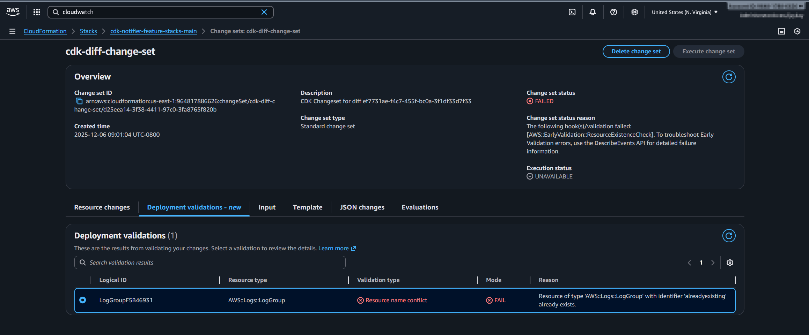

## Overview

This post builds on the previous example on [using cdk-notifier to compare changes in pull requests](/blog/2023-12-16-cdk-notifier-feature-stacks). It demonstrates how to extend the workflow by adding CloudFormation change set validation alongside `cdk diff` to provide more comprehensive pre-deployment validation.

This approach leverages CloudFormation's pre-deployment validation capabilities, which are detailed in AWS's blog post on [Accelerate infrastructure development with CloudFormation pre-deployment validation and simplified troubleshooting](https://aws.amazon.com/blogs/devops/accelerate-infrastructure-development-with-cloudformation-pre-deployment-validation-and-simplified-troubleshooting/).

## Use Case

The cdk diff via the cdk-notifier in pull requests helps a lot to understand what will happen after the merge, but not all deployment issues can be identified with the diff alone.

For example, adding a role with the same name as an existing role in the account will lead to a deployment failure, but this is not visible in the diff.

Also, adding multiple Global Secondary Indexes (GSIs) to an existing DynamoDB table in one deployment will fail, but the diff does not show this limitation.
⚠️ Unfortunately, I didn't manage to raise this problem in the deployment validation.

## The Extended Example

This example enhances the original feature stacks scenario with two key additions:

### Infrastructure Changes

The example adds:

1. **Global Secondary Indexes (GSIs)** to the DynamoDB table
2. **CloudWatch LogGroup** to the stack

```typescript
import { App, Stack, StackProps, aws_dynamodb as dynamodb } from "aws-cdk-lib";
import { LogGroup } from "aws-cdk-lib/aws-logs";
import { Construct } from "constructs";

export class CdkNotfifierFeatureStackExample extends Stack {
  constructor(scope: Construct, id: string, props: StackProps = {}) {
    super(scope, id, props);

    const table = new dynamodb.Table(this, "Table", {
      tableName: `Table-${branchName}`,
      partitionKey: { name: "id", type: dynamodb.AttributeType.STRING },
      billingMode: dynamodb.BillingMode.PAY_PER_REQUEST,
    });

    // Add CloudWatch LogGroup
    new LogGroup(this, "LogGroup", {
      logGroupName: "alreadyexisting",
    });

    // Add GSI 1
    table.addGlobalSecondaryIndex({
      indexName: "GSI1",
      partitionKey: { name: "gsi1pk", type: dynamodb.AttributeType.STRING },
      sortKey: { name: "gsi1sk", type: dynamodb.AttributeType.STRING },
    });

    // Add GSI 2
    table.addGlobalSecondaryIndex({
      indexName: "GSI2",
      partitionKey: { name: "gsi2pk", type: dynamodb.AttributeType.STRING },
      sortKey: { name: "gsi2sk", type: dynamodb.AttributeType.STRING },
    });
  }
}

const app = new App();

const branchName = process.env.BRANCH_NAME || "dev";
console.log(`Deploying with stack postfix ${branchName}`);

new CdkNotfifierFeatureStackExample(
  app,
  `cdk-notifier-feature-stacks-${branchName}`,
);

app.synth();
```

### Extended GitHub Action Workflow

The workflow now performs both `cdk diff` and `cdk deploy --method prepare-change-set`.
These command results are aggregated into a single log file, which is then processed by cdk-notifier to create a comprehensive report.

```yaml
- name: Check diff and change-set to main
  run: |
    pnpm install --frozen-lockfile  
    ECHO=$(echo "## Check the diff to main")
    echo $ECHO | tee -a cdk.log
    NPM_CONFIG_LOGLEVEL=error BRANCH_NAME=main pnpm exec cdk diff --progress=events &> >(tee -a cdk.log)
    ECHO=$(echo "## Check the change-set to main")
    echo $ECHO | tee -a cdk.log
    NPM_CONFIG_LOGLEVEL=error BRANCH_NAME=main pnpm exec cdk deploy --all --method prepare-change-set &> >(tee -a cdk.log) || true
    echo "create cdk-notifier report"
    echo "BRANCH_NAME: $BRANCH_NAME"
    echo "GITHUB_OWNER: $GITHUB_OWNER"
    echo "GITHUB_REPO: $GITHUB_REPO"
    cdk-notifier \
    --owner ${{ env.GITHUB_OWNER }} \
    --repo ${{ env.GITHUB_REPO }} \
    --token ${{ secrets.GITHUB_TOKEN }} \
    --log-file ./cdk.log \
    --tag-id diff-to-main \
    --pull-request-id ${{ env.PULL_REQUEST_ID }} \
    --vcs github \
    --ci circleci \
    --template extendedWithResources
```

Results in the Pull Request:


## Deployment Error with Multiple GSIs

When trying to deploy multiple GSIs to an existing table, the deployment validation will show the error:


## Further Enhancements

Future improvements could include:
checking the change set via the AWS CLI to describe the change set to get more detailed information about the changes planned by CloudFormation.

`aws cloudformation describe-change-set`



## Nice to Have (if not overlooked)

- The cdk diff creates by default a change set, which could be reported back in the diff

## Code and References

- Full example repository: [https://github.com/JohannesKonings/cdk-notifier-examples](https://github.com/JohannesKonings/cdk-notifier-examples)
- Related PR with changes: [https://github.com/JohannesKonings/cdk-notifier-examples/pull/12](https://github.com/JohannesKonings/cdk-notifier-examples/pull/12)
- cdk-notifier project: [https://github.com/karlderkaefer/cdk-notifier](https://github.com/karlderkaefer/cdk-notifier)

## Previous Post

For the foundational concepts behind this example, refer to the earlier post: [Use cdk-notifier to compare changes in pull requests](/blog/2023-12-16-cdk-notifier-feature-stacks)
