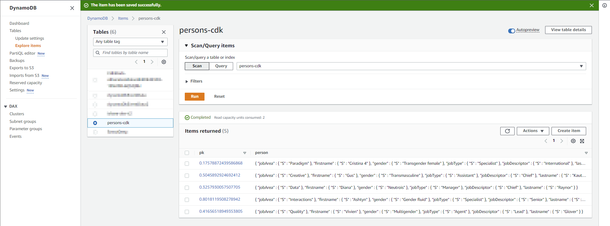
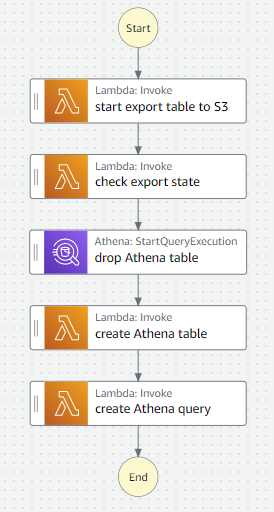
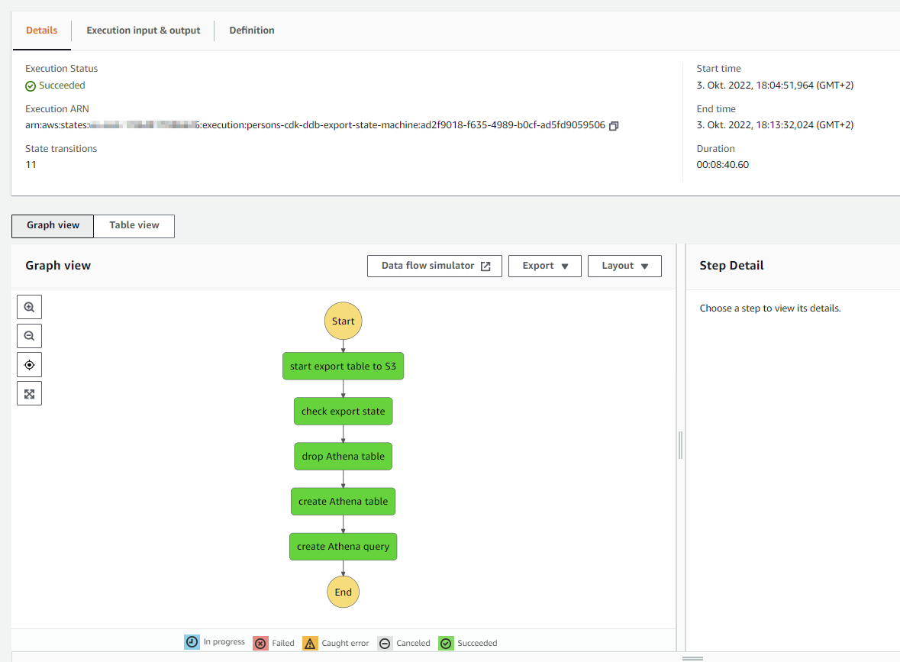
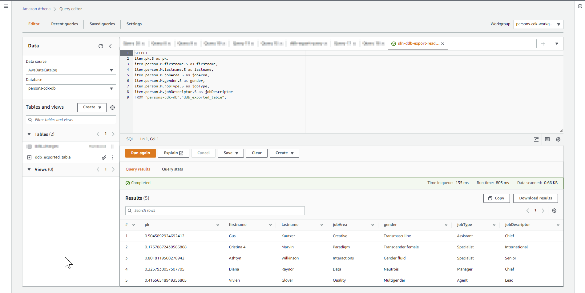

In [this]({{ site.baseurl }}/aws/2021/08/27/aws_example_ddb_analytics_cdk/) post is described how to get the data to analyze the changes in the dynamodb data. This post describes how to (semi) automate the export of the dynamodb table data and analyze it with Athena. [This](https://aws.amazon.com/de/blogs/aws/new-export-amazon-dynamodb-table-data-to-data-lake-amazon-s3/) post describes how you can do that manually.

One approach is with a lambda and another approach is with step functions. Both approaches implement the steps for triggering the export to a S3 bucket, create an athena table for that exported data and prepare a namend query for analyzing.

The data for this example looks like this.



## With lambda

[This lambda](https://github.com/JohannesKonings/test-aws-dynamodb-athena-cdk/blob/main/cdk/lib/ddb-export/ddb-export.lambda-function-ddb-export.ts) triggers the export with via the sdk and create or update a named query.

[The query](https://github.com/JohannesKonings/test-aws-dynamodb-athena-cdk/blob/main/cdk/lib/ddb-export/createTable.sql) creates the athena table. The export id will be set by the lambda by replacing the "s3location" with something like `s3://<<bucket name>>/ddb-exports/AWSDynamoDB/<<ddb-export-id>>/data/`.

```sql
CREATE EXTERNAL TABLE ddb_exported_table (
 Item struct<pk:struct<S:string>,
             person:struct<M:struct<
                jobArea:struct<S:string>,
                firstname:struct<S:string>,
                gender:struct<S:string>,
                jobType:struct<S:string>,
                jobDescriptor:struct<S:string>,
                lastname:struct<S:string>
                >>>
)
ROW FORMAT SERDE 'org.openx.data.jsonserde.JsonSerDe'
LOCATION 's3Location'
TBLPROPERTIES ( 'has_encrypted_data'='true');
```

<https://github.com/JohannesKonings/test-aws-dynamodb-athena-cdk/blob/main/cdk/lib/ddb-export/readTable.sql>

```sql
SELECT
item.pk.S as pk,
item.person.M.firstname.S as firstname,
item.person.M.lastname.S as lastname,
item.person.M.jobArea.S as jobArea,
item.person.M.gender.S as gender,
item.person.M.jobType.S as jobType,
item.person.M.jobDescriptor.S as jobDescriptor
FROM "db_name"."table_name";
```

After you started the lambda you have to wait until the export is finished. Then you can run the query for creating the athena table. The lambda has already deleted the old table. After that you can use the prepared query for analyzing.

A more orchestrated approach is with step function. That's better for waiting for the results :)

## With step functions

This are the steps, which are orchestrated by the step function.



It's definend [here](https://github.com/JohannesKonings/test-aws-dynamodb-athena-cdk/blob/main/cdk/lib/ddb-export/ddb-export-step-function.ts)

The step function could be startet with the default values.


It takes some minutes to complete.



The "recent queries" section list the steps for dropping the old table and create the new one.


After it's finished you can choose the saved query with the name `sfn-ddb-export-read-table`. It can be used to query all the data from the dynamodb table and could be adapted to more "complex" queries.



## Code

[https://github.com/JohannesKonings/test-aws-dynamodb-athena-cdk](https://github.com/JohannesKonings/test-aws-dynamodb-athena-cdk)
