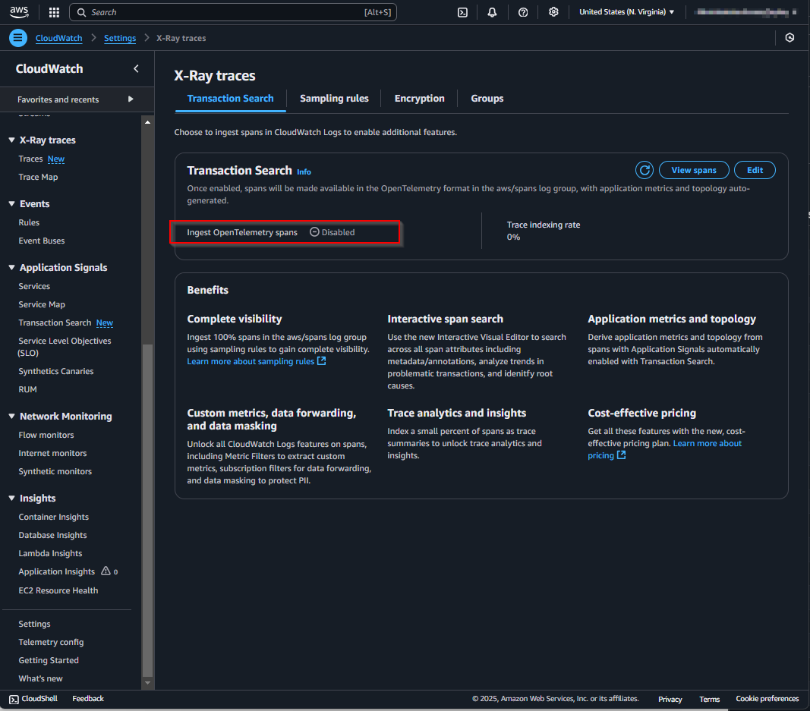
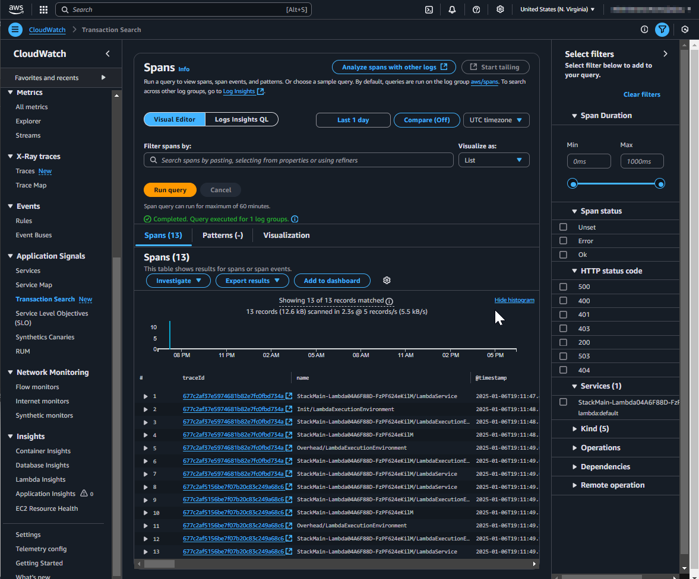

## Use case

You want to use [AWS CloudWatch Application Signals Transaction Search](https://docs.aws.amazon.com/AmazonCloudWatch/latest/monitoring/CloudWatch-Application-Monitoring-Sections.html) and your IaC is based on AWS CDK.

## Setup

This is how the Transaction Search page looks if it's not yet configured:


And like this in the X-Ray settings:



The AWS documentation outlines the steps to enable Transaction Search functionality here: https://docs.aws.amazon.com/AmazonCloudWatch/latest/monitoring/CloudWatch-Transaction-Search-getting-started.html#w24aac24c21c13b9

While the documentation provides AWS CLI commands, we can implement the same configuration using AWS CDK Custom Resources for infrastructure as code.

The whole configuration looks like this:

```typescript
    const { account, region } = Stack.of(this);

      // https://docs.aws.amazon.com/AmazonCloudWatch/latest/monitoring/CloudWatch-Transaction-Search-getting-started.html#w24aac24c21c13b9
      const applicationSignalsTransactionSearchLogsResourcePolicy =
        new AwsCustomResource(
          this,
          "ApplicationSignalsTransactionSearchLogsResourcePolicy",
          {
            onCreate: {
              service: "@aws-sdk/client-cloudwatch-logs",
              action: "PutResourcePolicy",
              parameters: {
                policyName:
                  "ApplicationSignalsTransactionSearchLogsResourcePolicy",
                policyDocument: JSON.stringify({
                  Version: "2012-10-17",
                  Statement: [
                    {
                      Sid: "TransactionSearchXRayAccess",
                      Effect: "Allow",
                      Principal: {
                        Service: "xray.amazonaws.com",
                      },
                      Action: ["logs:PutLogEvents", "logs:CreateLogStream"],
                      Resource: [
                        `arn:aws:logs:${region}:${account}:log-group:aws/spans:*`,
                        `arn:aws:logs:${region}:${account}:log-group:/aws/application-signals/data:*`,
                      ],
                      Condition: {
                        ArnLike: {
                          "aws:SourceArn": `arn:aws:xray:${region}:${account}:*`,
                        },
                        StringEquals: {
                          "aws:SourceAccount": account,
                        },
                      },
                    },
                  ],
                }),
              },
              physicalResourceId: PhysicalResourceId.of(
                "ApplicationSignalsTransactionSearchLogsResourcePolicy",
              ),
            },
            policy: AwsCustomResourcePolicy.fromSdkCalls({
              resources: AwsCustomResourcePolicy.ANY_RESOURCE,
            }),
          },
        );
      const applicationSignalsTransactionSearchXraySegmentDestination =
        new AwsCustomResource(
          this,
          "ApplicationSignalsTransactionSearchXraySegmentDestination",
          {
            onCreate: {
              service: "@aws-sdk/client-xray",
              action: "UpdateTraceSegmentDestination",
              parameters: {
                Destination: "CloudWatchLogs",
              },
              physicalResourceId: PhysicalResourceId.of(
                "ApplicationSignalsTransactionSearchXraySegmentDestination",
              ),
            },
            installLatestAwsSdk: true,
            policy: AwsCustomResourcePolicy.fromStatements([
              new PolicyStatement({
                effect: Effect.ALLOW,
                actions: ["logs:PutRetentionPolicy"],
                resources: [
                  `arn:aws:logs:${region}:${account}:log-group:aws/spans:log-stream:`,
                ],
              }),
              new PolicyStatement({
                effect: Effect.ALLOW,
                actions: ["xray:UpdateTraceSegmentDestination"],
                resources: ["*"],
              }),
            ]),
          },
        );
      applicationSignalsTransactionSearchXraySegmentDestination.node.addDependency(
        applicationSignalsTransactionSearchLogsResourcePolicy,
      );
      const applicationSignalsTransactionSearchXrayIndexRule =
        new AwsCustomResource(
          this,
          "ApplicationSignalsTransactionSearchXrayIndexRule",
          {
            onCreate: {
              service: "@aws-sdk/client-xray",
              action: "UpdateIndexingRule",
              parameters: {
                Name: "Default",
                Rule: {
                  Probabilistic: {
                    DesiredSamplingPercentage: 100,
                  },
                },
              },
              physicalResourceId: PhysicalResourceId.of(
                "ApplicationSignalsTransactionSearchXrayIndexRule",
              ),
            },
            installLatestAwsSdk: true,
            policy: AwsCustomResourcePolicy.fromSdkCalls({
              resources: AwsCustomResourcePolicy.ANY_RESOURCE,
            }),
          },
        );
      NagSuppressions.addResourceSuppressions(
        [
          applicationSignalsTransactionSearchXraySegmentDestination,
          applicationSignalsTransactionSearchLogsResourcePolicy,
          applicationSignalsTransactionSearchXrayIndexRule,
        ],
        [
          {
            id: "AwsSolutions-IAM5",
            reason: "CDK managed policy",
          },
        ],
        true,
      );
    }
```	

It contains the following steps:

1. Update the CloudWatch Logs Resource Policy
2. Update the X-Ray settings

### Update the CloudWatch Logs Resource Policy

The documentation [here](https://docs.aws.amazon.com/AmazonCloudWatch/latest/monitoring/CloudWatch-Transaction-Search-getting-started.html#w24aac24c21c13b9) is a little bit misleading. The shown condition `arn:partition:logs:region:account-id:*` should be `arn:partition:xray:region:account-id:*`. Also, the action `logs:PutLogEvents` should be `logs:PutLogEvents` and `logs:CreateLogStream`.

```typescript
 const applicationSignalsTransactionSearchLogsResourcePolicy =
        new AwsCustomResource(
          this,
          "ApplicationSignalsTransactionSearchLogsResourcePolicy",
          {
            onCreate: {
              service: "@aws-sdk/client-cloudwatch-logs",
              action: "PutResourcePolicy",
              parameters: {
                policyName:
                  "ApplicationSignalsTransactionSearchLogsResourcePolicy",
                policyDocument: JSON.stringify({
                  Version: "2012-10-17",
                  Statement: [
                    {
                      Sid: "TransactionSearchXRayAccess",
                      Effect: "Allow",
                      Principal: {
                        Service: "xray.amazonaws.com",
                      },
                      Action: ["logs:PutLogEvents", "logs:CreateLogStream"],
                      Resource: [
                        `arn:aws:logs:${region}:${account}:log-group:aws/spans:*`,
                        `arn:aws:logs:${region}:${account}:log-group:/aws/application-signals/data:*`,
                      ],
                      Condition: {
                        ArnLike: {
                          "aws:SourceArn": `arn:aws:xray:${region}:${account}:*`,
                        },
                        StringEquals: {
                          "aws:SourceAccount": account,
                        },
                      },
                    },
                  ],
                }),
              },
              physicalResourceId: PhysicalResourceId.of(
                "ApplicationSignalsTransactionSearchLogsResourcePolicy",
              ),
            },
            policy: AwsCustomResourcePolicy.fromSdkCalls({
              resources: AwsCustomResourcePolicy.ANY_RESOURCE,
            }),
          },
        );
```	

### Update the X-Ray settings

The 2 API calls for X-Ray are nearly straightforward. Only the commands `UpdateTraceSegmentDestination` and `UpdateIndexingRule` require the newest SDK version, as they were introduced in version: https://github.com/aws/aws-sdk-js-v3/releases/tag/v3.698.0


```typescript
 const applicationSignalsTransactionSearchXraySegmentDestination =
        new AwsCustomResource(
          this,
          "ApplicationSignalsTransactionSearchXraySegmentDestination",
          {
            onCreate: {
              service: "@aws-sdk/client-xray",
              action: "UpdateTraceSegmentDestination",
              parameters: {
                Destination: "CloudWatchLogs",
              },
              physicalResourceId: PhysicalResourceId.of(
                "ApplicationSignalsTransactionSearchXraySegmentDestination",
              ),
            },
            installLatestAwsSdk: true,
            policy: AwsCustomResourcePolicy.fromStatements([
              new PolicyStatement({
                effect: Effect.ALLOW,
                actions: ["logs:PutRetentionPolicy"],
                resources: [
                  `arn:aws:logs:${region}:${account}:log-group:aws/spans:log-stream:`,
                ],
              }),
              new PolicyStatement({
                effect: Effect.ALLOW,
                actions: ["xray:UpdateTraceSegmentDestination"],
                resources: ["*"],
              }),
            ]),
          },
        );
      applicationSignalsTransactionSearchXraySegmentDestination.node.addDependency(
        applicationSignalsTransactionSearchLogsResourcePolicy,
      );
      const applicationSignalsTransactionSearchXrayIndexRule =
        new AwsCustomResource(
          this,
          "ApplicationSignalsTransactionSearchXrayIndexRule",
          {
            onCreate: {
              service: "@aws-sdk/client-xray",
              action: "UpdateIndexingRule",
              parameters: {
                Name: "Default",
                Rule: {
                  Probabilistic: {
                    DesiredSamplingPercentage: 100,
                  },
                },
              },
              physicalResourceId: PhysicalResourceId.of(
                "ApplicationSignalsTransactionSearchXrayIndexRule",
              ),
            },
            installLatestAwsSdk: true,
            policy: AwsCustomResourcePolicy.fromSdkCalls({
              resources: AwsCustomResourcePolicy.ANY_RESOURCE,
            }),
          },
        );
```

## Result

After a few minutes, the Transaction Search is visible in the Management Console.





