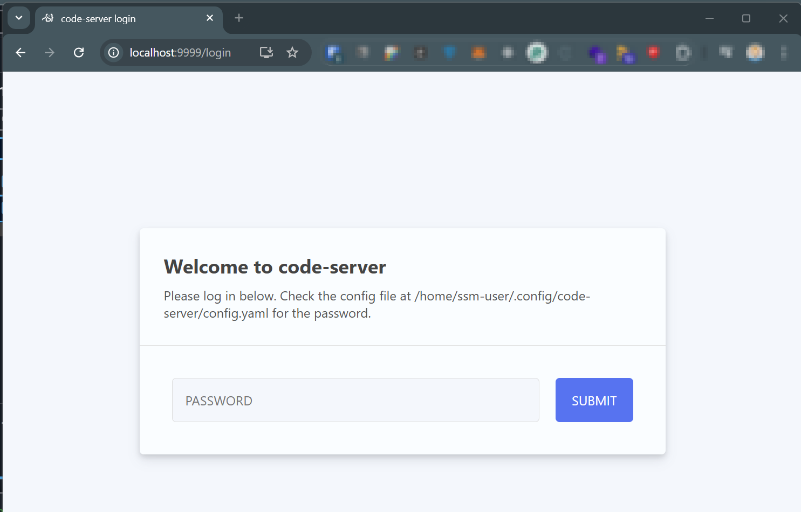
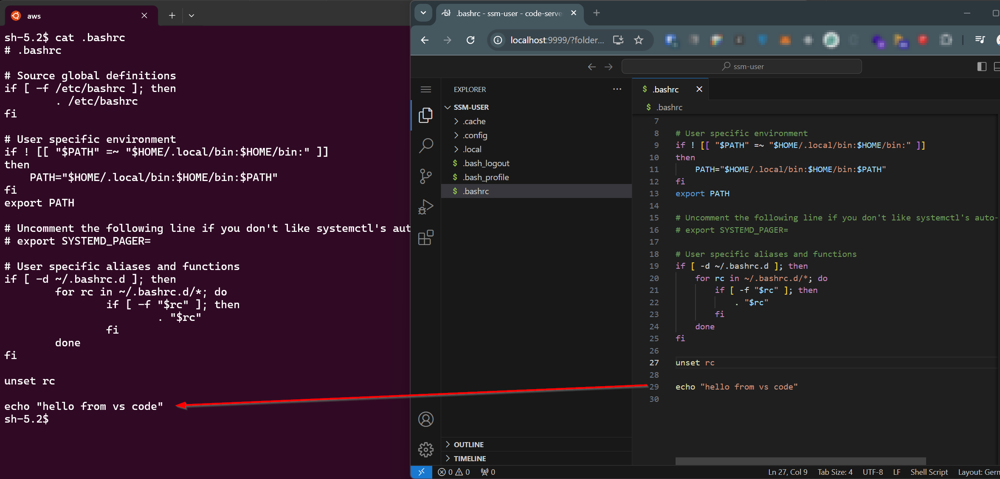

## Use case

You have a private EC2 instance in your AWS account and you want to edit files outside of the terminal or just with the help of vs code and vs code extensions on this instance without using SSH.
CDK is already in place and can be used to provision the necessary resources.

## Setup

The following steps are necessary to set up the environment.

- Configure SSM Session Manager for the private instance
- Installation of the SSM plugin for the AWS CLI
- Installation of vs code with the [code code-server](https://github.com/coder/code-server)

## Prerequisites

- The VPC network setting already exists.
- The private subnet has access to the internet

## Configure SSM Session Manager for the private instance

The configuration is described [here](https://repost.aws/knowledge-center/ec2-systems-manager-vpc-endpoints).

The needed VPC endpoints can be created like this:

```typescript
const subnetsPrivateIsolated = props.vpc.selectSubnets({
  subnetType: SubnetType.PRIVATE_ISOLATED,
});
props.vpc.addInterfaceEndpoint("VpcEndpointSsm", {
  service: InterfaceVpcEndpointAwsService.SSM,
  privateDnsEnabled: true,
  subnets: subnetsPrivateIsolated,
});
props.vpc.addInterfaceEndpoint("VpcEndpointSsmMessages", {
  service: InterfaceVpcEndpointAwsService.SSM_MESSAGES,
  privateDnsEnabled: true,
  subnets: subnetsPrivateIsolated,
});
props.vpc.addInterfaceEndpoint("VpcEndpointEc2Message", {
  service: InterfaceVpcEndpointAwsService.EC2_MESSAGES,
  privateDnsEnabled: true,
  subnets: subnetsPrivateIsolated,
});
```

Here is a list of AMIs, which has the SSM agent preinstalled: https://docs.aws.amazon.com/systems-manager/latest/userguide/ami-preinstalled-agent.html

The creation of the instance can than look like this:

```typescript
const roleSsm2Ec2 = new Role(this, "RoleSsm2Ec2", {
  assumedBy: new ServicePrincipal("ec2.amazonaws.com"),
});
this.roleSsm2Ec2.addManagedPolicy(
  ManagedPolicy.fromAwsManagedPolicyName("AmazonSSMManagedInstanceCore"),
);

new Instance(this, "Instance", {
  vpc: props.vpc,
  instanceType: InstanceType.of(InstanceClass.T2, InstanceSize.MICRO),
  machineImage: MachineImage.latestAmazonLinux2023(),
  role: roleSsm2Ec2,
});
```

The attached role is importent for the SSM Session Manager to work.

## Installation of the SSM plugin for the AWS CLI

Before the instance can be accessed via the AWS Systems Manager Session Manager, the AWS CLI needs the SSM plugin.
The installation is described [here](https://docs.aws.amazon.com/systems-manager/latest/userguide/session-manager-working-with-install-plugin.html).

## Installation of vs code via AWS Systems Manager Session Manager

Now the instance can be accessed via the AWS Systems Manager Session Manager.

```bash
aws ssm start-session --target <<instance-id>> --region <<region>>
```

With the following commands vs code can than be installed.

```bash
curl -fsSL https://code-server.dev/install.sh | sh
```


More details here: https://github.com/coder/code-server?tab=readme-ov-file#getting-started

Now run the code-server with the following command:

```bash
code-server
```


As you can see, the code-server is running on `http://127.0.0.1:8080/` (1.) and the password is in file `/home/ssm-user/.config/code-server/config.yaml` (2.).

That information are needed to connect to the code-server via the browser.

## Connect to vs code via AWS Systems Manager port forwarding

The instance has no public IP and can not be accessed via the browser. But with the help of the AWS Systems Manager port forwarding, the instance can be accessed via the browser.

```bash
aws ssm start-session   --region <<region>> \
                        --target <<instance-id>> \
                        --document-name AWS-StartPortForwardingSession \
                        --parameters '{"portNumber":["8080"],"localPortNumber":["9999"]}'
```

More Details here: https://aws.amazon.com/blogs/aws/new-port-forwarding-using-aws-system-manager-sessions-manager/

Now the code-server can be accessed via the browser with the following URL: `http://localhost:9999/`

Login with the password from the config.yaml file.



Now you can handle the files via vs code 🥳


