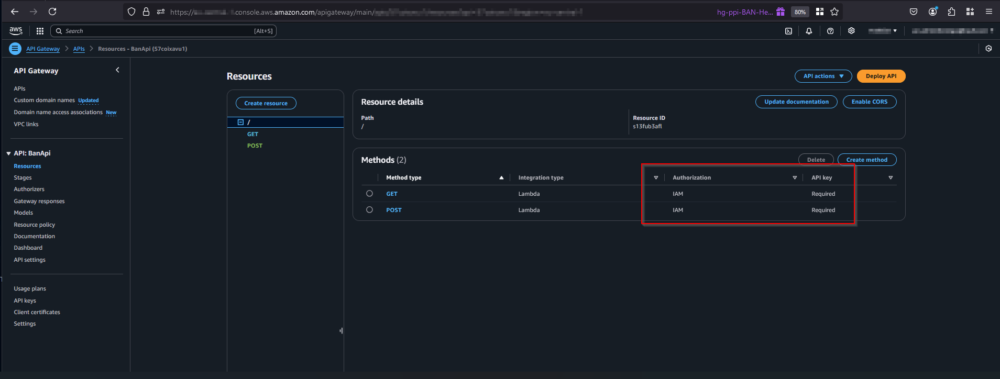
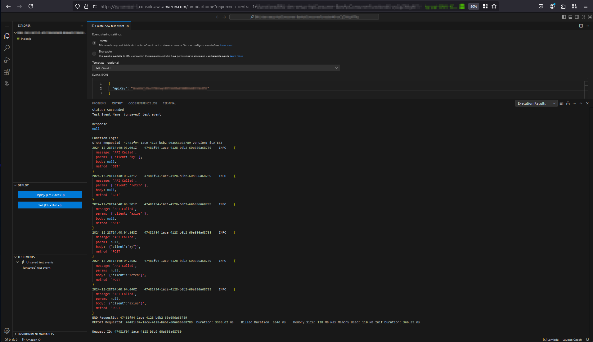

## Use case

API Gateways can be secured with IAM authentication. This means that the client must sign the request with the [AWS Signature Version 4](https://docs.aws.amazon.com/IAM/latest/UserGuide/reference_sigv.html). This post describes how to call an IAM authenticated API Gateway with different HTTP clients like [ky](https://github.com/sindresorhus/ky), [fetch](https://nodejs.org/dist/v18.20.5/docs/api/globals.html#fetch), and [axios](https://github.com/axios/axios).

## Setup

### API Gateway

The API Gateway looks like this:



The authorisation is set to `AWS_IAM` additional to an api key.

The lambda function is a simple one, which returns params, method and body.

```typescript
exports.handler = async function (event) {
  const params = event.queryStringParameters;
  const body = event.body;
  const method = event.httpMethod;
  return {
    statusCode: 200,
    body: JSON.stringify({
      message: "API Called",
      params,
      body,
      method,
    }),
  };
};
```

### Lambda function for calling the API Gateway

Main parts are copied form here: https://github.com/zirkelc/aws-sigv4-fetch by [zirkelc](https://zirkelc.dev/). This project can be used if the HTTP client will be fetch. If ky or axios should be used, the code must be adapted.

The signing procedure is capsuled in the `signV4` function.

```typescript
import { Sha256 } from "@aws-crypto/sha256-js";
import type { AwsCredentialIdentity, Provider } from "@aws-sdk/types";
import { HttpRequest } from "@smithy/protocol-http";
import { SignatureV4 } from "@smithy/signature-v4";

// for this scope these values can be hard coded
const REGION = "eu-central-1";
const SERVICE = "execute-api";

type SigV4Props = {
  readonly credentials?:
    | AwsCredentialIdentity
    | Provider<AwsCredentialIdentity>;
  readonly method: string;
  readonly headers: Record<string, string>;
  readonly body?: BodyInit | undefined | null;
  readonly url: URL;
};

export const signV4 = async (props: SigV4Props) => {
  if (!props.credentials) {
    throw new Error("Credentials are required for signing");
  }

  const signer = new SignatureV4({
    credentials: props.credentials,
    region: REGION,
    service: SERVICE,
    sha256: Sha256,
  });

  const { method, headers, url, body } = props;

  // https://github.com/zirkelc/aws-sigv4-fetch/blob/44d19e270783e8566c2f39eebc1eb83e1b8af3ad/src/create-signed-fetcher.ts#L36C5-L37C32
  // host is required by AWS Signature V4: https://docs.aws.amazon.com/general/latest/gr/sigv4-create-canonical-request.html
  headers["host"] = url.host;

  const request = new HttpRequest({
    method: method,
    body,
    headers: headers,
    hostname: url.hostname,
    path: url.pathname,
    protocol: url.protocol,
    port: url.port ? Number(url.port) : undefined,
    username: url.username,
    password: url.password,
    fragment: url.hash,
    query: Object.fromEntries(url.searchParams.entries()),
  });

  const signedRequest = await signer.sign(request);

  return signedRequest;
};
```

The call of the API Gateway looks like following. It does mainly two parts: Assuming a role for the credentials and calling the API Gateway with different HTTP clients.

```typescript
import { AssumeRoleCommand, STSClient } from "@aws-sdk/client-sts";
import ky from "ky";
import axios from "axios";
import { signV4 } from "../utils/signV4/signV4";
// Set the AWS Region.
const REGION = "eu-central-1";
// Create an AWS STS service client object.
export const client = new STSClient({ region: REGION });
export const handler = async (event: { apiKey: string }) => {
  try {
    // get the credentials via a role which is allowed to call the API Gateway
    const command = new AssumeRoleCommand({
      // The Amazon Resource Name (ARN) of the role to assume.
      RoleArn: "arn:aws:iam::123456789012:role/ApiAccess",
      // An identifier for the assumed role session.
      RoleSessionName: "session1",
      // The duration, in seconds, of the role session. The value specified
      // can range from 900 seconds (15 minutes) up to the maximum session
      // duration set for the role.
      DurationSeconds: 900,
    });
    const response = await client.send(command);
    // console.log(response);
    if (!response.Credentials) {
      throw new Error("No credentials found in response");
    }
    if (!response.Credentials.AccessKeyId) {
      throw new Error("No access key found in response");
    }
    if (!response.Credentials.SecretAccessKey) {
      throw new Error("No secret key found in response");
    }

    // GET ky
    const urlKyGet =
      "https://<<api gw id>>.execute-api.eu-central-1.amazonaws.com/default?client=ky";
    const signedRequestKyGet = await signV4({
      credentials: {
        accessKeyId: response.Credentials.AccessKeyId,
        secretAccessKey: response.Credentials.SecretAccessKey,
        sessionToken: response.Credentials.SessionToken,
      },
      method: "GET",
      headers: {
        "Content-Type": "application/json",
        "x-api-key": event.apiKey,
      },
      url: new URL(urlKyGet),
    });

    const responseApiKyGet = await ky(urlKyGet, {
      method: signedRequestKyGet.method,
      headers: signedRequestKyGet.headers,
    });
    const dataKyGet = await responseApiKyGet.json();
    console.log(dataKyGet);
    // GET fetch
    const urlFetchGet =
      "https://<<api gw id>>.execute-api.eu-central-1.amazonaws.com/default?client=fetch";
    const signedRequestFetchGet = await signV4({
      credentials: {
        accessKeyId: response.Credentials.AccessKeyId,
        secretAccessKey: response.Credentials.SecretAccessKey,
        sessionToken: response.Credentials.SessionToken,
      },
      method: "GET",
      headers: {
        "Content-Type": "application/json",
        "x-api-key": event.apiKey,
      },
      url: new URL(urlFetchGet),
    });
    const responseApiFetchGet = await fetch(urlFetchGet, {
      method: signedRequestFetchGet.method,
      headers: signedRequestFetchGet.headers,
    });
    const dataFetchGet = await responseApiFetchGet.json();
    console.log(dataFetchGet);
    // GET axios
    const urlAxiosGet =
      "https://<<api gw id>>.execute-api.eu-central-1.amazonaws.com/default?client=axios";
    const signedRequestAxiosGet = await signV4({
      credentials: {
        accessKeyId: response.Credentials.AccessKeyId,
        secretAccessKey: response.Credentials.SecretAccessKey,
        sessionToken: response.Credentials.SessionToken,
      },
      method: "GET",
      headers: {
        "Content-Type": "application/json",
        "x-api-key": event.apiKey,
      },
      url: new URL(urlAxiosGet),
    });
    const responseApiAxiosGet = await axios.get(urlAxiosGet, {
      headers: signedRequestAxiosGet.headers,
    });
    const dataAxiosGet = responseApiAxiosGet.data;
    console.log(dataAxiosGet);
    // POST ky
    const urlKyPost =
      "https://<<api gw id>>.execute-api.eu-central-1.amazonaws.com/default";
    const signedRequestKyPost = await signV4({
      credentials: {
        accessKeyId: response.Credentials.AccessKeyId,
        secretAccessKey: response.Credentials.SecretAccessKey,
        sessionToken: response.Credentials.SessionToken,
      },
      method: "POST",
      headers: {
        "Content-Type": "application/json",
        "x-api-key": event.apiKey,
      },
      body: JSON.stringify({ client: "ky" }),
      url: new URL(urlKyPost),
    });
    const responseApiKyPost = await ky(urlKyPost, {
      method: signedRequestKyPost.method,
      headers: signedRequestKyPost.headers,
      body: signedRequestKyPost.body as string,
    });
    const dataKyPost = await responseApiKyPost.json();
    console.log(dataKyPost);
    // POST fetch
    const urlFetchPost =
      "https://<<api gw id>>.execute-api.eu-central-1.amazonaws.com/default";
    const signedRequestFetchPost = await signV4({
      credentials: {
        accessKeyId: response.Credentials.AccessKeyId,
        secretAccessKey: response.Credentials.SecretAccessKey,
        sessionToken: response.Credentials.SessionToken,
      },
      method: "POST",
      headers: {
        "Content-Type": "application/json",
        "x-api-key": event.apiKey,
      },
      body: JSON.stringify({ client: "fetch" }),
      url: new URL(urlFetchPost),
    });
    const responseApiFetchPost = await fetch(urlFetchPost, {
      method: signedRequestFetchPost.method,
      headers: signedRequestFetchPost.headers,
      body: signedRequestFetchPost.body as string,
    });
    const dataFetchPost = await responseApiFetchPost.json();
    console.log(dataFetchPost);
    // POST axios
    const urlAxiosPost =
      "https://<<api gw id>>.execute-api.eu-central-1.amazonaws.com/default";
    const signedRequestAxiosPost = await signV4({
      credentials: {
        accessKeyId: response.Credentials.AccessKeyId,
        secretAccessKey: response.Credentials.SecretAccessKey,
        sessionToken: response.Credentials.SessionToken,
      },
      method: "POST",
      headers: {
        "Content-Type": "application/json",
        "x-api-key": event.apiKey,
      },
      body: JSON.stringify({ client: "axios" }),
      url: new URL(urlAxiosPost),
    });
    const responseApiAxiosPost = await axios.post(
      urlAxiosPost,
      signedRequestAxiosPost.body,
      {
        headers: signedRequestAxiosPost.headers,
      },
    );
    const dataAxiosPost = responseApiAxiosPost.data;
    console.log(dataAxiosPost);
  } catch (error) {
    console.error(error);
  }
};
```

The role has this policy attached and allow to call API Gateways.

```json
{
  "Version": "2012-10-17",
  "Statement": [
    {
      "Action": "execute-api:Invoke",
      "Resource": "*",
      "Effect": "Allow"
    }
  ]
}
```

The call of the API Gateway is than calling the signV4 function with the credentials and "all information" for the API call.

e.g. for a GET call

```typescript
const urlKyGet =
  "https://<<api gw id>>.execute-api.eu-central-1.amazonaws.com/default?client=ky";
const signedRequestKyGet = await signV4({
  credentials: {
    accessKeyId: response.Credentials.AccessKeyId,
    secretAccessKey: response.Credentials.SecretAccessKey,
    sessionToken: response.Credentials.SessionToken,
  },
  method: "GET",
  headers: {
    "Content-Type": "application/json",
    "x-api-key": event.apiKey,
  },
  url: new URL(urlKyGet),
});
```

The return value can be used for different HTTP clients.

```typescript
const responseApiKyGet = await ky(urlKyGet, {
  method: signedRequestKyGet.method,
  headers: signedRequestKyGet.headers,
});
```

In that way the signing request can be abstracted and the HTTP client can be changed easily.

## Result

The test result of the example lambda function will than look like this:



## Sources

- [AWS Signature Version 4 for API requests](https://docs.aws.amazon.com/IAM/latest/UserGuide/reference_sigv.html)
- [aws-sigv4-fetch](https://github.com/zirkelc/aws-sigv4-fetch/tree/main) by [zirkelc](https://zirkelc.dev/)
- [ky](https://github.com/sindresorhus/ky)
- [fetch](https://nodejs.org/dist/v18.20.5/docs/api/globals.html#fetch)
- [axios](https://github.com/axios/axios)
