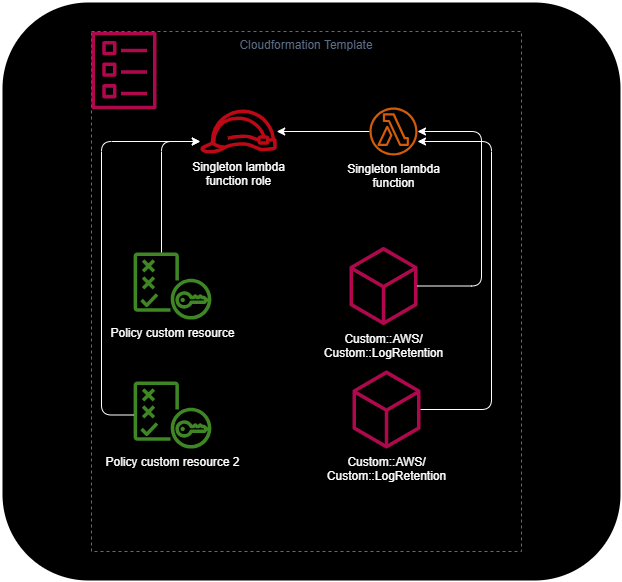

## Overview

When using AWS CDK with custom resources, CDK creates a singleton Lambda function that handles all custom resource operations. This Lambda function can trigger several cdk-nag findings, even if you're not directly using custom resources in your stack. This article explains how to properly suppress these findings globally.

## Understanding the Problem

### How CDK Uses Custom Resources

CDK uses a shared Lambda function to handle all custom resources in your stack. Here's a typical example of creating a custom resource:

```typescript
new AwsCustomResource(this, "GetParameter", {
  onUpdate: {
    service: "SSM",
    action: "GetParameter",
    parameters: {
      Name: "my-parameter",
      WithDecryption: true,
    },
    physicalResourceId: PhysicalResourceId.of(Date.now().toString()),
  },
  functionName: "GetParameter",
  policy: AwsCustomResourcePolicy.fromSdkCalls({
    resources: AwsCustomResourcePolicy.ANY_RESOURCE,
  }),
});
```

### Generated CloudFormation Components

When CDK synthesizes this code, it creates several CloudFormation resources:

1. The custom resource itself
2. An IAM policy for the custom resource
3. An IAM role for the singleton Lambda function
4. The singleton Lambda function

```yaml
  # The custom resource, which calling the singleton lambda function
  "GetParameter42B0A00E": {
   "Type": "Custom::AWS",
   "Properties": {
    "ServiceToken": {
     "Fn::GetAtt": [
      "AWS679f53fac002430cb0da5b7982bd22872D164C4C",
      "Arn"
     ]
    },
    "Create": "{\"service\":\"SSM\",\"action\":\"GetParameter\",\"parameters\":{\"Name\":\"my-parameter\",\"WithDecryption\":true},\"physicalResourceId\":{\"id\":\"1736701660301\"}}",
    "Update": "{\"service\":\"SSM\",\"action\":\"GetParameter\",\"parameters\":{\"Name\":\"my-parameter\",\"WithDecryption\":true},\"physicalResourceId\":{\"id\":\"1736701660301\"}}",
    "InstallLatestAwsSdk": false
   },
   "DependsOn": [
    "GetParameterCustomResourcePolicyD8E5D455"
   ],
   "UpdateReplacePolicy": "Delete",
   "DeletionPolicy": "Delete",
   "Metadata": {
    "aws:cdk:path": "StackMain/GetParameter/Resource/Default"
   }
  },
  # The policy which is attached to the singleton lambda function role
  "GetParameterCustomResourcePolicyD8E5D455": {
   "Type": "AWS::IAM::Policy",
   "Properties": {
    "PolicyDocument": {
     "Statement": [
      {
       "Action": "ssm:GetParameter",
       "Effect": "Allow",
       "Resource": "*"
      }
     ],
     "Version": "2012-10-17"
    },
    "PolicyName": "GetParameterCustomResourcePolicyD8E5D455",
    "Roles": [
     {
      "Ref": "AWS679f53fac002430cb0da5b7982bd2287ServiceRoleC1EA0FF2"
     }
    ]
   },
   "UpdateReplacePolicy": "Delete",
   "DeletionPolicy": "Delete",
   "Metadata": {
    "aws:cdk:path": "StackMain/GetParameter/CustomResourcePolicy/Resource"
   }
  },
  # The role for the singleton lambda function
  # Causing the finding AWSSolution-IAM4, because of the used managed policy
  "AWS679f53fac002430cb0da5b7982bd2287ServiceRoleC1EA0FF2": {
   "Type": "AWS::IAM::Role",
   "Properties": {
    "AssumeRolePolicyDocument": {
     "Statement": [
      {
       "Action": "sts:AssumeRole",
       "Effect": "Allow",
       "Principal": {
        "Service": "lambda.amazonaws.com"
       }
      }
     ],
     "Version": "2012-10-17"
    },
    "ManagedPolicyArns": [
     {
      "Fn::Join": [
       "",
       [
        "arn:",
        {
         "Ref": "AWS::Partition"
        },
        ":iam::aws:policy/service-role/AWSLambdaBasicExecutionRole"
       ]
      ]
     }
    ]
   },
   "UpdateReplacePolicy": "Delete",
   "DeletionPolicy": "Delete",
   "Metadata": {
    "aws:cdk:path": "StackMain/AWS679f53fac002430cb0da5b7982bd2287/ServiceRole/Resource"
   }
  },
  # The lambda function which is used for all custom resources
  "AWS679f53fac002430cb0da5b7982bd22872D164C4C": {
   "Type": "AWS::Lambda::Function",
   "Properties": {
    "Code": {
     "S3Bucket": {
      "Fn::Sub": "cdk-hnb659fds-assets-${AWS::AccountId}-${AWS::Region}"
     },
     "S3Key": "ce2f3595a340d6c519a65888ef97e3b9b64f053f83608e32cc28162e22d7d99a.zip"
    },
    "FunctionName": "GetParameter",
    "Handler": "index.handler",
    "Role": {
     "Fn::GetAtt": [
      "AWS679f53fac002430cb0da5b7982bd2287ServiceRoleC1EA0FF2",
      "Arn"
     ]
    },
    "Runtime": {
     "Fn::FindInMap": [
      "LatestNodeRuntimeMap",
      {
       "Ref": "AWS::Region"
      },
      "value"
     ]
    },
    "Timeout": 120
   },
   "DependsOn": [
    "AWS679f53fac002430cb0da5b7982bd2287ServiceRoleC1EA0FF2"
   ],
   "UpdateReplacePolicy": "Delete",
   "DeletionPolicy": "Delete",
   "Metadata": {
    "aws:cdk:path": "StackMain/AWS679f53fac002430cb0da5b7982bd2287/Resource",
    "aws:asset:path": "asset.ce2f3595a340d6c519a65888ef97e3b9b64f053f83608e32cc28162e22d7d99a",
    "aws:asset:is-bundled": false,
    "aws:asset:property": "Code"
   }
  },
```

This will be the linked resources if there a two custom resources in the stack.



### cdk-nag Findings

This configuration triggers three main findings from cdk-nag:

```shell
[Error at /StackMain/ApplicationsSignals/GetParameter/CustomResourcePolicy/Resource] AwsSolutions-IAM5[Resource::*]: The IAM entity contains wildcard permissions and does not have a cdk-nag rule suppression with evidence for those permission.

[Error at /StackMain/AWS679f53fac002430cb0da5b7982bd2287/ServiceRole/Resource] AwsSolutions-IAM4[Policy::arn:<AWS::Partition>:iam::aws:policy/service-role/AWSLambdaBasicExecutionRole]: The IAM user, role, or group uses AWS managed policies.

[Warning at /StackMain/AWS679f53fac002430cb0da5b7982bd2287/Resource] CdkNagValidationFailure[AwsSolutions-L1]: 'AwsSolutions-L1' threw an error during validation.
```

### Why Resource-Level Suppression Isn't Enough

A simple resource-level suppression like this only handles the `AwsSolutions-IAM5` finding:

```typescript
NagSuppressions.addResourceSuppressions(
  customResource,
  [
    {
      id: "AwsSolutions-IAM5",
      reason: "Policy Creation derived from SdkCalls are OK",
    },
  ],
  true,
);
```

This doesn't work for the other findings because the singleton Lambda function is attached to the root of the stack and requires a different suppression approach.

## The Solution

### Overview

To properly suppress all findings related to the custom resource singleton Lambda, we need to:

1. Identify all possible paths where the custom resource creates resources
2. Check if these paths exist in our stack
3. Apply suppressions only to existing paths

### Implementation

Here's the complete solution:

```typescript
const suppressions: NagPackSuppression[] = [
  {
    id: "AwsSolutions-IAM4",
    reason: "Custom resource singleton lambda",
  },
  {
    id: "AwsSolutions-L1",
    reason: "Custom resource singleton lambda",
  },
];

const stack = Stack.of(this);
// The UUID is a fixed value used by CDK for custom resources
const customResourceId = `AWS${AwsCustomResource.PROVIDER_FUNCTION_UUID.split("-").join("")}`;
const stackName = stack.stackName;

// Define all possible paths that could trigger cdk-nag findings
const customResourceSuppressPaths = new Set([
  `/${stackName}/${customResourceId}/ServiceRole/Resource`,
  `/${stackName}/${customResourceId}/Resource`,
]);

// Get all existing paths in the stack
const allExistingPaths = new Set(
  stack.node.findAll().map((node) => `/${node.node.path}`),
);

// Apply suppressions only to paths that exist
for (const path of customResourceSuppressPaths) {
  if (allExistingPaths.has(path)) {
    NagSuppressions.addResourceSuppressionsByPath(
      stack,
      path,
      suppressions,
      true,
    );
  }
}
```

### Benefits

This solution:

- Handles all cdk-nag findings related to the singleton Lambda
- Works whether you're directly using custom resources or not
- Prevents errors from trying to suppress non-existent paths
- Can be implemented centrally in your stack

## Additional Resources

If you're using a custom [NagPack](https://github.com/cdklabs/cdk-nag/blob/main/docs/NagPack.md), you can find implementation examples [here](https://github.com/JohannesKonings/cdk-nag-custom-nag-pack?tab=readme-ov-file#custom-resource).
