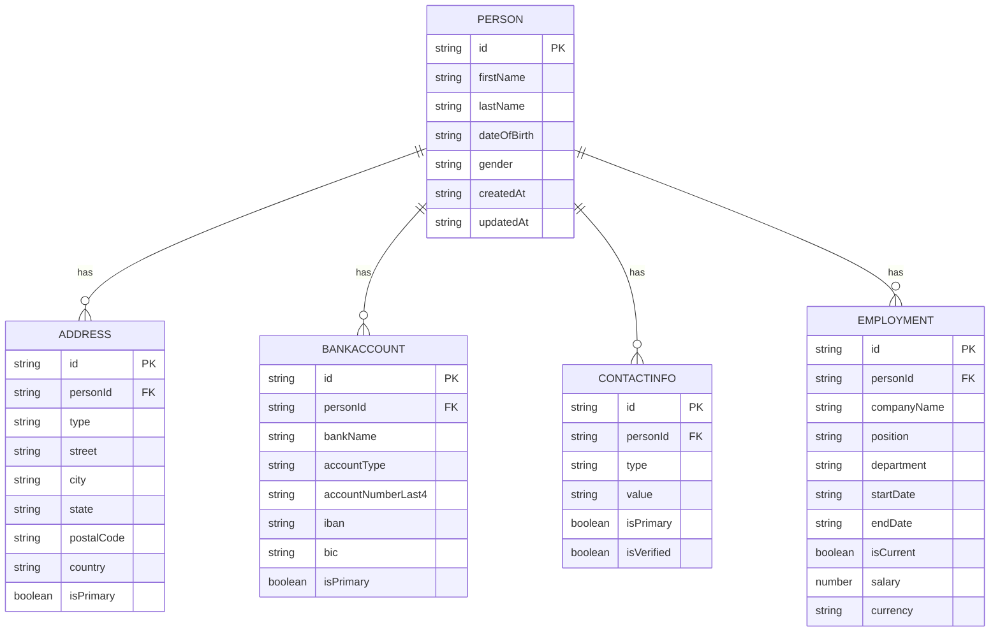

## Introduction

In [Simple example of TanStack DB with DynamoDB on AWS](/blog/2025-12-20-tanstack-start-aws-db-simple/), I describe how to use TanStack DB with a single entity in combination with DynamoDB.
This post contains a simple example with multiple entities and how to sync single table design with TanStack DB collections.

At a high level, we’ll go from infrastructure (a DynamoDB table), to a small DynamoDB client, to a TanStack Start server route, and finally to a TanStack DB collection that powers a simple UI.

**Update:** This post has been updated to include performance optimizations using global collections instead of factory-based per-person collections. This enables instant sub-millisecond navigation between person details without network requests. See the [Improved data retrieval](#improved-data-retrieval-global-collections) section for details.

The complete implementation is available in the [tanstack-aws repository](https://github.com/JohannesKonings/tanstack-aws), which serves as a working example and template for this deployment pattern.

## Architecture Overview


## Disclaimer

This is an enhancement of a very simple example to get you started with TanStack DB and DynamoDB on AWS with multiple entities, but still simple. It is not production-ready and lacks features like error handling, security, and optimizations.

## Demo Video

The following video demonstrates the improved data retrieval with global collections, showing instant navigation between person details:

<iframe width="560" height="315" src="https://www.youtube.com/embed/TP4k8dHPL7w" title="TanStack DB Global Collections Demo" frameborder="0" allow="accelerometer; autoplay; clipboard-write; encrypted-media; gyroscope; picture-in-picture; web-share" allowfullscreen></iframe>

## The data model

This example implements a multi-entity data model for managing persons with related information. The schemas are defined using Zod as the single source of truth, with ElectroDB entities derived from these schemas to ensure type safety throughout the stack.



## DynamoDB single table design

All entities are stored in a single DynamoDB table using a carefully designed key structure that enables efficient querying patterns.

### Key Structure

| Entity      | Partition Key (pk)  | Sort Key (sk)               | Description                 |
| ----------- | ------------------- | --------------------------- | --------------------------- |
| Person      | `PERSON#<personId>` | `PROFILE`                   | Person profile data         |
| Address     | `PERSON#<personId>` | `ADDRESS#<addressId>`       | Person's addresses          |
| BankAccount | `PERSON#<personId>` | `BANK#<bankId>`             | Person's bank accounts      |
| ContactInfo | `PERSON#<personId>` | `CONTACT#<contactId>`       | Person's contact info       |
| Employment  | `PERSON#<personId>` | `EMPLOYMENT#<employmentId>` | Person's employment history |

This structure groups all data for a single person under the same partition key, allowing efficient retrieval of a person and all their related entities in a single query.

### Access Patterns

The design supports the following access patterns:

| Access Pattern             | Key Condition                                    | Description                                          |
| -------------------------- | ------------------------------------------------ | ---------------------------------------------------- |
| Get all persons            | GSI1: `gsi1pk = PERSONS`                         | List all persons                                     |
| Get all addresses          | GSI1: `gsi1pk = ADDRESSES`                       | List all addresses (for global collection)           |
| Get all bank accounts      | GSI1: `gsi1pk = BANKACCOUNTS`                    | List all bank accounts (for global collection)       |
| Get all contacts           | GSI1: `gsi1pk = CONTACTS`                        | List all contacts (for global collection)            |
| Get all employments        | GSI1: `gsi1pk = EMPLOYMENTS`                     | List all employments (for global collection)         |
| Get person by ID           | `pk = PERSON#<id>`, `sk = PROFILE`               | Single person lookup                                 |
| Get person with all data   | `pk = PERSON#<id>`                               | Get person + all related entities (collection query) |
| Get person's addresses     | `pk = PERSON#<id>`, `sk begins_with ADDRESS#`    | All addresses for a person                           |
| Get person's bank accounts | `pk = PERSON#<id>`, `sk begins_with BANK#`       | All bank accounts for a person                       |
| Get person's contacts      | `pk = PERSON#<id>`, `sk begins_with CONTACT#`    | All contacts for a person                            |
| Get person's employment    | `pk = PERSON#<id>`, `sk begins_with EMPLOYMENT#` | All employment records for a person                  |

The table entries will look a little bit different as ElectroDB will take care of the attribute mapping.

### Global Secondary Indexes

**GSI1: Multi-Entity Type Index**

GSI1 is shared by ALL entity types using different partition key templates. This single GSI handles all "get all entities of type X" queries efficiently without table scans.

| Entity      | gsi1pk Template | gsi1sk                  | Query Method                                  |
| ----------- | --------------- | ----------------------- | --------------------------------------------- |
| Person      | `PERSONS`       | `lastName#firstName#id` | `PersonEntity.query.allPersons({})`           |
| Address     | `ADDRESSES`     | `personId#id`           | `AddressEntity.query.allAddresses({})`        |
| BankAccount | `BANKACCOUNTS`  | `personId#id`           | `BankAccountEntity.query.allBankAccounts({})` |
| ContactInfo | `CONTACTS`      | `personId#id`           | `ContactInfoEntity.query.allContacts({})`     |
| Employment  | `EMPLOYMENTS`   | `personId#id`           | `EmploymentEntity.query.allEmployments({})`   |

**Benefits of Single GSI1 for All Entities:**

- ✅ **No scans** - Each entity type query uses an efficient Query operation
- ✅ **Single GSI** - Reduces infrastructure complexity and costs
- ✅ **Template-based partitioning** - Clean separation by entity type
- ✅ **ElectroDB auto-populates** - gsi1pk/gsi1sk populated automatically on write

This approach enables the global collections pattern for TanStack DB, where all entities are loaded once at startup and filtered client-side for instant navigation.

## ElectroDB as DynamoDB client

[ElectroDB](https://electrodb.dev/) simplifies working with single-table designs that contain multiple entities. In this example, a single DynamoDB table stores Person, Address, BankAccount, ContactInfo, and Employment entities using composite keys. ElectroDB handles the complexity of query building, attribute mapping, and relationship management across these entities, eliminating the need to manually construct DynamoDB expressions. It provides type-safe entity definitions (derived from Zod schemas), automatic key generation, and collection queries that efficiently retrieve related entities together—making single-table designs more maintainable and less error-prone than raw DynamoDB client code.

The schema looks like this:

<details>
<summary>Click to expand ElectroDB schema</summary>

```typescript
import { getDdbDocClient } from "#src/webapp/integrations/ddb-client/ddbClient.ts";
import { zodToElectroDBAttributes } from "#src/webapp/integrations/electrodb/zod-to-electrodb.ts";
import {
  AddressSchema,
  BankAccountSchema,
  ContactInfoSchema,
  EmploymentSchema,
  PersonSchema,
} from "#src/webapp/types/person.ts";
import { Entity, type EntityConfiguration, Service } from "electrodb";

// =============================================================================
// Table Configuration
// =============================================================================

const TABLE_NAME =
  process.env.DDB_PERSONS_TABLE_NAME ?? "TanstackAwsStack-db-persons";

const getEntityConfig = (): EntityConfiguration => ({
  client: getDdbDocClient(),
  table: TABLE_NAME,
});

// =============================================================================
// Derived ElectroDB Attributes from Zod Schemas (Single Source of Truth)
// =============================================================================

const personAttributes = zodToElectroDBAttributes(PersonSchema);
const addressAttributes = zodToElectroDBAttributes(AddressSchema);
const bankAccountAttributes = zodToElectroDBAttributes(BankAccountSchema);
const contactInfoAttributes = zodToElectroDBAttributes(ContactInfoSchema);
const employmentAttributes = zodToElectroDBAttributes(EmploymentSchema);

// =============================================================================
// Person Entity
// =============================================================================

export const PersonEntity = new Entity(
  {
    model: {
      entity: "Person",
      version: "1",
      service: "persons",
    },
    attributes: personAttributes,
    indexes: {
      primary: {
        pk: { field: "pk", composite: ["id"] },
        sk: { field: "sk", composite: [] },
      },
      // GSI1: List all persons
      allPersons: {
        index: "GSI1",
        pk: { field: "gsi1pk", composite: [], template: "PERSONS" },
        sk: { field: "gsi1sk", composite: ["lastName", "firstName", "id"] },
      },
    },
  },
  getEntityConfig(),
);

// =============================================================================
// Address Entity
// =============================================================================

export const AddressEntity = new Entity(
  {
    model: {
      entity: "Address",
      version: "1",
      service: "persons",
    },
    attributes: addressAttributes,
    indexes: {
      primary: {
        pk: { field: "pk", composite: ["personId"] },
        sk: { field: "sk", composite: ["id"] },
      },
      // GSI1: Query all addresses
      allAddresses: {
        index: "GSI1",
        pk: { field: "gsi1pk", composite: [], template: "ADDRESSES" },
        sk: { field: "gsi1sk", composite: ["personId", "id"] },
      },
    },
  },
  getEntityConfig(),
);

// =============================================================================
// BankAccount Entity
// =============================================================================

export const BankAccountEntity = new Entity(
  {
    model: {
      entity: "BankAccount",
      version: "1",
      service: "persons",
    },
    attributes: bankAccountAttributes,
    indexes: {
      primary: {
        pk: { field: "pk", composite: ["personId"] },
        sk: { field: "sk", composite: ["id"] },
      },
      // GSI1: Query all bank accounts
      allBankAccounts: {
        index: "GSI1",
        pk: { field: "gsi1pk", composite: [], template: "BANKACCOUNTS" },
        sk: { field: "gsi1sk", composite: ["personId", "id"] },
      },
    },
  },
  getEntityConfig(),
);

// =============================================================================
// ContactInfo Entity
// =============================================================================

export const ContactInfoEntity = new Entity(
  {
    model: {
      entity: "ContactInfo",
      version: "1",
      service: "persons",
    },
    attributes: contactInfoAttributes,
    indexes: {
      primary: {
        pk: { field: "pk", composite: ["personId"] },
        sk: { field: "sk", composite: ["id"] },
      },
      // GSI1: Query all contacts
      allContacts: {
        index: "GSI1",
        pk: { field: "gsi1pk", composite: [], template: "CONTACTS" },
        sk: { field: "gsi1sk", composite: ["personId", "id"] },
      },
    },
  },
  getEntityConfig(),
);

// =============================================================================
// Employment Entity
// =============================================================================

export const EmploymentEntity = new Entity(
  {
    model: {
      entity: "Employment",
      version: "1",
      service: "persons",
    },
    attributes: employmentAttributes,
    indexes: {
      primary: {
        pk: { field: "pk", composite: ["personId"] },
        sk: { field: "sk", composite: ["id"] },
      },
      // GSI1: Query all employments
      allEmployments: {
        index: "GSI1",
        pk: { field: "gsi1pk", composite: [], template: "EMPLOYMENTS" },
        sk: { field: "gsi1sk", composite: ["personId", "id"] },
      },
    },
  },
  getEntityConfig(),
);

// =============================================================================
// Persons Service - Collection Queries
// =============================================================================

new Service(
  {
    person: PersonEntity,
    address: AddressEntity,
    bankAccount: BankAccountEntity,
    contactInfo: ContactInfoEntity,
    employment: EmploymentEntity,
  },
  getEntityConfig(),
);
```

</details>

Certain fields are derived from Zod schemas to ensure type safety throughout the stack and have a single source of truth

**Full implementation**: [person.ts (Zod Schemas)](https://github.com/JohannesKonings/tanstack-aws/blob/2025-12-27-tanstack-start-aws-db-multiple-entities-update/src/webapp/types/person.ts) | [entities.ts (ElectroDB Entities)](https://github.com/JohannesKonings/tanstack-aws/blob/2025-12-27-tanstack-start-aws-db-multiple-entities-update/src/webapp/integrations/electrodb/entities.ts) | [zod-to-electrodb.ts](https://github.com/JohannesKonings/tanstack-aws/blob/2025-12-27-tanstack-start-aws-db-multiple-entities-update/src/webapp/integrations/electrodb/zod-to-electrodb.ts)

## The persons client

This wrapper around ElectroDB entities provides type-safe methods for performing CRUD operations on persons and their related entities. The updated version includes `getAllX` methods for each entity type that query GSI1 to support global collections.

**Full implementation**: [personsClient.ts](https://github.com/JohannesKonings/tanstack-aws/blob/2025-12-27-tanstack-start-aws-db-multiple-entities-update/src/webapp/integrations/electrodb/personsClient.ts)

<details>
<summary>Click to expand personsClient.ts</summary>

```typescript
/**
 * ElectroDB-based Persons Client
 *
 * Uses ElectroDB entities for type-safe DynamoDB operations.
 */

import type {
  Address,
  BankAccount,
  ContactInfo,
  Employment,
  Person,
} from "#src/webapp/types/person.ts";
import {
  AddressEntity,
  BankAccountEntity,
  ContactInfoEntity,
  EmploymentEntity,
  PersonEntity,
} from "#src/webapp/integrations/electrodb/entities.ts";

// =============================================================================
// Person Operations
// =============================================================================

/**
 * Get all persons using GSI1
 */
export const getAllPersons = async (): Promise<Person[]> => {
  const result = await PersonEntity.query.allPersons({}).go();
  return result.data.map((item) => ({
    id: item.id,
    firstName: item.firstName,
    lastName: item.lastName,
    dateOfBirth: item.dateOfBirth,
    gender: item.gender,
    createdAt: item.createdAt,
    updatedAt: item.updatedAt,
  }));
};

/**
 * Create a new person
 */
export const createPerson = async (person: Person): Promise<Person> => {
  const result = await PersonEntity.put(person).go();
  return result.data as Person;
};

/**
 * Update a person
 * Uses put with merged data to ensure GSI1 composite keys are properly formatted
 */
export const updatePerson = async (
  personId: string,
  updates: Partial<Person>,
): Promise<Person> => {
  // First, get the current person to merge with updates
  const current = await PersonEntity.get({ id: personId }).go();
  if (!current.data) {
    throw new Error(`Person with id ${personId} not found`);
  }

  // Merge current data with updates and use put to replace the item
  const updatedPerson = {
    id: personId,
    firstName: updates.firstName ?? current.data.firstName,
    lastName: updates.lastName ?? current.data.lastName,
    dateOfBirth: updates.dateOfBirth ?? current.data.dateOfBirth,
    gender: updates.gender ?? current.data.gender,
    createdAt: current.data.createdAt,
    updatedAt: updates.updatedAt ?? new Date().toISOString(),
  };

  const result = await PersonEntity.put(updatedPerson).go();
  return result.data as Person;
};

/**
 * Delete a person and all related entities
 */
export const deletePerson = async (personId: string): Promise<void> => {
  // Delete all related entities first
  const [addresses, bankAccounts, contacts, employments] = await Promise.all([
    AddressEntity.query.primary({ personId }).go(),
    BankAccountEntity.query.primary({ personId }).go(),
    ContactInfoEntity.query.primary({ personId }).go(),
    EmploymentEntity.query.primary({ personId }).go(),
  ]);

  // Delete all related items
  await Promise.all([
    ...addresses.data.map((addr) =>
      AddressEntity.delete({ personId, id: addr.id }).go(),
    ),
    ...bankAccounts.data.map((bank) =>
      BankAccountEntity.delete({ personId, id: bank.id }).go(),
    ),
    ...contacts.data.map((contact) =>
      ContactInfoEntity.delete({ personId, id: contact.id }).go(),
    ),
    ...employments.data.map((emp) =>
      EmploymentEntity.delete({ personId, id: emp.id }).go(),
    ),
    PersonEntity.delete({ id: personId }).go(),
  ]);
};

// =============================================================================
// Address Operations
// =============================================================================

/**
 * Get all addresses using GSI1 (allAddresses)
 * Uses partition key template 'ADDRESSES' for efficient querying
 */
export const getAllAddresses = async (): Promise<Address[]> => {
  const result = await AddressEntity.query.allAddresses({}).go();
  return result.data as Address[];
};

export const createAddress = async (address: Address): Promise<Address> => {
  const result = await AddressEntity.put(address).go();
  return result.data as Address;
};

export const updateAddress = async (address: Address): Promise<Address> => {
  const result = await AddressEntity.put(address).go();
  return result.data as Address;
};

export const deleteAddress = async (
  personId: string,
  addressId: string,
): Promise<void> => {
  await AddressEntity.delete({ personId, id: addressId }).go();
};

// =============================================================================
// BankAccount Operations
// =============================================================================

/**
 * Get all bank accounts using GSI1 (allBankAccounts)
 */
export const getAllBankAccounts = async (): Promise<BankAccount[]> => {
  const result = await BankAccountEntity.query.allBankAccounts({}).go();
  return result.data as BankAccount[];
};

export const createBankAccount = async (
  bankAccount: BankAccount,
): Promise<BankAccount> => {
  const result = await BankAccountEntity.put(bankAccount).go();
  return result.data as BankAccount;
};

export const updateBankAccount = async (
  bankAccount: BankAccount,
): Promise<BankAccount> => {
  const result = await BankAccountEntity.put(bankAccount).go();
  return result.data as BankAccount;
};

export const deleteBankAccount = async (
  personId: string,
  bankAccountId: string,
): Promise<void> => {
  await BankAccountEntity.delete({ personId, id: bankAccountId }).go();
};

// =============================================================================
// ContactInfo Operations
// =============================================================================

/**
 * Get all contacts using GSI1 (allContacts)
 */
export const getAllContacts = async (): Promise<ContactInfo[]> => {
  const result = await ContactInfoEntity.query.allContacts({}).go();
  return result.data as ContactInfo[];
};

export const createContact = async (
  contact: ContactInfo,
): Promise<ContactInfo> => {
  const result = await ContactInfoEntity.put(contact).go();
  return result.data as ContactInfo;
};

export const updateContact = async (
  contact: ContactInfo,
): Promise<ContactInfo> => {
  const result = await ContactInfoEntity.put(contact).go();
  return result.data as ContactInfo;
};

export const deleteContact = async (
  personId: string,
  contactId: string,
): Promise<void> => {
  await ContactInfoEntity.delete({ personId, id: contactId }).go();
};

// =============================================================================
// Employment Operations
// =============================================================================

// Helper to convert null to undefined for ElectroDB compatibility
const normalizeEmployment = (employment: Employment) => ({
  ...employment,
  endDate: employment.endDate ?? undefined,
});

/**
 * Get all employments using GSI1 (allEmployments)
 */
export const getAllEmployments = async (): Promise<Employment[]> => {
  const result = await EmploymentEntity.query.allEmployments({}).go();
  return result.data as Employment[];
};

export const createEmployment = async (
  employment: Employment,
): Promise<Employment> => {
  const result = await EmploymentEntity.put(
    normalizeEmployment(employment),
  ).go();
  return result.data as Employment;
};

export const updateEmployment = async (
  employment: Employment,
): Promise<Employment> => {
  const result = await EmploymentEntity.put(
    normalizeEmployment(employment),
  ).go();
  return result.data as Employment;
};

export const deleteEmployment = async (
  personId: string,
  employmentId: string,
): Promise<void> => {
  await EmploymentEntity.delete({ personId, id: employmentId }).go();
};
```

</details>

## The new GSI for DynamoDB

The DynamoDB table uses a single GSI that serves all entity types with different partition key templates. This enables efficient querying of all entities of a specific type without table scans.

**Full implementation**: [DatabasePersons.ts](https://github.com/JohannesKonings/tanstack-aws/blob/2025-12-27-tanstack-start-aws-db-multiple-entities-update/lib/constructs/DatabasePersons.ts)

<details>
<summary>Click to expand DatabasePersons.ts</summary>

```typescript
import {
  AttributeType,
  BillingMode,
  ProjectionType,
  Table,
} from "aws-cdk-lib/aws-dynamodb";
import { Construct } from "constructs";

export class DatabasePersons extends Construct {
  public readonly dbPersons: Table;
  constructor(scope: Construct, id: string) {
    super(scope, id);

    this.dbPersons = new Table(this, "Persons", {
      partitionKey: { name: "pk", type: AttributeType.STRING },
      sortKey: { name: "sk", type: AttributeType.STRING },
      billingMode: BillingMode.PAY_PER_REQUEST,
    });

    // GSI1: Multi-entity type index
    // Serves all entity types with different gsi1pk templates:
    // - PERSONS, ADDRESSES, BANKACCOUNTS, CONTACTS, EMPLOYMENTS
    this.dbPersons.addGlobalSecondaryIndex({
      indexName: "GSI1",
      partitionKey: { name: "gsi1pk", type: AttributeType.STRING },
      sortKey: { name: "gsi1sk", type: AttributeType.STRING },
      projectionType: ProjectionType.ALL,
    });
  }
}
```

</details>

## The TanStack DB collection with server functions

The updated implementation uses **global collections** instead of factory-based per-person collections. This approach loads all entities once at app startup and enables instant sub-millisecond navigation between person details without network requests.

**Full implementation**: [persons.ts (collections)](https://github.com/JohannesKonings/tanstack-aws/blob/2025-12-27-tanstack-start-aws-db-multiple-entities-update/src/webapp/db-collections/persons.ts)

<details>
<summary>Click to expand persons.ts (TanStack DB global collections)</summary>

```typescript
import * as electrodbClient from "#src/webapp/integrations/electrodb/personsClient";
import { getContext } from "#src/webapp/integrations/tanstack-query/root-provider";
import {
  type Address,
  AddressSchema,
  type BankAccount,
  BankAccountSchema,
  type ContactInfo,
  ContactInfoSchema,
  type Employment,
  EmploymentSchema,
  type Person,
  PersonSchema,
} from "#src/webapp/types/person";
import { queryCollectionOptions } from "@tanstack/query-db-collection";
import { createCollection } from "@tanstack/react-db";
import { createServerFn } from "@tanstack/react-start";

// =============================================================================
// Server Functions - Global Fetchers
// =============================================================================

/**
 * Get all persons (profile only)
 */
const fetchPersons = createServerFn({ method: "GET" }).handler(async () =>
  electrodbClient.getAllPersons(),
);

/**
 * Get all addresses (global)
 */
const fetchAllAddresses = createServerFn({ method: "GET" }).handler(async () =>
  electrodbClient.getAllAddresses(),
);

/**
 * Get all bank accounts (global)
 */
const fetchAllBankAccounts = createServerFn({ method: "GET" }).handler(
  async () => electrodbClient.getAllBankAccounts(),
);

/**
 * Get all contacts (global)
 */
const fetchAllContacts = createServerFn({ method: "GET" }).handler(async () =>
  electrodbClient.getAllContacts(),
);

/**
 * Get all employments (global)
 */
const fetchAllEmployments = createServerFn({ method: "GET" }).handler(
  async () => electrodbClient.getAllEmployments(),
);

// ... mutation server functions (createPersonFn, updatePersonFn, etc.)

// =============================================================================
// TanStack DB Global Collections
// =============================================================================

/**
 * Persons Collection - Main collection for person profiles
 *
 * Uses eager sync mode (default) - all persons loaded upfront.
 * Good for datasets < 10k rows.
 */
export const personsCollection = createCollection(
  queryCollectionOptions<Person>({
    queryKey: ["persons"],
    queryFn: () => fetchPersons(),
    queryClient: getContext().queryClient,
    getKey: (item) => item.id,
    onInsert: async ({ transaction }) => {
      await Promise.all(
        transaction.mutations.map((mutation) =>
          createPersonFn({ data: mutation.modified as Person }),
        ),
      );
    },
    onUpdate: async ({ transaction }) => {
      await Promise.all(
        transaction.mutations.map((mutation) =>
          updatePersonFn({
            data: {
              personId: mutation.key as string,
              updates: mutation.changes as Partial<Person>,
            },
          }),
        ),
      );
    },
    onDelete: async ({ transaction }) => {
      await Promise.all(
        transaction.mutations.map((mutation) =>
          deletePersonFn({ data: mutation.key as string }),
        ),
      );
    },
  }),
);

/**
 * Global Addresses Collection
 *
 * All addresses loaded once, joined client-side with persons.
 * Enables instant navigation between person details without network calls.
 */
export const addressesCollection = createCollection(
  queryCollectionOptions<Address>({
    queryKey: ["addresses"],
    queryFn: () => fetchAllAddresses(),
    queryClient: getContext().queryClient,
    getKey: (item) => item.id,
    // ... onInsert, onUpdate, onDelete handlers
  }),
);

/**
 * Global Bank Accounts Collection
 */
export const bankAccountsCollection = createCollection(
  queryCollectionOptions<BankAccount>({
    queryKey: ["bankAccounts"],
    queryFn: () => fetchAllBankAccounts(),
    queryClient: getContext().queryClient,
    getKey: (item) => item.id,
    // ... onInsert, onUpdate, onDelete handlers
  }),
);

/**
 * Global Contacts Collection
 */
export const contactsCollection = createCollection(
  queryCollectionOptions<ContactInfo>({
    queryKey: ["contacts"],
    queryFn: () => fetchAllContacts(),
    queryClient: getContext().queryClient,
    getKey: (item) => item.id,
    // ... onInsert, onUpdate, onDelete handlers
  }),
);

/**
 * Global Employments Collection
 */
export const employmentsCollection = createCollection(
  queryCollectionOptions<Employment>({
    queryKey: ["employments"],
    queryFn: () => fetchAllEmployments(),
    queryClient: getContext().queryClient,
    getKey: (item) => item.id,
    // ... onInsert, onUpdate, onDelete handlers
  }),
);
```

</details>

The key difference from the previous factory-based approach is that all collections are now **global singletons** that load all entities once at app startup. The client-side filtering using TanStack DB's `eq()` operator provides instant navigation between persons.

## The hook

Custom React hooks provide a clean interface for components to interact with the TanStack DB collections. The updated `usePersons` hook now also prefetches all entity data for instant person detail loading. The `usePersonDetail` hook uses TanStack DB's `eq()` operator to filter the global collections client-side, providing sub-millisecond navigation.

**Full implementation**: [useDbPersons.ts](https://github.com/JohannesKonings/tanstack-aws/blob/2025-12-27-tanstack-start-aws-db-multiple-entities-update/src/webapp/hooks/useDbPersons.ts)

<details>
<summary>Click to expand useDbPersons.ts</summary>

```typescript
import type {
  Address,
  BankAccount,
  ContactInfo,
  Employment,
  Person,
} from "#src/webapp/types/person";
import {
  addressesCollection,
  bankAccountsCollection,
  contactsCollection,
  employmentsCollection,
  personsCollection,
} from "#src/webapp/db-collections/persons";
import { eq, useLiveQuery } from "@tanstack/react-db";

// =============================================================================
// Prefetch Person Entities Hook
// =============================================================================

/**
 * Hook to prefetch all person-related entity collections.
 * Call this after persons are loaded to ensure entity data is available
 * immediately when a user selects a person.
 */
export function usePrefetchPersonEntities() {
  const addressesQuery = useLiveQuery(addressesCollection);
  const bankAccountsQuery = useLiveQuery(bankAccountsCollection);
  const contactsQuery = useLiveQuery(contactsCollection);
  const employmentsQuery = useLiveQuery(employmentsCollection);

  return {
    isLoading:
      addressesQuery.isLoading ||
      bankAccountsQuery.isLoading ||
      contactsQuery.isLoading ||
      employmentsQuery.isLoading,
    isReady:
      !addressesQuery.isLoading &&
      !bankAccountsQuery.isLoading &&
      !contactsQuery.isLoading &&
      !employmentsQuery.isLoading,
  };
}

// =============================================================================
// Persons List Hook
// =============================================================================

/**
 * Hook for accessing and mutating the persons collection.
 * Also prefetches entity data for instant person detail loading.
 */
export function usePersons() {
  const query = useLiveQuery(personsCollection);

  // Prefetch entity data once persons start loading
  const entitiesPrefetch = usePrefetchPersonEntities();

  const addPerson = (person: Person) => {
    personsCollection.insert(person);
  };

  const updatePerson = (id: string, changes: Partial<Person>) => {
    personsCollection.update(id, (draft) => {
      Object.assign(draft, changes, { updatedAt: new Date().toISOString() });
    });
  };

  const deletePerson = (id: string) => {
    personsCollection.delete(id);
  };

  return {
    persons: query.data ?? [],
    isLoading: query.isLoading,
    isError: query.isError,
    isEntitiesReady: entitiesPrefetch.isReady,
    addPerson,
    updatePerson,
    deletePerson,
  };
}

// =============================================================================
// Combined Person Detail Hook (Using TanStack DB Joins)
// =============================================================================

/**
 * Hook for accessing a person with all related entities using global collections.
 *
 * Benefits over factory-based collections:
 * - All data loaded once at app startup
 * - Navigation between persons is instant (sub-millisecond)
 * - No network requests when switching between person details
 * - Differential dataflow updates only what changed
 */
export function usePersonDetail(personId: string) {
  // Query person by ID using eq() from global collection
  const personQuery = useLiveQuery(
    (query) =>
      query
        .from({ persons: personsCollection })
        .where(({ persons }) => eq(persons.id, personId)),
    [personId],
  );

  // Query addresses for this person from global collection
  const addressesQuery = useLiveQuery(
    (query) =>
      query
        .from({ addresses: addressesCollection })
        .where(({ addresses }) => eq(addresses.personId, personId)),
    [personId],
  );

  // Query bank accounts for this person from global collection
  const bankAccountsQuery = useLiveQuery(
    (query) =>
      query
        .from({ bankAccounts: bankAccountsCollection })
        .where(({ bankAccounts }) => eq(bankAccounts.personId, personId)),
    [personId],
  );

  // Query contacts for this person from global collection
  const contactsQuery = useLiveQuery(
    (query) =>
      query
        .from({ contacts: contactsCollection })
        .where(({ contacts }) => eq(contacts.personId, personId)),
    [personId],
  );

  // Query employments for this person from global collection
  const employmentsQuery = useLiveQuery(
    (query) =>
      query
        .from({ employments: employmentsCollection })
        .where(({ employments }) => eq(employments.personId, personId)),
    [personId],
  );

  const isLoading =
    personQuery.isLoading ||
    addressesQuery.isLoading ||
    bankAccountsQuery.isLoading ||
    contactsQuery.isLoading ||
    employmentsQuery.isLoading;

  // Person mutations
  const updatePerson = (changes: Partial<Person>) => {
    personsCollection.update(personId, (draft) => {
      Object.assign(draft, changes, { updatedAt: new Date().toISOString() });
    });
  };

  const deletePerson = () => {
    personsCollection.delete(personId);
  };

  // ... mutation functions for addresses, bank accounts, contacts, employments

  return {
    person: personQuery.data?.[0],
    addresses: addressesQuery.data ?? [],
    bankAccounts: bankAccountsQuery.data ?? [],
    contacts: contactsQuery.data ?? [],
    employments: employmentsQuery.data ?? [],
    isLoading,
    updatePerson,
    deletePerson,
    // ... other mutation functions
  };
}
```

</details>

## Improved data retrieval: Global collections

The key improvement in this update is the shift from **factory-based per-person collections** to **global collections**. This architectural change provides significant performance benefits:

### Previous approach (Factory Collections)

```typescript
// Created new collection for each personId - multiple network requests
const createAddressesCollection = (personId: string) =>
  createCollection({
    queryKey: ["persons", personId, "addresses"],
    queryFn: () => fetchAddresses(personId), // Network request per person
  });
```

### New approach (Global Collections)

```typescript
// Single global collection - one network request, client-side filtering
export const addressesCollection = createCollection({
  queryKey: ["addresses"],
  queryFn: () => fetchAllAddresses(), // Uses GSI1: gsi1pk = 'ADDRESSES'
});
```

### Performance comparison

| Metric                          | Factory Collections  | Global Collections        |
| ------------------------------- | -------------------- | ------------------------- |
| Network requests per navigation | 4-5 (one per entity) | 0 (data already loaded)   |
| Time to show person details     | 100-500ms            | <1ms                      |
| Memory efficiency               | Duplicate per person | Normalized, shared data   |
| Cache reuse                     | None                 | Full TanStack Query cache |

### When to use which approach

| Data Size    | Recommended Mode | Reason                                   |
| ------------ | ---------------- | ---------------------------------------- |
| < 10k rows   | Eager (global)   | Load everything upfront, instant queries |
| 10k-50k rows | Progressive      | Fast first paint, background sync        |
| > 50k rows   | On-demand        | Query-driven loading with predicate push |

Our persons example uses **Eager mode** since typical datasets are well under 10k entities.

## Seed the database

A seed script populates the DynamoDB table with realistic test data using Faker. It creates persons with all related entities, handles batching to avoid throttling, and supports clearing existing data before seeding.

**Full implementation**: [seed-persons.ts](https://github.com/JohannesKonings/tanstack-aws/blob/2025-12-27-tanstack-start-aws-db-multiple-entities-update/scripts/seed-persons.ts)

<details>
<summary>Click to expand seed-persons.ts</summary>

```typescript
#!/usr/bin/env node
// oxlint-disable max-statements
/* oxlint-disable no-console, no-await-in-loop, no-magic-numbers */
/**
 * Seed Script for DB Persons
 *
 * Populates the DynamoDB Persons table with fake data.
 * Uses ElectroDB client and faker data generators.
 *
 * Usage:
 *   pnpm seed:persons
 *   pnpm seed:persons 100     # Seed 100 persons
 *   pnpm seed:persons --clear # Clear existing data first
 */

import type {
  ContactInfo,
  Employment,
  PersonWithRelations,
} from "#src/webapp/types/person.ts";
import { generatePersons, initFaker } from "#src/webapp/data/fake-persons.ts";
import {
  createAddress,
  createBankAccount,
  createContact,
  createEmployment,
  createPerson,
  deletePerson,
  getAllPersons,
} from "#src/webapp/integrations/electrodb/personsClient.ts";

// =============================================================================
// Configuration
// =============================================================================

const DEFAULT_COUNT = 50;
const BATCH_SIZE = 10;
const LOG_INTERVAL = 10;

// =============================================================================
// Helpers
// =============================================================================

const normalizeContactInfo = (
  contact: ContactInfo,
): Omit<ContactInfo, "isVerified"> & { isVerified: boolean } => ({
  ...contact,
  isVerified: contact.isVerified ?? false,
});

const normalizeEmployment = (
  employment: Employment,
): Omit<Employment, "endDate"> & { endDate: string | undefined } => ({
  ...employment,
  endDate: employment.endDate ?? undefined,
});

const sleep = (ms: number) => new Promise((resolve) => setTimeout(resolve, ms));

// =============================================================================
// Seed Functions
// =============================================================================

const seedOnePerson = async (
  personData: PersonWithRelations,
): Promise<void> => {
  // Create the person
  await createPerson({
    id: personData.id,
    firstName: personData.firstName,
    lastName: personData.lastName,
    dateOfBirth: personData.dateOfBirth,
    gender: personData.gender,
    createdAt: personData.createdAt,
    updatedAt: personData.updatedAt,
  });

  // Create related entities in parallel
  await Promise.all([
    ...personData.addresses.map((addr) => createAddress(addr)),
    ...personData.bankAccounts.map((bank) => createBankAccount(bank)),
    ...personData.contacts.map((contact) =>
      createContact(normalizeContactInfo(contact)),
    ),
    ...personData.employments.map((emp) =>
      createEmployment(normalizeEmployment(emp)),
    ),
  ]);
};

const seedPersonsBatch = async (
  persons: PersonWithRelations[],
): Promise<number> => {
  let successCount = 0;

  for (const person of persons) {
    try {
      await seedOnePerson(person);
      successCount++;
    } catch (error) {
      console.error(`Failed to seed person ${person.id}:`, error);
    }
  }

  return successCount;
};

const clearAllPersons = async (): Promise<number> => {
  console.log("Clearing existing persons...");

  const existingPersons = await getAllPersons();
  let deletedCount = 0;

  for (const person of existingPersons) {
    try {
      await deletePerson(person.id);
      deletedCount++;
      if (deletedCount % LOG_INTERVAL === 0) {
        console.log(
          `  Deleted ${deletedCount}/${existingPersons.length} persons...`,
        );
      }
    } catch (error) {
      console.error(`Failed to delete person ${person.id}:`, error);
    }
  }

  console.log(`Cleared ${deletedCount} persons`);
  return deletedCount;
};

// =============================================================================
// Main
// =============================================================================

const main = async () => {
  // Parse arguments
  const args = process.argv.slice(2);
  const shouldClear = args.includes("--clear");
  const countArg = args.find((arg) => !arg.startsWith("--"));
  let count = DEFAULT_COUNT;
  if (countArg) {
    count = parseInt(countArg, 10);
  }

  console.log("=".repeat(60));
  console.log("DB Persons Seed Script");
  console.log("=".repeat(60));

  // Check for table name
  const tableName = process.env.DDB_PERSONS_TABLE_NAME;
  if (!tableName) {
    console.error("Error: DDB_PERSONS_TABLE_NAME environment variable not set");
    console.log("\nRun: export DDB_PERSONS_TABLE_NAME=<your-table-name>");
    process.exit(1);
  }
  console.log(`Table: ${tableName}`);

  // Clear if requested
  if (shouldClear) {
    await clearAllPersons();
    console.log("");
  }

  // Generate fake data
  console.log(`Generating ${count} persons...`);
  initFaker();
  const persons = generatePersons(count);
  console.log(`Generated ${persons.length} persons with relations`);

  // Seed in batches
  console.log(`\nSeeding in batches of ${BATCH_SIZE}...`);
  let totalSeeded = 0;

  for (let idx = 0; idx < persons.length; idx += BATCH_SIZE) {
    const batch = persons.slice(idx, idx + BATCH_SIZE);
    const seeded = await seedPersonsBatch(batch);
    totalSeeded += seeded;

    console.log(`  Seeded ${totalSeeded}/${persons.length} persons...`);

    // Small delay to avoid throttling
    await sleep(100);
  }

  console.log("");
  console.log("=".repeat(60));
  console.log(`Seed Complete: ${totalSeeded} persons created`);
  console.log("=".repeat(60));
};

main().catch((error) => {
  console.error("Seed script failed:", error);
  process.exit(1);
});
```

</details>


## Result

The implementation demonstrates a multi-entity data model with DynamoDB's single table design. The DynamoDB table shows the hierarchical key structure with person profiles and related entities stored efficiently. The UI displays the person list with all associated data managed through TanStack DB collections.


## Conclusion

Because ElectroDB handles the entities and single table design, it's more or less a direct mapping from the ElectroDB client to TanStack DB collections.
At least for the described data model and access patterns.

The update to global collections demonstrates how TanStack DB's architecture enables significant performance improvements with minimal code changes. By loading all entities once at startup and filtering client-side, navigation between person details becomes instant—no network requests needed.

At this size of around 10-50 persons, this approach works well. With much more data (>10k rows), you may need to consider progressive or on-demand loading strategies. TanStack DB's query-driven sync patterns support these scenarios as your data grows.

## Sources and References

- **Examples (full implementation on GitHub)**: [github.com/JohannesKonings/tanstack-aws](https://github.com/JohannesKonings/tanstack-aws)
- **Original tag**: [2025-12-27-tanstack-start-aws-db-multiple-entities](https://github.com/JohannesKonings/tanstack-aws/releases/tag/2025-12-27-tanstack-start-aws-db-multiple-entities)
- **Updated tag (global collections)**: [2025-12-27-tanstack-start-aws-db-multiple-entities-update](https://github.com/JohannesKonings/tanstack-aws/releases/tag/2025-12-27-tanstack-start-aws-db-multiple-entities-update)
- **TanStack DB documentation**: [tanstack.com/db/latest](https://tanstack.com/db/latest)
- **TanStack DB 0.5 Query-Driven Sync**: [tanstack.com/blog/tanstack-db-0.5-query-driven-sync](https://tanstack.com/blog/tanstack-db-0.5-query-driven-sync)
- **ElectroDB documentation**: [electrodb.dev](https://electrodb.dev/)
